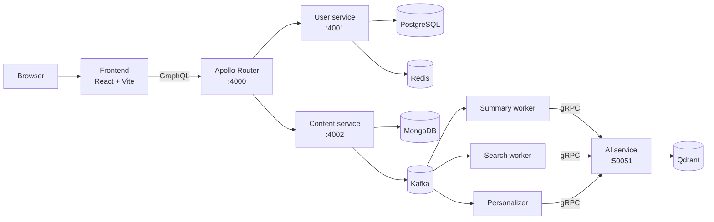

# Topos

Topos is a full-stack blogging platform where people can publish posts, use
AI-assisted writing tools, search the post library, and receive personalised
recommendations.

## Start here

- **New to Topos?** Read the [documentation home](docs/README.md), then use
  the [local quick start](docs/getting-started/quickstart.md).
- **Working on a service?** Use the service guides for
  [AI](services/ai/docs/README.md), [content](services/content/docs/README.md),
  [users](services/user/docs/README.md), [frontend](frontend/docs/README.md),
  or the [gateway](gateway/docs/README.md).
- **Running the platform?** Start with the
  [infrastructure guide](infrastructure/docs/README.md).
- **Seeding configuration?** Read the
  [Seed Secrets guide](tools/seed-secrets/docs/README.md).
- **Understanding product roles?** See [use cases](docs/use-cases.md).

## Run locally

You need Docker Desktop or Docker Engine with the Compose plugin. From the
repository root:

```bash
make local-up
```

The command creates `infrastructure/docker/local/.env.local` from its example
file when needed, builds the local stack, and waits for its Compose health
checks. Open <http://localhost:3000> when it is ready.

```bash
make local-logs  # follow logs from every local container
make local-down  # stop containers; keep their data volumes
```

> [!WARNING]
> `make local-clean` also deletes local Docker volumes. Use it only when you
> intentionally want to discard local data.

## How the pieces fit together



The [architecture guide](docs/concepts/architecture.md) explains this diagram,
the ownership of each data store, and the difference between a request handled
immediately and background work handled later.

## Repository map

| Directory | Purpose |
| --- | --- |
| `frontend/` | Browser application written with React and Vite. |
| `gateway/` | The single GraphQL entry point, powered by Apollo Router. |
| `services/user/` | Accounts, profiles, and JSON Web Tokens (JWTs). |
| `services/content/` | Posts, tags, chats, drafts, and background workers. |
| `services/ai/` | AI generation, retrieval, chat, and recommendations over gRPC. |
| `infrastructure/` | Local/prod Compose stacks, Terraform, and observability. |
| `tools/seed-secrets/` | Safely copies approved configuration into AWS services. |

## Contributing

Read [CONTRIBUTING.md](CONTRIBUTING.md) before opening a pull request. The
[agent guidance](AGENTS.md) contains repository rules and the command matrix
for each service.

## License

Topos is released under the [MIT License](LICENSE.md).
