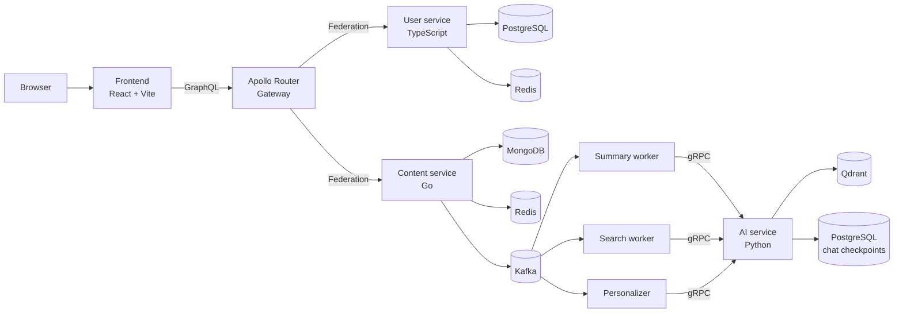

# Platform architecture

Topos is a modular blogging platform. The browser has one public GraphQL API;
behind it, services own user data, content, and AI capabilities separately.

## Boundaries and ownership

| Boundary | Owns | Does not own |
| --- | --- | --- |
| User service | Accounts, profile fields, password hash, JWT issuance | Posts and chat data |
| Content service | Posts, tags, drafts, chats, messages, interaction records | Account credentials and vector records |
| AI service | Generated content, retrieval, vectors, user-interest profiles, workflow checkpoints | Canonical posts or accounts |
| Gateway | API composition, CORS, header propagation, telemetry | Business data |
| Frontend | User experience and local UI state | Authorization decisions or backend data ownership |

## Two kinds of work

A **synchronous request** returns while the caller is waiting. For example,
`createPost` saves the post and returns it through GraphQL.

An **asynchronous event** is handled later. The content service publishes a
Kafka event after a post change; separate workers generate a summary, update
the search index, or update a recommendation profile. This keeps authoring
responsive and gives failed work a retry/DLQ path.

See [request and event flows](request-flows.md) and the detailed
[content architecture](../../services/content/docs/concepts/architecture.md).
