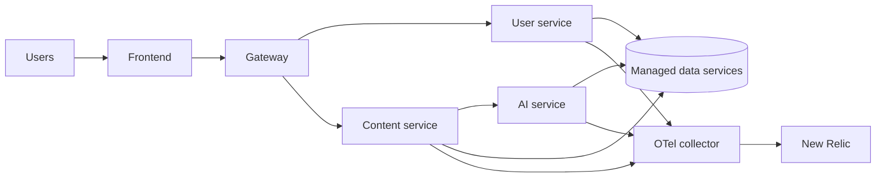

# Deployment overview

The production Compose stack starts application containers and an OpenTelemetry
collector. Managed data services are external to the Compose file.

Use `make prod-up` to start the production Compose stack. Set `WITH_INFRA=1`
when a cold deployment also needs Terraform to apply infrastructure. Set
`SEED_SECRETS=1` only when intentionally seeding managed configuration first.
Those behaviours are defined in the root [Makefile](../../Makefile).

> [!WARNING]
> `make infra-destroy ENV=prod` is blocked unless `CONFIRM_DESTROY=1`, but it
> is still destructive. Review Terraform output and the target environment
> before using any destroy command.
