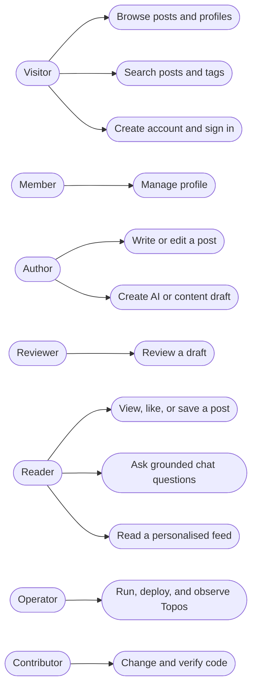

# Topos use cases

This page describes what people can do with Topos. It is intentionally kept
outside the repository landing page so the [README](../README.md) stays a short
starting point.

## People and capabilities

An individual can have more than one role. For example, a signed-in person can
write posts, review another person's draft, and receive recommendations.

## Publish and review content

An author can create a post directly or submit a draft for community review.
A draft may originate from an AI prompt or from author-supplied content. A
reviewer other than the author can approve or reject it. Approval creates or
updates the related post; rejection retains the draft so the author can revise
and resubmit it.

Read the [draft lifecycle](../services/content/docs/concepts/draft-lifecycle.md).

## Discover and discuss content

Visitors can browse and search. Signed-in readers can also record views, likes,
and saves, which improve later recommendations. Chat answers are grounded in
retrieved post content and record the post IDs cited by the assistant.

Read [search and recommendations](../services/ai/docs/concepts/retrieval-and-recommendations.md)
and the [chat flow](../services/content/docs/concepts/chat-flow.md).

## Operate and extend the platform

Operators start local stacks, deploy managed environments, seed approved
configuration, and inspect telemetry. Contributors use service-level tests and
code generation before opening a pull request.

- [Infrastructure operations](../infrastructure/docs/operations/terraform-workflow.md)
- [Observability](../infrastructure/docs/concepts/observability-architecture.md)
- [Contributing](../CONTRIBUTING.md)
