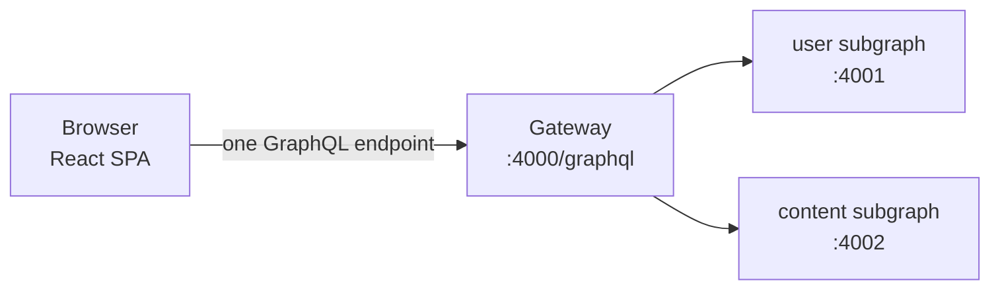
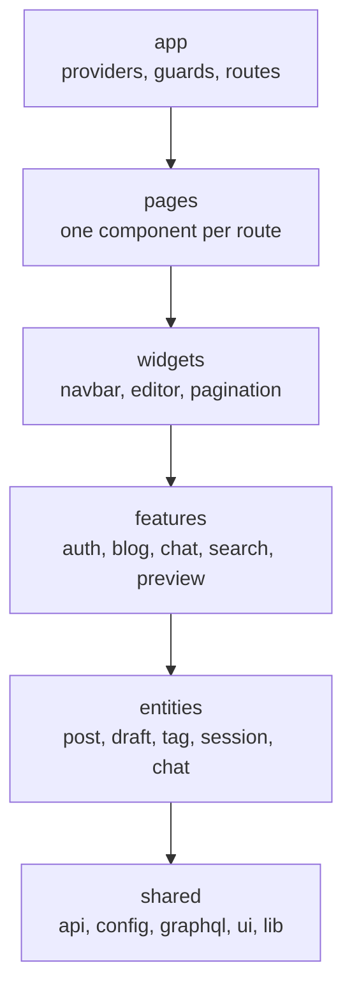

# Frontend documentation

The frontend is Topos's React/Vite single-page application. It is the only
part of the system a reader actually touches: it renders posts, handles
sign-in, sends GraphQL operations to the gateway, and renders whatever comes
back.

## New here?

Read these five pages in order. By the end you will have run the app, changed
a component, and traced a click all the way to the back end and back.

1. [Quick start](getting-started/quickstart.md) — install, run, and see data.
2. [Configuration](getting-started/configuration.md) — the six environment
   variables and how they reach the browser.
3. [Application architecture](concepts/architecture.md) — the five enforced
   source layers, the composition root, and the rule that each layer only
   imports what sits below it.
4. [User journeys](concepts/user-journeys.md) — what a person can actually do.
5. [Request flows](concepts/request-flows.md) — what happens when they do it.

## Where the frontend sits

The app sends every operation to the gateway. It has no knowledge of which
subgraph answered, and it never calls a subgraph directly.

## Browse by topic

| If you want to… | Read this |
| --- | --- |
| Run the app or the mock modes | [Quick start](getting-started/quickstart.md) |
| Set or debug an environment variable | [Configuration](getting-started/configuration.md) |
| Find where a component belongs | [Application architecture](concepts/architecture.md) |
| Understand route guards and sign-in state | [Routing and session](concepts/routing-and-session.md) |
| Change, add or debug a GraphQL operation | [Data model](concepts/data-model.md) |
| Follow a feature end to end | [Request flows](concepts/request-flows.md) |
| See what a user can do in the product | [User journeys](concepts/user-journeys.md) |
| Work without a running back end | [Mock and preview modes](concepts/mock-and-preview.md) |
| Trace Apollo links, retries or auth headers | [GraphQL client](components/graphql-client.md) |
| Handle a failed operation | [Error handling](components/error-handling.md) |
| Add or style a UI element | [UI system](components/ui-system.md) |
| Build, ship or run it in Docker | [Build and deployment](operations/build-and-deployment.md) |
| Write or run tests | [Testing overview](testing/overview.md) |

## The shape of the source

Arrows point the way imports are allowed to go: a layer may only import from
layers below it. ESLint fails the build if this is broken. Details in
[Application architecture](concepts/architecture.md).

## Numbers worth knowing

| Thing | Count |
| --- | --- |
| TypeScript and TSX files | 299 |
| Lines of `src/` TypeScript | about 32,500 |
| Routes in `src/App.tsx` | 11 named plus a catch-all |
| Mock GraphQL handlers | 35 (14 queries, 21 mutations) |
| Test files | 72 |
| Test cases | 446 (424 unit, 22 integration) |

These are counted from the source; re-count them if the code has moved on.
