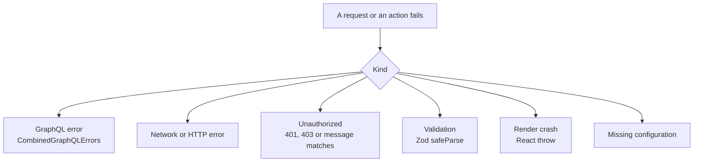
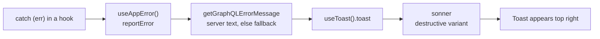
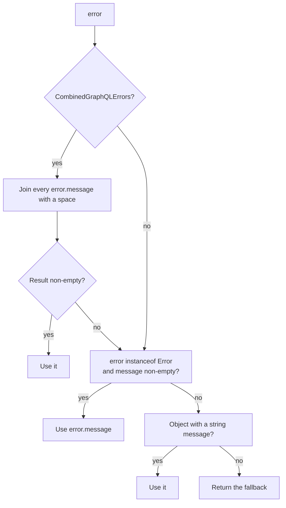

# Error handling

There is no global error store. Failures are classified where they happen and
surfaced where the user is looking: a toast, an inline status, a skeleton with
a retry, or a full-screen alert. This page is the catalogue.

## What can go wrong



Each of those has a different owner:

| Kind | Detected in | Surfaced as |
| --- | --- | --- |
| GraphQL error | The link chain and the component | Destructive toast with the server's message |
| Network error | `RetryLink` first, then the component | Toast after retries are exhausted |
| Unauthorized | `errorLink`, `bootstrapSession`, route guards | Session cleared, then redirect or the configuration of a fresh session |
| Validation | Zod in forms, schemas in controllers | Field-level messages, or an early return |
| Render crash | `ErrorBoundary` | `Something went wrong.` |
| Missing configuration | `env.ts` Zod parse | Full-screen `role="alert"` |

## The toast path



`src/shared/ui/hooks/useAppError.ts` is four lines and is the standard way to
report a failed mutation:

```text
reportError(error, "Could not update like.")
```

`useToast` is a thin wrapper over `sonner` that maps the `variant` field:

| Variant | Call made to sonner |
| --- | --- |
| `destructive` | `sonnerToast.error(message, options)` |
| anything else | `sonnerToast(message, options)` |

`title` becomes the message; `description` is passed through as an option.
Calling `toast({ description: "…" })` without a title puts the description
straight into the message.

Call sites today are just two: `usePostInteractions` and
`useReviewQueueController`. The other 20 files that show feedback import
`useToast` directly and build the message themselves, which is the pattern to
copy for new code.

## Error messages

`getGraphQLErrorMessage(error, fallback)` in
`src/shared/api/errors/graphql-error.ts` resolves the text in this order:



`getGraphQLErrorCodes` does the same traversal but returns
`extensions.code` values (`FORBIDDEN`, `NOT_FOUND`, …), which is what you
want when behaviour depends on the error class rather than its wording. It
has one production caller today: `useProfileEditorController` checks for
`USER_ALREADY_EXISTS` to render a friendly "that username is taken" message.

## Domain errors and `Result`

`src/shared/domain/` defines a small, dependency-free error vocabulary:

| Export | Shape |
| --- | --- |
| `DomainErrorCode` | `UNAUTHENTICATED`, `FORBIDDEN`, `NOT_FOUND`, `VALIDATION`, `NETWORK`, `GRAPHQL`, `UNKNOWN` |
| `DomainError` | `{ code, message, cause?, issues? }` |
| `domainError(code, message, extras?)` | Constructor |
| `isDomainError(value)` | Type guard |
| `Result<T, E>` | `{ ok: true, value }` or `{ ok: false, error }` |
| `ok`, `err`, `isOk`, `isErr`, `map`, `mapErr`, `flatMap`, `unwrapOr` | Helpers |

Be aware that **this machinery currently has one production caller.**
`src/entities/upload/lib/upload-image.ts` wraps Cloudinary failures in
`domainError("NETWORK", …)` and returns `ok()` / `err()`; everything else in
the app throws and catches instead. The module is fully unit-tested, so it is
a reasonable choice for new code that benefits from exhaustive handling, but
do not assume it is the house style.

## `ErrorBoundary`

A single class component, `src/app/providers/ErrorBoundary.tsx`, used in three
places:

| Location | Protects |
| --- | --- |
| Outermost in `AppProviders` | The whole application |
| Around the `SearchBar` on `Home` | Search controls only |
| Around the feed on `Home` | The tabs and list only |

On a caught error it logs with `logger.error` and renders:

```text
Something went wrong.
```

with `role="alert"` and `aria-live="assertive"`.

Three limitations to know before you rely on it:

1. **It has no reset.** Once `hasError` is true it stays true; navigating
   elsewhere does not recover. You need a reload.
2. **It only catches render, lifecycle and constructor errors.** Errors
   inside event handlers, `setTimeout`, promises and async effects are not
   caught by any boundary.
3. **Nesting is shallow on purpose.** The two boundaries inside `Home` mean a
   broken feed does not take the navbar or the search box with it.

## Where each surface appears

| Situation | Surface | Example |
| --- | --- | --- |
| A mutation failed | Destructive toast | `Could not approve the draft.` |
| The feed cannot be personalised | Toast plus inline **Retry** button | `Personalized feed unavailable` with `Retry personalized feed` |
| A query failed | Inline `section: "error"` state | `useReviewQueueController.community.section` |
| A query is loading | Skeleton | `ViewBlogPageSkeleton`, `BlogCardSkeleton`, `RouteShellSkeleton` |
| Session never hydrated | Inline card plus **Retry** | Route guards after 8 seconds |
| Configuration invalid | Full-screen alert | `App`, `AppApolloProvider` |
| Suggestions failed | Inline message plus `retry()` | `useSearchSuggestionsController` |
| The post does not exist | Dedicated not-found layout | `ViewBlogPage` renders `Missing Article` |
| The whole page crashed | Error boundary text | `Something went wrong.` |

## Failure handling by example

### Swallowed on purpose

Some failures must not reach the user:

| Site | Code | Reason |
| --- | --- | --- |
| Recording a view | `.catch(() => {})` | Telemetry; never block reading |
| Refetching after a mutation | `logger.warn` inside `try`/`catch` | The mutation already succeeded |
| Reading the post after an error | `catch { /* swallow */ }` | The real error is exposed via the query's own `error` field |
| Restoring `scrollRestoration` | empty `catch` | Not worth surfacing |

### Rolled back on purpose

Optimistic writes are undone on failure: `writeLikedState`,
`writeSavedState` and `rollbackDraftStatusIfOptimistic` all restore the
previous value before showing the toast.

### Retried on purpose

`RetryLink` handles network blips transparently; `ForYouList`,
`useSearchSuggestionsController` and the route guards expose an explicit
Retry control when a human decision helps.

## Logging

`src/shared/lib/logger.ts` wraps `console.*` with a level prefix and one
behaviour worth remembering: **`debug` messages are dropped in production**
(`import.meta.env.DEV` is false). `info`, `warn` and `error` always log.

There is no remote logging, no error reporting service and no global handler.
An unhandled rejection will show in the browser console and nowhere else.

## Checklist for new code

1. Catch where the user can act, not deep inside a repository.
2. Use `getGraphQLErrorMessage(error, "Human sentence.")` so the server text
   wins when it exists.
3. Surface with `useAppError` for failures and `useToast` for confirmations.
4. If you write optimistically, write the rollback in the same `catch`.
5. If a failure is harmless, swallow it deliberately with a comment saying
   why.
6. If the user can retry, render a control rather than a spinner that never
   ends.

## Next step

Continue with [UI system](ui-system.md).
