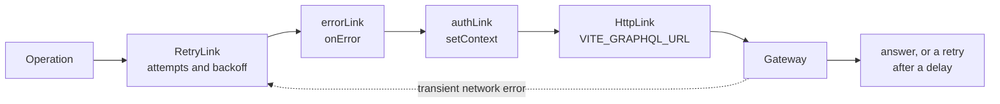
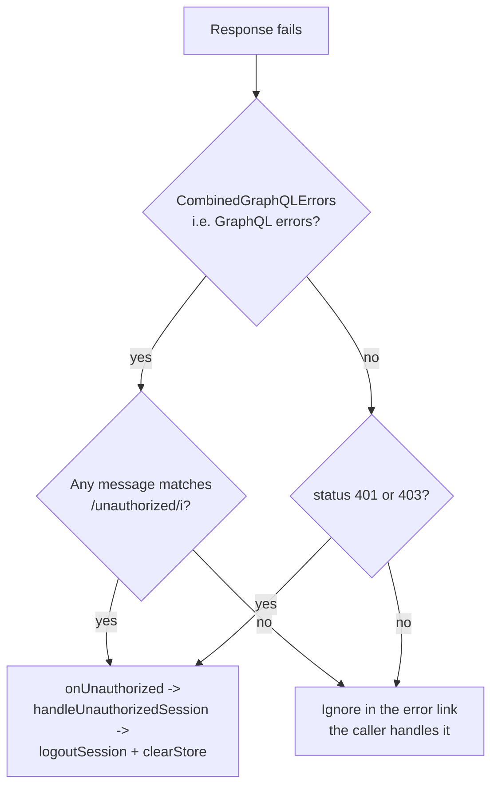

# GraphQL client

Everything the frontend sends to the back end goes through one Apollo Client
instance. This page explains how that instance is built, what each link in
the chain does, and how failures are classified.

## Building the client

`AppApolloProvider` creates the client lazily and stores it in a `useRef`, so
it is built at most once for the lifetime of the app:

```text
createApolloClient({
  uri: env.VITE_GRAPHQL_URL,
  getToken: () => useSessionStore.getState().token,
  onUnauthorized: () => handleUnauthorizedSession(client),
})
```

`getToken` reads the Zustand store directly rather than subscribing, which
means every request picks up the current token without re-rendering the
provider. If `hasValidEnv` is false the provider renders the configuration
alert instead of an Apollo instance.

## The link chain



Links run in the order they appear in `from([...])`, and `RetryLink` sits
first so it can re-run everything below it.

| Order | Link | File | Responsibility |
| --- | --- | --- | --- |
| 1 | `RetryLink` | `client.ts` | Decide whether to try again, and how long to wait |
| 2 | `onError` | `client.ts` | Detect unauthorized responses and call `onUnauthorized` |
| 3 | `setContext` | `client.ts` | Add the `Authorization` header |
| 4 | `HttpLink` | `client.ts` | Put the request on the wire |

### Retry rules

| Setting | Value |
| --- | --- |
| Initial delay | 300 ms |
| Maximum delay | 3,000 ms, with jitter |
| Maximum attempts | 3 |

`retryIf` is the interesting part. It returns `false` in every one of these
cases:

| Skip retry when… | Why |
| --- | --- |
| There is no error | Nothing to retry |
| The operation is a mutation | Never repeat a write automatically |
| The status is 401 or 403 | Retrying an authorization failure cannot help |
| The error is a timeout (`TimeoutError`, `AbortError`, `BootstrapTimeoutError`, or a message matching `timeout|timed out|aborted`) | The caller already owns cancellation |
| The error is a GraphQL error, with or without `unauthorized` in the text | A server-side error is a decision, not a blip |

In practice that means **only network-level failures on queries are retried.**
The `CombinedGraphQLErrors` branch returns `false` on both paths, which looks
redundant but keeps the intent explicit.

### Authentication

`buildAuthHeaders(token)` returns `{ Authorization: "Bearer <token>" }` when a
token exists, and `{}` when it does not. Anonymous requests therefore carry no
`Authorization` header at all rather than an empty one.

### Unauthorized detection

Two helpers in `src/shared/api/links/auth.ts`:

```text
hasUnauthorizedNetworkError  status is 401 or 403
hasUnauthorizedGraphQLError  error message matches /unauthorized/i
```

They feed two different paths:



Because detection is message-based, a gateway that returns
`PERMISSION_DENIED` without the word "unauthorized" will not sign the user
out here. The route guards and `bootstrapSession` apply the same helpers.

## Reading errors in components

Two helpers are exported from `src/shared/api`:

| Helper | Behaviour |
| --- | --- |
| `getGraphQLErrorCodes(error)` | `extensions.code` from every GraphQL error, or `[code]` for a single error object, or `[]` |
| `getGraphQLErrorMessage(error, fallback)` | Joins every GraphQL error `message` with a space; falls back to `error.message`; falls back to the supplied string |

The usual call site is `useAppError`:

```text
reportError(error, "Could not update like.")
```

which produces a destructive toast. See [Error handling](error-handling.md).

## Cache

`buildApolloCache()` configures type policies for `Post`, `Tag`, `User`,
`SearchResult` and the paginated `Query` fields. That is documented in
[Data model](../concepts/data-model.md); the client itself does not know
anything about it beyond owning the cache instance.

## Adding a query

1. Add the document to the right source file (see
   [Data model](../concepts/data-model.md#where-graphql-operations-live)).
2. `npm run codegen`.
3. Expose it from the entity repository: a `useX` hook for components, an
   `xOnce` method for imperative calls.
4. Choose a fetch policy deliberately; see
   [Data model](../concepts/data-model.md#fetch-policies-in-use).
5. If it returns a post list, decide whether it joins
   `POST_LIST_QUERY_NAMES`.

## Gotchas

| Gotcha | Detail |
| --- | --- |
| Retries never apply to mutations | If a write fails, the user must act |
| Unauthorized detection is textual | `/unauthorized/i` must appear somewhere in the message |
| `onUnauthorized` is fire-and-forget | `void deps.onUnauthorized()`, so a rejected logout would be an unhandled rejection rather than a user-visible error |
| The token is read, not subscribed | `getToken` runs per operation; a token change does not rebuild the client |
| The error link does not swallow errors | It only inspects them; the caller still receives the failure |

## Next step

Continue with [Error handling](error-handling.md).
