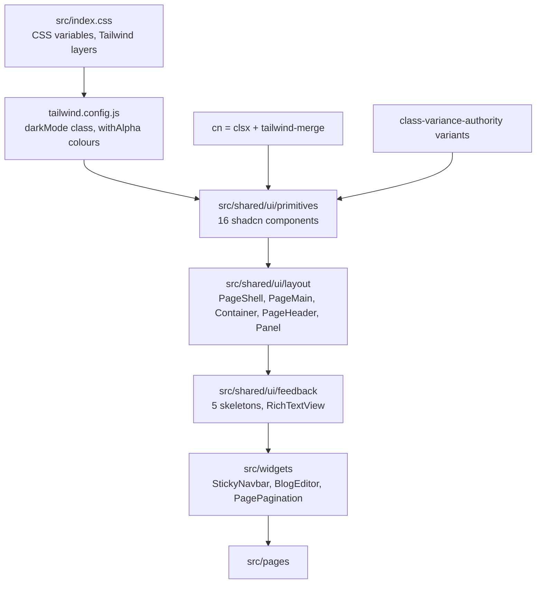
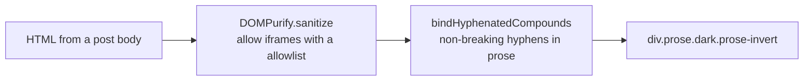

# UI system

The visual layer is Tailwind CSS 3 on top of shadcn/ui primitives, driven by
CSS variables so light and dark are one token set. This page explains how the
stack fits together and how to add a component without fighting it.

## The stack



## Colour tokens

`tailwind.config.js` defines colours with one helper:

```js
const withAlpha = (variable) => `rgb(var(${variable}) / <alpha-value>)`
```

so every token in `src/index.css` is a space-separated RGB triple:

```css
--primary: 77 68 227;
--surface: 248 248 249;
```

and the Tailwind class `bg-primary` resolves to `rgb(var(--primary) / 1)`.
Opacity modifiers like `bg-primary/90` therefore work on every token.

| Token group | Members |
| --- | --- |
| Page | `background`, `foreground`, `surface`, `surface-low`, `surface-lowest`, `surface-high`, `surface-highest` |
| Brand | `primary`, `primary-foreground`, `primary-container`, `primary-fixed-dim` |
| Structure | `border`, `outline`, `outline-variant`, `input`, `ring` |
| Feedback | `secondary`, `muted`, `accent`, `destructive` |
| Containers | `card`, `popover` (each with a `-foreground`) |

Dark mode is `darkMode: ["class"]`: `ThemeProvider` adds `dark` to `<html>`,
and `src/index.css` overrides the same variables under `.dark` (two blocks,
at lines 59 and 105).

### Type

| Role | Font | How it is applied |
| --- | --- | --- |
| Body | Inter | `--font-sans`, the Tailwind default |
| Labels and code | Space Grotesk | `--font-mono`, used for the uppercase tracked labels |
| Editorial text | Merriweather | Hand-written classes in `src/index.css` such as `.blog-title-input`, `.blog-draft-input` and `.blog-summary-alert`, plus the `.prose` rules |

All three load from Google Fonts with a single `@import` at the top of
`src/index.css`.

The UI leans on the mono face for labels: uppercase, `tracking-[0.18em]`,
`text-[0.6875rem]`. That is a deliberate house style, visible in
`AIDraftGenerator`, `ViewBlogPage` and the preview banner.

## `cn` and variants

```ts
export function cn(...inputs: ClassValue[]) {
  return twMerge(clsx(inputs))
}
```

`clsx` builds the class list conditionally; `tailwind-merge` resolves
conflicts so a later `className` reliably overrides an earlier one. Every
component composes its defaults with `cn(defaults, className)`.

Variants use `class-variance-authority`. `Button` is the canonical example:
six variants (`default`, `outline`, `secondary`, `ghost`, `destructive`,
`link`) and eight sizes (`default`, `xs`, `sm`, `lg`, `icon`, `icon-xs`,
`icon-sm`, `icon-lg`).

## The 16 primitives

| File | Component |
| --- | --- |
| `alert-dialog.tsx` | Confirmation dialogs |
| `avatar.tsx` | User images with fallbacks |
| `badge.tsx` | Small status labels |
| `button.tsx` | Buttons and `asChild` links |
| `card.tsx` | Panelled content |
| `command.tsx` | `cmdk` command palette |
| `dialog.tsx` | Modal dialogs |
| `dropdown-menu.tsx` | Menus |
| `input.tsx`, `input-group.tsx`, `textarea.tsx`, `label.tsx` | Form controls |
| `pagination.tsx` | Page controls |
| `skeleton.tsx` | Loading blocks |
| `tabs.tsx` | Tab sets |
| `toaster.tsx` | The `sonner` mount point |

They are generated by shadcn. `components.json` points the CLI at the right
places:

| Setting | Value |
| --- | --- |
| `aliases.components` | `@/shared/ui/primitives` |
| `aliases.utils` | `@/shared/lib/cn` |
| `tailwind.css` | `src/index.css` |
| `iconLibrary` | `lucide` |
| `style` | `radix-nova` |

Adding a component is `npx shadcn@latest add <name>` from `frontend/`, which
writes into `src/shared/ui/primitives/`.

## Layout and feedback helpers

| Directory | Exports | Use for |
| --- | --- | --- |
| `src/shared/ui/layout/` | `PageShell`, `PageMain`, `Container`, `PageHeader`, `Panel` | The repeating page frame |
| `src/shared/ui/feedback/` | `BlogCardSkeleton`, `DraftCardSkeleton`, `DraftDetailSkeleton`, `RouteShellSkeleton`, `ViewBlogPageSkeleton`, `RichTextView` | Loading states and rendered HTML |
| `src/shared/ui/hooks/` | `useToast`, `useAppError` | Feedback |

`PageMain` bakes in the shared geometry
(`container mx-auto px-4 pb-20 pt-app-navbar-offset`), and
`.pt-app-navbar-offset` is a hand-written utility in `src/index.css` that
resolves to `var(--app-navbar-offset)`. The preview banner changes that
variable at runtime, which is why it emits a `<style>` block rather than
class names.

### Rendering rich text safely

`RichTextView` is the only component that uses `dangerouslySetInnerHTML`, and
it sanitizes first:



`bindHyphenatedCompounds` replaces hyphens in compound words with
`NON_BREAKING_HYPHEN` so lines do not break in the middle of a term, while
skipping `A`, `CODE`, `PRE`, `SCRIPT` and `STYLE`.

## Loading states

Skeletons mirror the real layout so the page does not jump:

| Skeleton | Replaces |
| --- | --- |
| `RouteShellSkeleton` | The whole route while it lazy-loads or the session hydrates |
| `BlogCardSkeleton` | One feed card |
| `ViewBlogPageSkeleton` | The post detail page |
| `DraftCardSkeleton` / `DraftDetailSkeleton` | Review queue rows and detail |

Prefer a skeleton over a spinner: it communicates shape, which is what the
user is waiting for.

## Accessibility notes

| Practice | Where |
| --- | --- |
| `role="alert"` | Configuration alert, `ErrorBoundary`, route guard timeout |
| `aria-live="assertive"` | The error boundary's fallback heading |
| `aria-live="polite"` | Chat composer, chat thread, home feed status |
| `aria-hidden` on decorative icons | Everywhere an icon sits next to text |
| `aria-describedby` and `aria-invalid` | 7 and 13 usages respectively, wiring forms to their error paragraphs |
| Focus rings via `focus-visible:ring-1` | All interactive primitives |

There is no `aria-busy` usage in the codebase; loading is communicated by
swapping in a skeleton instead.

The primitives come from Radix, so keyboard navigation, focus trapping and
`Escape` handling are inherited rather than reimplemented.

## Checklist for adding UI

1. Reuse a primitive before writing markup; `npx shadcn@latest add` if one is
   missing.
2. Colour through tokens (`bg-surface-low`, `text-muted-foreground`), never
   raw hex.
3. Compose with `cn(defaults, className)` so callers can override.
4. Variant-heavy components belong in `src/shared/ui/primitives`; feature
   components belong in `src/features/<area>/components`.
5. Composed, reusable blocks belong in `src/widgets/`.
6. Give every loading state a skeleton and every failure a message.
7. Run `npm run lint` and `npm test`.

## Next step

Continue with [Build and deployment](../operations/build-and-deployment.md).
