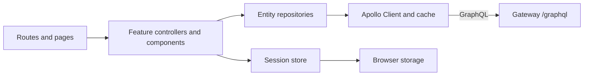

# Frontend application architecture

The frontend groups code by application, features, entities, shared utilities,
and widgets. GraphQL documents and generated types live under `src/shared/graphql/`.
The session layer stores the authenticated identity and the API link adds the
JWT to later GraphQL requests.
