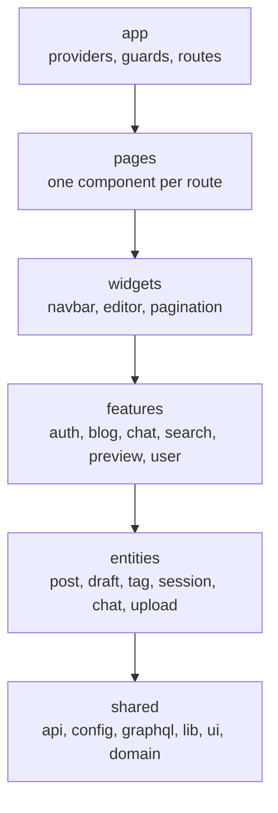
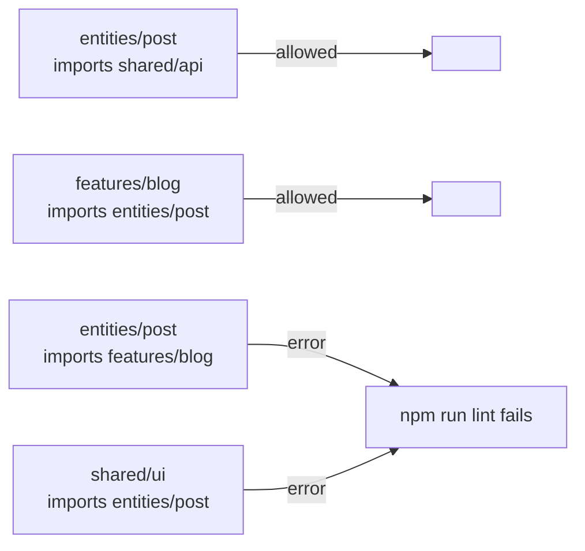
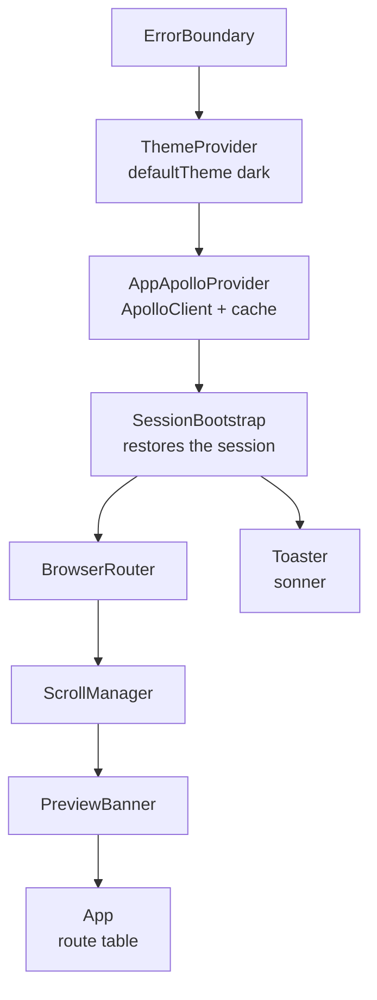
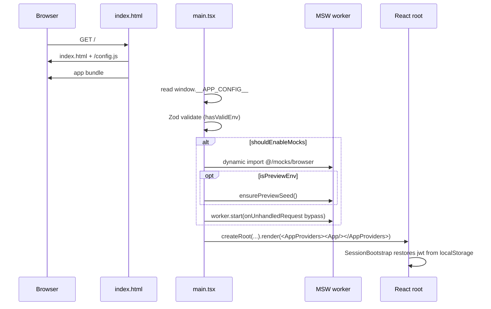

# Application architecture

The frontend is organised into five layers with a strict one-way dependency
rule: **a layer may only import from layers below it.** This is not a
convention you have to remember, because ESLint fails `npm run lint` when it
is broken. `src/app/` sits above the five as the composition root.

## The layer stack



| Layer | Files | Lines | Holds |
| --- | --- | --- | --- |
| `src/app/` | 8 | 349 | Provider composition, route guards, scroll restoration |
| `src/pages/` | 16 | 2,422 | One component per route, mostly wiring |
| `src/widgets/` | 25 | 2,469 | Reusable composed blocks such as `StickyNavbar` and `BlogEditor` |
| `src/features/` | 125 | 15,160 | User-facing use cases: controllers, forms, dialogs |
| `src/entities/` | 37 | 2,462 | Business objects and the repositories that fetch them |
| `src/shared/` | 70 | 5,639 | Apollo links, config, GraphQL documents, UI primitives |

Counts come from `find` over `src/`; re-count them if the code has moved on.

`src/app/` is the composition root. ESLint forbids every other layer from
importing it, but it may import anything itself.

`src/main.tsx`, `src/App.tsx`, `src/mocks/` and `src/test/` sit **outside**
the layer stack. They are the composition entry point and the test fixtures,
so they may import anything.

## The rule is enforced

`eslint.config.js` declares the zones and wires them into
`import/no-restricted-paths` at severity `error`:

```js
const layerZones = [
  { target: 'shared',    forbid: ['entities', 'features', 'widgets', 'pages', 'app'] },
  { target: 'entities',  forbid: ['features', 'widgets', 'pages', 'app'] },
  { target: 'features',  forbid: ['widgets', 'pages', 'app'] },
  { target: 'widgets',   forbid: ['pages', 'app'] },
  { target: 'pages',     forbid: ['app'] },
]
```

Import something you should not and you get:

```text
Layer "entities" may not import from "features".
```



### What each layer is allowed to reach

| You are in… | You may import | You may **not** import |
| --- | --- | --- |
| `shared` | nothing else in the stack | `entities`, `features`, `widgets`, `pages`, `app` |
| `entities` | `shared` | `features`, `widgets`, `pages`, `app` |
| `features` | `entities`, `shared` | `widgets`, `pages`, `app` |
| `widgets` | `features`, `entities`, `shared` | `pages`, `app` |
| `pages` | `widgets`, `features`, `entities`, `shared` | `app` |
| `app` | everything | nothing |

Two consequences are worth internalising:

- **Shared code cannot know about your data.** If `src/shared/` needs a post
  shape, the type has to be defined in `shared` itself (which is exactly what
  `src/shared/graphql/content-documents.ts` does) or passed in as a generic.
- **Features talk to entities, never to each other.** `features/blog` cannot
  import `features/search`. Anything genuinely common belongs in an entity or
  in `shared`.

## Where `shared` code lives

| Directory | Contents |
| --- | --- |
| `src/shared/api/` | Apollo client factory, links, error helpers, cache type policies, list invalidation |
| `src/shared/config/` | `env.ts` (Zod-validated configuration) and `preview.ts` |
| `src/shared/domain/` | `DomainError` and `Result` helpers |
| `src/shared/graphql/` | Hand-written operations in `content-documents.ts`, plus `generated/` |
| `src/shared/lib/` | `cn`, `logger`, `storage`, `sanitize-html`, `usePagination` |
| `src/shared/ui/` | shadcn primitives, layout shells, skeletons, hooks, theme |

## The provider tree

`src/main.tsx` calls `bootstrap()` which optionally starts MSW, then renders
one `<AppProviders>` wrapper around `<App />`. `AppProviders` composes
everything in a fixed order:



The order matters:

1. **`ErrorBoundary` is outermost** so a render crash anywhere shows
   `Something went wrong.` instead of a white page.
2. **`ThemeProvider`** sets `defaultTheme="dark"` with storage key
   `vite-ui-theme` and toggles the `dark` class on `<html>`.
3. **`AppApolloProvider`** constructs the client once and provides it to
   everything below, including `SessionBootstrap`.
4. **`SessionBootstrap`** runs before routing so `ProtectedRoute` does not
   race the first request. The `Toaster` deliberately lives *inside*
   `SessionBootstrap` but *outside* `BrowserRouter`, so toasts survive
   navigation.
5. **`ScrollManager`** and **`PreviewBanner`** are siblings of the router;
   the banner only renders when `isPreview()` is true.

## Boot sequence



Note that mocks start **before** the first render. That ordering is what makes
`dev:mock` work at all: if React mounted first, the initial `Me` query would
already be in flight when the service worker came up.

## Writing a new feature

1. Decide the layer. If it has its own API calls and data shape, it is an
   **entity**. If it is a user-facing interaction, it is a **feature**.
2. Put the GraphQL document in `src/shared/graphql/content-documents.ts`
   (content) or `src/entities/<name>/api/` (auth, chat, user), then run
   `npm run codegen`.
3. Expose a small repository API rather than calling `useQuery` from the
   component. `postRepository`, `tagRepository`, `draftRepository`,
   `chatRepository`, `authRepository` and `userRepository` are the examples to
   copy.
4. Keep the page thin. `src/pages/*` should mostly assemble widgets and hand
   them a controller hook.
5. Run `npm run lint` and `npm test`.

## Things that look like mistakes but are not

| Observation | Explanation |
| --- | --- |
| `src/App.tsx` imports from every layer | It is the composition root, outside the zone targets |
| `content-documents.ts` defines its own types instead of using `generated/` | The hand-written interfaces predate codegen; the operations are still validated by `npm run codegen` |
| `ProtectedRoute` and `PublicOnlyRoute` repeat the same timeout logic | Deliberate duplication; both are about 40 lines, read independently, and each has its own redirect target |
| `src/shared/domain/result.ts` looks unused | `Result` and `DomainError` are exercised by `upload-image.ts` and by `src/shared/domain/__tests__/`. The rest of the app prefers throwing and catching, which is why you will not see `ok()` elsewhere |
| `src/App.tsx` lazy-loads most pages | The 8 `React.lazy` declarations are `Signup`, `Signin`, `CreateNewBlog`, `UserProfile`, `ReviewQueuePage`, `DraftDetailPage`, `DraftResubmitPage` and `ChatPage`. `Home`, `ViewBlogPage` and `SearchResultsPage` are eager because they are the common entry points |

## Next step

Continue with [Routing and session](routing-and-session.md).
