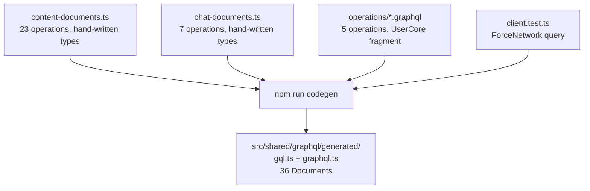
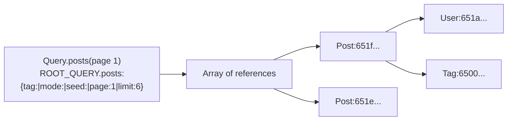
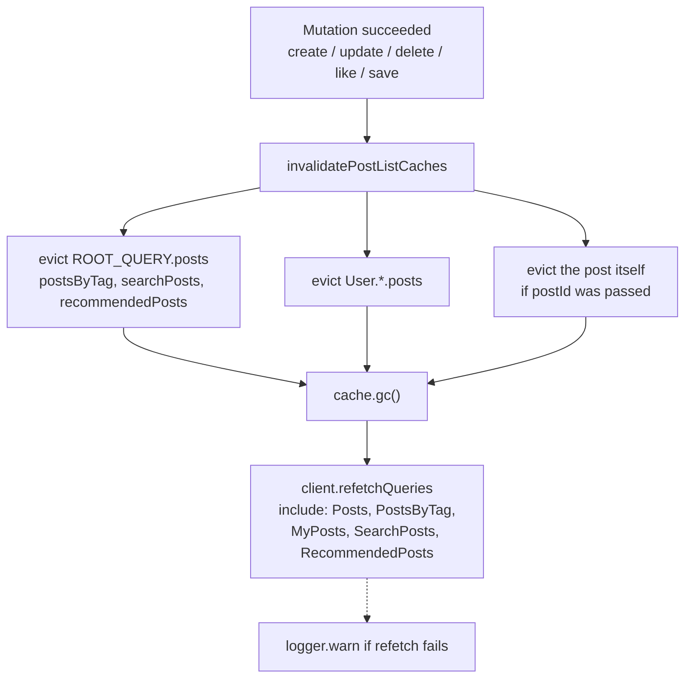

# Data model

There is no database in the browser. What the frontend has instead is an
Apollo Client cache full of normalised entities, plus a set of GraphQL
operations that keep it fed. This page explains where operations live, how
types are generated, and how the cache decides what a "fresh list" means.

## Where GraphQL operations live

Four places, deliberately:

| Source | Operations | Fragments | Types come from | Imported by |
| --- | --- | --- | --- | --- |
| `src/shared/graphql/content-documents.ts` | 23 | 5 | Hand-written interfaces in the same file | 28 files |
| `src/entities/chat/api/chat-documents.ts` | 7 | 2 | Hand-written interfaces in the same file | 3 files |
| `src/shared/graphql/operations/*.graphql` | 5 | 1 (`UserCore`) | Generated | 13 files |
| `src/shared/graphql/fragments/user-core.graphql` | 0 | 1 | Generated | pulled in by the five operations above |



`codegen.ts` scans `src/**/*.{graphql,ts,tsx}` while excluding
`src/shared/graphql/generated/**`. That is why `ForceNetwork`, defined inside
`src/shared/api/__tests__/client.test.ts`, shows up in the generated output
even though it is not a real feature.

## Codegen

```bash
npm run codegen
```

The configuration in `codegen.ts` is short and worth reading in full:

| Setting | Value |
| --- | --- |
| `schema` | `../services/user/schema.graphql` and `../services/content/graph/schema.graphqls` |
| `documents` | `src/**/*.{graphql,ts,tsx}`, minus `src/shared/graphql/generated/**` |
| `generates` | `./src/shared/graphql/generated/` using the `client` preset |
| `fragmentMasking` | `false` |
| `ignoreNoDocuments` | `false`, so an empty document set is an error |

Two consequences:

1. **Codegen never contacts a running gateway.** It reads the sibling
   services' schema files from disk. You can run it offline, and it fails the
   moment a field you query disappears from the subgraph.
2. **`npm run build` is a contract test.** The build script is
   `npm run codegen && tsc -b && vite build`, so a stale query breaks the
   build before it ever reaches CI.

### The two type systems

This is the part that confuses people, so it is worth being blunt:

- `content-documents.ts` and `chat-documents.ts` export their **own**
  hand-written interfaces (`ContentPostCard`, `PostsQuery`,
  `ChatMessageItem`, …) next to a `gql` template literal cast to
  `DocumentNode<ThoseTypes, ThoseVars>`.
- Codegen generates a *second*, independent set of `PostsQuery`,
  `ChatMessageItem` and friends in `generated/graphql.ts`.

Both are type-checked against the schema: the `gql` documents are codegen's
input, so a wrong field fails `npm run codegen` regardless of which interface
you import. The hand-written interfaces are an additional thing to keep in
sync by hand when you add a field.

| If you are… | Import from |
| --- | --- |
| Reading or writing posts, drafts, tags, search | `@/shared/graphql/content-documents` |
| Working on chat threads and messages | `@/entities/chat/api/chat-documents` |
| Working on sign-in, sign-up, profile or the `me` query | `@/shared/graphql/generated/graphql` |

Adding a field to a content operation means editing **both** the query and
its interface in `content-documents.ts`.

## The normalised cache

`buildApolloCache()` in `src/shared/api/apollo/cache/index.ts` builds an
`InMemoryCache` with type policies for `Post`, `Tag`, `User`, `SearchResult`
and `Query`.



Every object with a `keyFields: ["id"]` policy (`Post`, `Tag`, `User`) is
stored once under `Typename:id`. A list only stores references, so liking a
post anywhere updates it everywhere.

`SearchResult` is the exception: `keyFields: false`. Search hits are not
identifiable and are not shared between queries.

### Field policies

| Query field | `keyArgs` | `merge` | Effect |
| --- | --- | --- | --- |
| `post` | `["id"]` | `false` | One cached entry per post id, never merged |
| `posts` | `paginatedPostListKeyArgs` | replace | Cache key includes tag, mode, seed, page, limit and query |
| `postsByTag` | `paginatedPostListKeyArgs` | replace | same |
| `recommendedPosts` | `paginatedPostListKeyArgs` | replace | same |
| `searchPosts` | `["query", "page", "limit"]` | `false` | Different pages are separate entries |
| `tags` | `["query", "limit"]` | `false` | |
| `me` | n/a | `false` | Replaced wholesale, never merged |
| `User.posts` | `["page", "limit"]` | replace | Author pages paginate independently |

`paginatedPostListKeyArgs` builds a string like
`tag:|mode:|seed:|page:1|limit:6` or, for a search,
`tag:|mode:|seed:|page:2|limit:6|query:graphql`. `merge` returning
`incoming` means "new page, new value" rather than appending, so flipping
from page 1 to page 2 does not concatenate two pages into one bogus list.

`seed` is in the key because the "Surprise me" feed reshuffles: a new seed is
a different cache entry, which is what makes Back restore the previous
shuffle.

## Fetch policies in use

| Policy | Where | Why |
| --- | --- | --- |
| `cache-and-network` | `postRepository.useSearch`, `useGet`, `useRecommended` | Show cached content instantly, then refresh in place |
| `network-only` | `bootstrapSession`'s `Me` query | Never trust the cache when re-establishing identity |
| `no-cache` | `postRepository.searchOnce` | Type-ahead suggestions should not pollute the cache |
| `cache-first` | `postRepository.recommendedOnce`, `useCurrentUser` | Read once and reuse |
| default (`cache-first`) | most mutations' follow-up | |

`useQuery` calls that use `cache-and-network` also set
`notifyOnNetworkStatusChange: true` so the loading state reappears when the
network refresh starts.

## Keeping lists consistent after a mutation

Mutations that change posts all funnel through one helper,
`refreshPostListQueries` in `src/shared/api/refetchLists.ts`:



| Constant | Value |
| --- | --- |
| `POST_LIST_QUERY_NAMES` | `Posts`, `PostsByTag`, `MyPosts`, `SearchPosts`, `RecommendedPosts` |
| `ROOT_POST_LIST_FIELDS` | `posts`, `postsByTag`, `searchPosts`, `recommendedPosts` |

Note the asymmetry: `MyPosts` is refetched by name but is **not** one of the
`ROOT_QUERY` fields that get evicted, and `myPosts` is also not in
`ROOT_POST_LIST_FIELDS`. It still ends up correct because `refetchQueries`
re-runs it, but if you add a new list query you must add it to
`POST_LIST_QUERY_NAMES` *and* consider whether it needs an evict entry.

A failure to refetch is logged with `logger.warn` and swallowed: the UI keeps
whatever the mutation returned rather than surfacing an error.

## Reading and writing interactions directly

Likes and saves optimistically write into the cache without waiting for the
server, using three helpers on `postRepository`:

| Helper | What it does |
| --- | --- |
| `readInteractionState(client, postId, fallback)` | Reads `likedByMe`/`savedByMe` from the normalised `Post:id` fragment, falling back to the caller's value |
| `writeLikedState(client, postId, liked)` | `cache.modify` on `Post:id`, overwriting `likedByMe` |
| `writeSavedState(client, postId, saved)` | `cache.modify` on `Post:id`, overwriting `savedByMe` |

Because the cache is normalised, a single `writeLikedState` flips the heart
on the feed card, the detail page and the author's list at once.

## Adding a new operation

1. Pick the right source file (table above).
2. Add the document. For content operations, add the hand-written interface
   next to it.
3. Run `npm run codegen`. It fails if the field does not exist in the
   sibling service's schema.
4. Expose it through the entity repository rather than calling `useQuery`
   from a component.
5. If it returns a list of posts, decide whether it belongs in
   `POST_LIST_QUERY_NAMES` and `ROOT_POST_LIST_FIELDS`.
6. `npm run lint && npm test`.

## Gotchas

| Gotcha | Detail |
| --- | --- |
| Generated code is also committed | `npm run codegen` writes to `src/shared/graphql/generated/`, which `.gitignore` now ignores — but `gql.ts`, `graphql.ts` and `index.ts` are already tracked, so Git keeps following them. That matters: CI runs `npm ci`, lint and tests with no codegen step, so the committed copies are what make `npm test` work on a fresh checkout |
| Two definitions of `PostsQuery` | One hand-written in `content-documents.ts`, one generated in `graphql.ts`. They can drift; only the generated one is checked against the schema automatically |
| `SearchResult` has no key | `keyFields: false` means search hits are never normalised or shared |
| `cache.extract(false)` walks everything | `getCacheEntityIds` filters every key in the store by a `User:` prefix, so it is O(all entities) |
| Refetch failures are silent | `refreshPostListQueries` logs a warning and resolves |

## Next step

Continue with [Request flows](request-flows.md).
