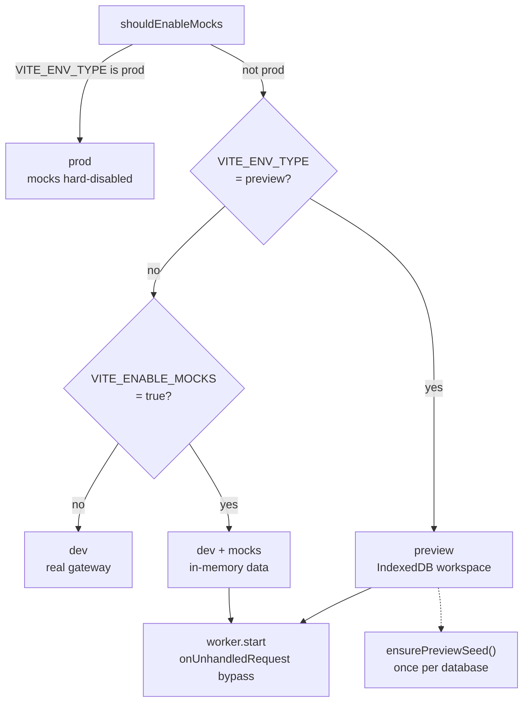
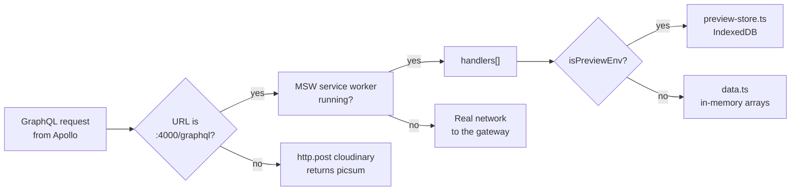

# Mock and preview modes

The frontend can run with no back end at all. Mock Service Worker (MSW)
intercepts GraphQL requests in the browser and answers them from local data.
There are two flavours, and the difference is where that data lives.

## The mode matrix



| Mode | Command | Data store | Survives reload? | Needs Docker? |
| --- | --- | --- | --- | --- |
| Real | `make dev` | The gateway | yes | yes |
| Mock | `make dev-mock` | Module-level arrays in `src/mocks/data.ts` | no | no |
| Preview | `make dev-preview` | IndexedDB database `topos-preview` | yes | no |
| Prod | `make build-prod` | the real gateway, mocks disabled | n/a | n/a |

The decision lives in one expression in `src/shared/config/env.ts`:

```text
shouldEnableMocks = VITE_ENV_TYPE !== "prod"
                    && (VITE_ENV_TYPE === "preview" || VITE_ENABLE_MOCKS === "true")
```

`src/main.tsx` checks it before the first render and dynamically imports
`@/mocks/browser`. Preview mode additionally awaits `ensurePreviewSeed()` so
the database has content before any component asks for a post.

## How interception works

`src/mocks/browser.ts` calls `setupWorker(...handlers)`. `src/mocks/handlers.ts`
builds one MSW GraphQL link pinned to a single URL:

```text
graphql.link("http://localhost:4000/graphql")
```

So only requests aimed at that exact endpoint are intercepted; a Cloudinary
upload, for example, is matched by a separate `http.post` handler instead.



`onUnhandledRequest: "bypass"` means anything MSW has no handler for falls
through to the network rather than producing a console warning.

## What is intercepted

| Kind | Count | Notes |
| --- | --- | --- |
| GraphQL queries | 14 | `Me`, `User`, `Posts`, `PostsByTag`, `Post`, `Tags`, `MyPosts`, `SearchPosts`, `RecommendedPosts`, `PostDrafts`, `MyPostDrafts`, `Chats`, `Chat`, `ChatMessages` |
| GraphQL mutations | 21 | auth, post CRUD, interactions, AI helpers, the draft queue, chat |
| Cloudinary uploads | 1 | Always returns a `picsum.photos` URL |

**28 of the 35 GraphQL handlers branch on `isPreviewEnv`**, running the
preview implementation when it is true and the in-memory one otherwise. The
seven chat handlers (`Chats`, `Chat`, `ChatMessages`, `CreateChat`,
`RenameChat`, `DeleteChat`, `AskChat`) always go to the preview store.

## Preview data

| File | Lines | Role |
| --- | --- | --- |
| `src/mocks/data.ts` | 1,282 | Seed arrays plus the in-memory implementations |
| `src/mocks/preview/preview-store.ts` | 1,075 | Async CRUD over IndexedDB |
| `src/mocks/preview/preview-db.ts` | 185 | Database wrapper with an in-memory fallback |
| `src/mocks/preview/seed.ts` | 20 | `ensurePreviewSeed()` |

| Constant | Value | Defined in |
| --- | --- | --- |
| `PREVIEW_DB_NAME` | `topos-preview` | `src/shared/config/preview.ts` |
| `PREVIEW_DB_VERSION` | `3` | same |
| `PREVIEW_SEED_VERSION` | `4` | same |

Eight object stores are created: `users`, `posts`, `drafts`, `tags`, `chats`,
`messages`, `meta`, `profiles`.

Seeding is idempotent and versioned: `ensurePreviewSeed()` returns early if
`meta.seedVersion` is already set, otherwise it copies the seed arrays into
IndexedDB and writes `PREVIEW_SEED_VERSION`. Bump the constant to force a
reseed on existing browsers.

If `indexedDB` is missing, `preview-db.ts` swaps in a `MemoryFallback` built
from `Map` instances, so preview degrades to mock behaviour instead of
crashing.

### Tokens differ between the modes

| Mode | Token issued on sign-in | Who can resolve it |
| --- | --- | --- |
| Mock | `mock-token` | In-memory `signedInUser` in `data.ts` |
| Preview | `preview-<userId>` | `previewGetUserFromToken` reading IndexedDB |

That difference has a visible consequence: **chat only works in preview
mode.** `resolveChatUser` resolves the token through
`previewGetUserFromToken`, which requires the `preview-` prefix, and falls
back to the first row of the preview `users` store. In `dev:mock` nothing
seeds that store, so chat handlers answer `unauthorized`.

## What is simulated

| Feature | How it is faked |
| --- | --- |
| AI summary | Seed posts ship with `summaryStatus` of `COMPLETED` or `PENDING` |
| AI tag generation | `generateTags` matches keywords against a `TAG_KEYWORDS` table, defaulting to `Architecture, Distributed Systems, Go` |
| AI draft generation | `generatePostContent` builds a title from the first ten prompt words plus a fixed three-paragraph body |
| Chat answers | `previewAskChat` sleeps 350 to 750 ms, scores posts against stop-word-filtered prompt terms, and returns the top five with `citedPostIds` |
| Image upload | The Cloudinary handler returns a seeded `picsum.photos` URL |

The artificial delay in `previewAskChat` exists so the stop and cancel paths
in `useChatController` are actually exercisable.

## The preview UI

Two components are visible only when `isPreview()` is true:

| Component | Behaviour |
| --- | --- |
| `PreviewBanner` | Fixed top strip reading "Preview — local demo data · uploads disabled · AI simulated", plus a style block that increases `--app-navbar-offset` |
| `PreviewNoticeDialog` | Explains the rules after 600 ms on the landing page or 200 ms after auth, with a **Don't show again** checkbox persisted per user |

Uploads refuse earlier than the banner suggests:
`use-image-upload.tsx` returns `PREVIEW_DISABLED_REASON` (`Not available in
preview mode`) before constructing the provider.

## Mocks in tests

Tests use the same handler array over a Node transport:

| Setting | Browser | Tests |
| --- | --- | --- |
| Transport | `setupWorker` | `setupServer` from `msw/node` in `src/test/server.ts` |
| Unhandled requests | `bypass` | `error`, so a missing handler fails the test |
| Reset | n/a | `server.resetHandlers()` in `afterEach` |
| Session | n/a | `sessionStoreActions.resetForTests()` and `resetSessionBootstrapForTests()` also run |

Because `vitest.config.ts` defines `VITE_ENABLE_MOCKS` only implicitly through
`env`, and the MSW server is started by `src/test/setup.ts` unconditionally,
every test runs against handlers regardless of mode.

## Switching modes safely

| Symptom | Cause | Fix |
| --- | --- | --- |
| Mocks still active after `make build-prod` | A `config.js` overriding the build | Remove or edit `window.__APP_CONFIG__` in the browser |
| Preview data looks stale | `PREVIEW_SEED_VERSION` unchanged | Bump the constant, or clear site data |
| Sign-in works but chat says `unauthorized` | Running `dev:mock` | Use `make dev-preview` for chat |
| Requests reach the real gateway in mock mode | The URL is not `http://localhost:4000/graphql` | MSW only intercepts that exact link |
| No data at all in preview | IndexedDB blocked by the browser | The `MemoryFallback` should take over; check the console |

## Next step

Continue with [GraphQL client](../components/graphql-client.md).
