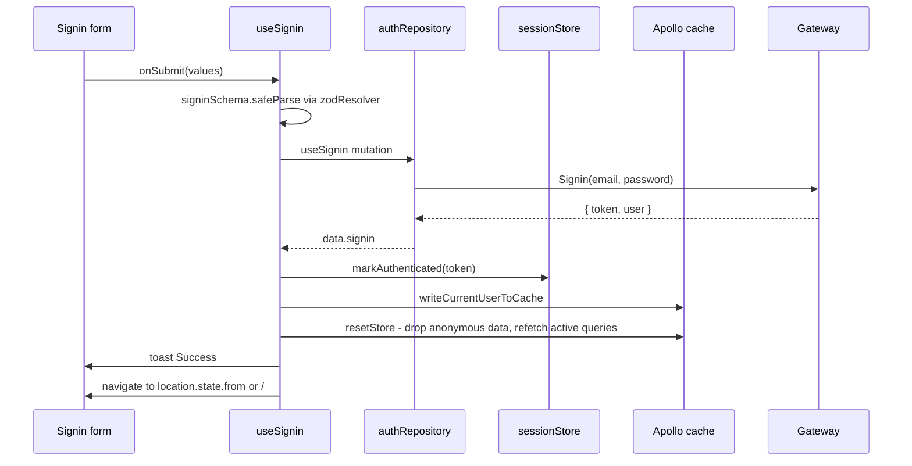
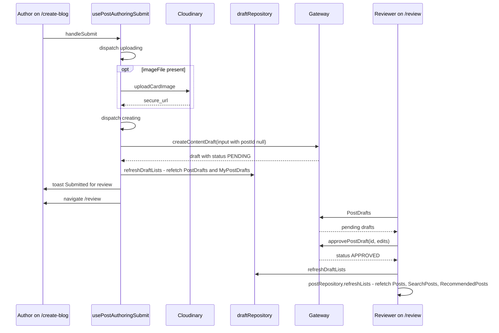
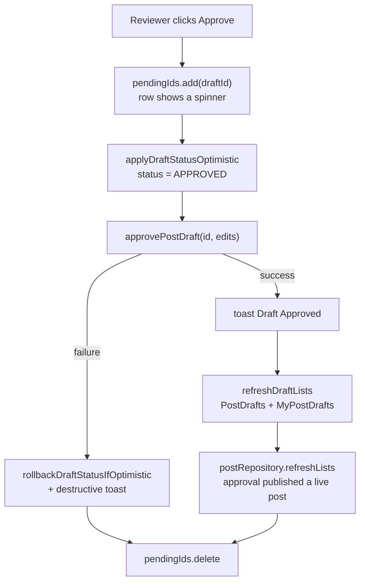
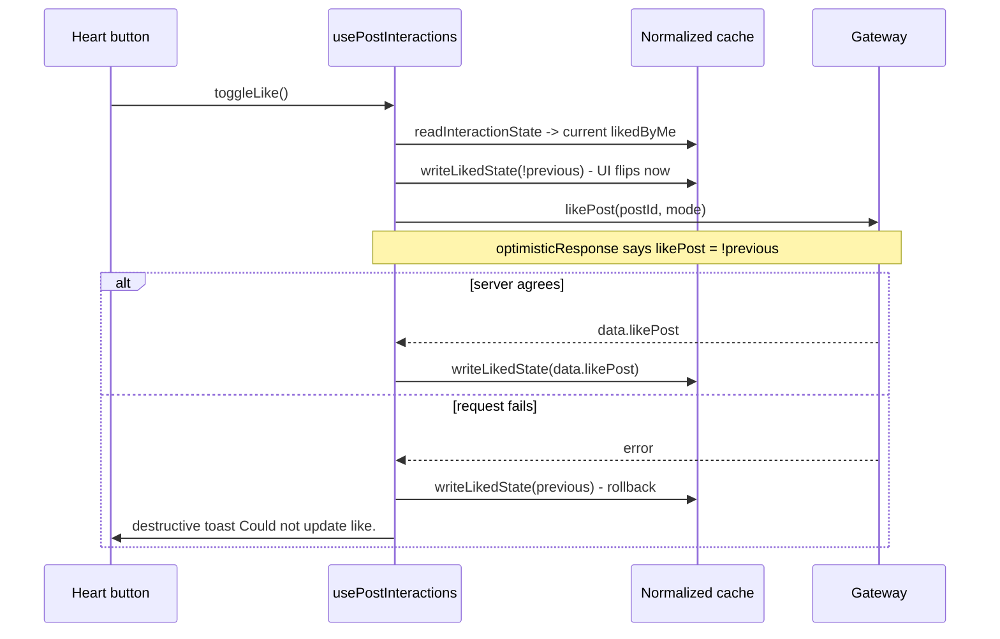
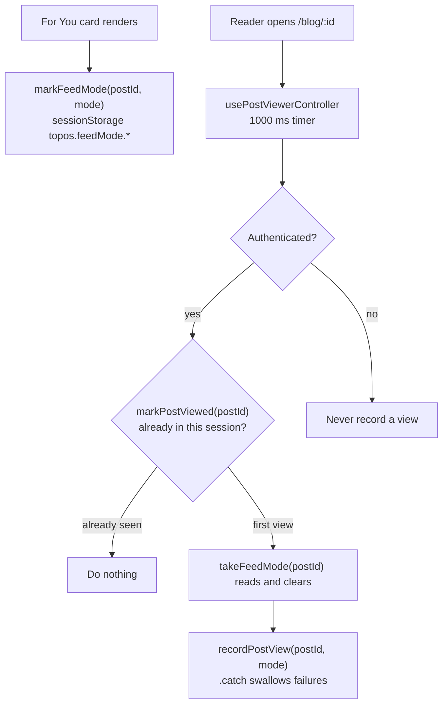
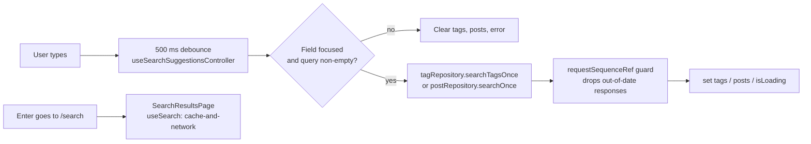
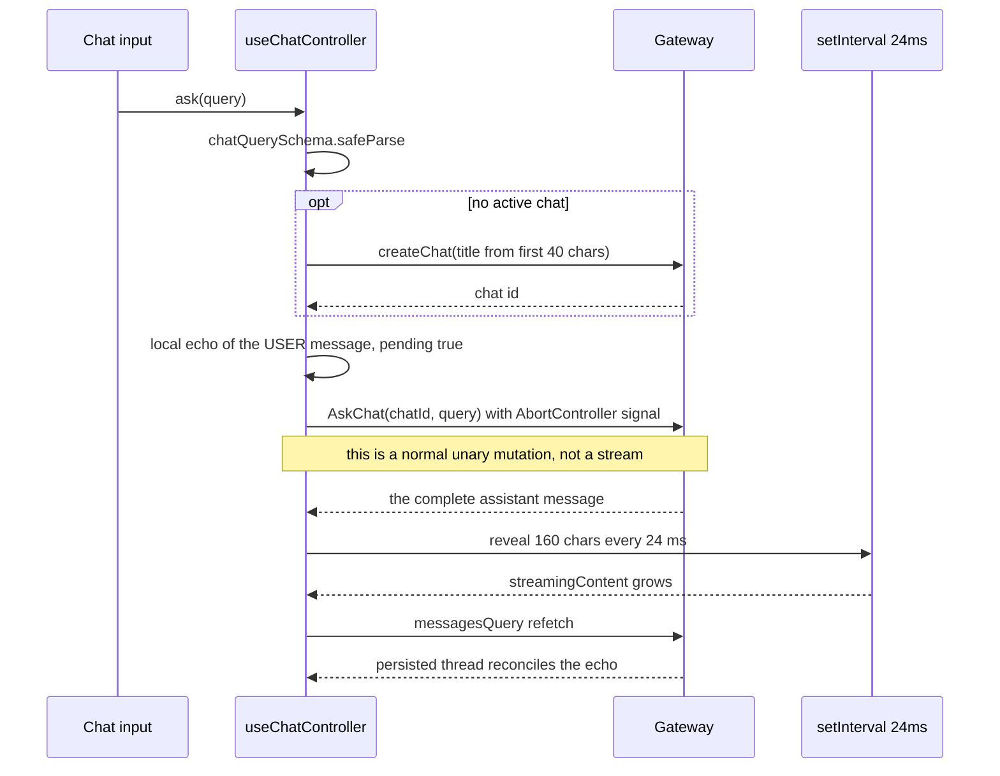

# Request flows

Six flows traced end to end through the real code. Each one starts at a
component, goes out through the Apollo link chain to the gateway, and comes
back into the cache. Read this page with
[Data model](data-model.md) next to it.

## 1. Signing in

Details that matter:

- The redirect target comes from `ProtectedRoute`, which stores
  `state={{ from: location }}` when it bounces you to `/signin`. Following a
  link to `/create-blog` while signed out therefore returns you to
  `/create-blog` afterwards.
- `resetStore()` (not `clearStore()`) runs after `markAuthenticated`. It
  refetches active queries *under the new bearer token*, so public posts
  reappear with correct `likedByMe` values.
- Failures become a destructive toast with
  `getGraphQLErrorMessage(error, "Invalid credentials.")`, which joins every
  GraphQL error message with a space and falls back only if there is none.

## 2. Publishing a post

Topos is review-first: **nothing goes live without a peer approving it.**
There is no code path in the frontend that publishes directly.

Three submit modes share one reducer and one `PostAuthoringSubmitState`:

| Mode | Trigger | Mutation | Result |
| --- | --- | --- | --- |
| `create` | Publishing a new post | `createContentDraft` with `postId: null` | A new `PENDING` entry in the queue |
| `edit` | Saving changes to a live post | `createContentDraft` with `postId: post.id` | A revision proposal; the live post is untouched |
| `resubmit` | Editing a rejected draft | `resubmitContentDraft(id, input)` | Back into the queue, never straight to live |

The reducer cycles `idle → uploading → creating/updating → idle`, or lands on
`{ kind: "error", message }`. `submitLabel()` turns that state into the button
text (`Uploading…`, `Submitting…`, `Resubmitting…`), and `isSubmitInFlight`
disables the form.

Two extra guards:

- A re-entry `isSubmittingRef` makes double-clicks harmless.
- `hasChanges` compares title, body, `JSON.stringify(tags)` and image URL. No
  change means an early return with a `No Changes` toast and no request.

There is a second authoring path: `AIDraftGenerator` can send the prompt
straight to `createPostDraft(prompt)` via `useCreatePostDraft`, which puts an
AI-written post into the same queue instead of the editor.

## 3. Approving, rejecting and withdrawing

`useReviewQueueController` drives the two-section queue (`community` from
`PostDrafts`, `mine` from `MyPostDrafts`) with an optimistic write followed
by a refetch:

| Action | Mutation | Optimistic status | Refreshes post lists |
| --- | --- | --- | --- |
| Approve | `approvePostDraft` | `APPROVED` | Yes, because approval publishes |
| Reject | `rejectPostDraft` | `REJECTED` | No |
| Withdraw | `deletePostDraft` | none | No |
| Resubmit | `resubmitContentDraft` | none | No |

The `pendingRef` `Set` is a second, synchronous guard: the `pendingIds` state
is for rendering, `pendingRef` is what actually blocks a duplicate request.
Both are updated together, and the `finally` block always clears them.

A lost race resolves itself: if someone else approved the draft first, the
mutation fails, the optimistic status rolls back to whatever
`rollbackDraftStatusIfOptimistic` recorded, and the refetch pulls server
truth.

## 4. Liking or saving

Why one `cache.modify` is enough: `Post:id` is a single normalised entity, so
the feed card, the detail page and the author's list all read the same
`likedByMe`. No refetch is needed for a toggle.

The `mode` variable is the recommendation feed the post was shown in, read
from `FeedModeContext` (`DEFAULT` or `SURPRISE`). Posts that appeared outside
a recommendation feed send `null`, so their interactions stay unattributed.

Both toggles bail out early when `isLiking || isSaving`, so a slow request
cannot be stacked on itself.

## 5. Viewing a post and attributing it to a feed

Four independent guards, all in `usePostViewerController`:

| Guard | Constant | What it stops |
| --- | --- | --- |
| `isAuthenticated` | n/a | The mutation requires auth, so anonymous readers never fire it |
| `VIEW_DEBOUNCE_MS = 1000` | one second after the post is ready | Recording a view for someone who bounced straight back |
| `markPostViewed` in-tab `Set` | module-level, lives as long as the tab | Navigating away and back firing twice |
| Redis dedupe on the server | 24 hours | The same across sessions and devices |

Failures are swallowed on purpose with `.catch(() => {})`: a view counter is
telemetry, and a dropped event must never break reading.

`markFeedMode` writes to `sessionStorage` so the handoff survives navigation
but dies with the tab. `takeFeedMode` removes the entry as it reads it, which
means a second visit in the same tab attributes to no feed.

The detail page also polls `summaryStatus` every 3 seconds while it is
`PENDING`, and stops polling as soon as it becomes `COMPLETED` or `FAILED`.

## 6. Searching

Three details worth copying when you write something similar:

1. **`DEBOUNCE_MS = 500`** keeps keystrokes from becoming requests.
2. **`requestSequenceRef`** is an incrementing counter. Every effect run
   bumps it and captures the new value; a response whose captured value no
   longer matches is dropped, so a slow earlier request can never overwrite a
   newer one.
3. **Suggestions do not use the cache.** `searchOnce` runs with
   `fetchPolicy: "no-cache"`, so type-ahead results never evict or pollute
   the real `/search` results, which do use `cache-and-network`.

Closing the field or clearing the query bumps the sequence and empties
everything in one branch, so no stale spinner is left behind.

## 7. Chat

**The "stream" is a client-side animation.** `askChat` is an ordinary
mutation that returns the whole answer; `DEFAULT_STREAM_INTERVAL_MS = 24` and
`DEFAULT_STREAM_CHUNK_SIZE = 160` control how fast the UI reveals it. Nothing
arrives incrementally from the server.

Everything about stopping is therefore local:

| Mechanism | Purpose |
| --- | --- |
| `sequenceRef` increment | A bumped sequence makes any in-flight reveal or response self-cancel |
| `abortRef.current.abort()` | Cancels the HTTP request if it is still open |
| `localEcho` | Optimistic `USER` message rendered before the request resolves |
| `chatQuerySchema.safeParse` | Rejects empty input before any network activity |

`stop()` bumps the sequence, aborts, clears the reveal, resets
`streamingContent` and `localEcho`, and refetches the thread so the stored
messages win.

Switching chats (`selectChat`) does the same cleanup first, which is why the
thread never shows the previous conversation's half-revealed answer.

## Next step

Continue with [User journeys](user-journeys.md).
