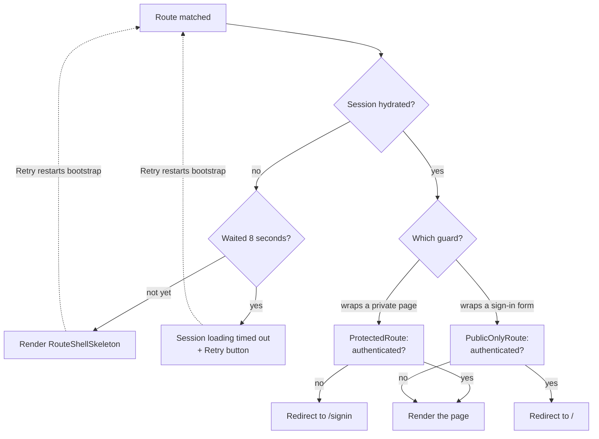
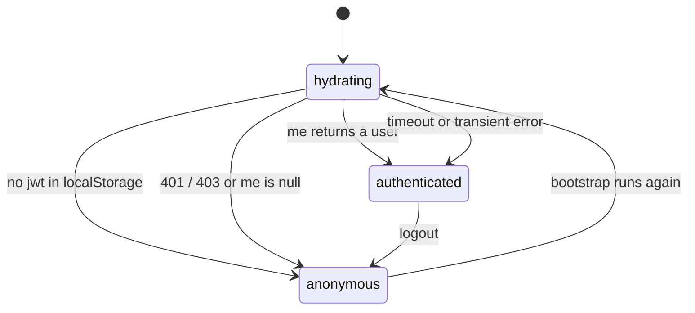
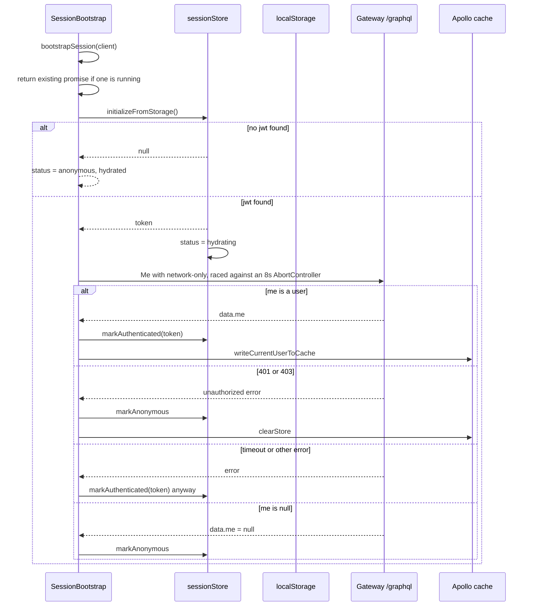

# Routing and session

Two things decide what a visitor sees: the route table in `src/App.tsx`, and
the session store that says whether anybody is signed in. This page covers
both, because the guards between them are where most "why is my page a
skeleton?" questions come from.

## The route table

`App.tsx` renders one `<Suspense fallback={<RouteShellSkeleton />}>` around a
flat list of routes. There is no nested routing and no layout route.

| Path | Guard | Component | Loaded how |
| --- | --- | --- | --- |
| `/signup` | `PublicOnlyRoute` | `Signup` | lazy |
| `/signin` | `PublicOnlyRoute` | `Signin` | lazy |
| `/` | none | `Home` | eager |
| `/blog/:id` | none | `ViewBlogPage` | eager |
| `/create-blog` | `ProtectedRoute` | `CreateNewBlog` | lazy |
| `/profile` | `ProtectedRoute` | `UserProfile` | lazy |
| `/review` | `ProtectedRoute` | `ReviewQueuePage` | lazy |
| `/review/:draftId` | `ProtectedRoute` | `DraftDetailPage` | lazy |
| `/review/:draftId/edit` | `ProtectedRoute` | `DraftResubmitPage` | lazy |
| `/chat` | `ProtectedRoute` | `ChatPage` | lazy |
| `/search` | none | `SearchResultsPage` | eager |
| `*` | none | redirect to `/` | eager |

Three of the twelve entries are public reading routes, so someone can browse,
read and search Topos without an account. Six require a session, and two are
for people who must *not* have one yet.

## What the guards do

Both guards live in `src/app/routing/` and share the same shape:

1. Watch `status` and `hasHydrated` from `useSessionStore`.
2. While hydration is unfinished, render `<RouteShellSkeleton />`.
3. If hydration has not finished after **8 seconds**, render
   `Session loading timed out. Please try again.` with a **Retry** button.
4. Once hydrated, either forward or redirect.

Reading the two branches literally:

| Guard | `authenticated` does | `anonymous` does |
| --- | --- | --- |
| `ProtectedRoute` | render the page | `<Navigate to="/signin" replace />` |
| `PublicOnlyRoute` | `<Navigate to="/" replace />` | render the sign-in or sign-up form |

The Retry button clears `hasTimedOut` and calls
`bootstrapSession(client, 8000)` again. Because `bootstrapSession` is
single-flight, hammering Retry while a request is in flight reuses the same
promise instead of firing duplicates.

## The session state machine

`AuthStatus` has exactly three values, defined in
`src/entities/session/model/session.ts`:

| Status | Meaning | `hasHydrated` |
| --- | --- | --- |
| `hydrating` | Bootstrap has started, result unknown | `false` |
| `authenticated` | A token exists and we are treating the user as signed in | `true` |
| `anonymous` | No token, or the server rejected it | `true` |

The token lives under the localStorage key `jwt`
(`SESSION_TOKEN_STORAGE_KEY`). It is written by `markAuthenticated`, read by
`initializeFromStorage`, and deleted by `markAnonymous`.

## Bootstrapping the session

`SessionBootstrap` calls `bootstrapSession(client)` once, in a `useEffect`,
before routing matters. The full sequence:

### The policy is deliberately optimistic

`bootstrapSession` treats almost every failure as "stay signed in":

| Outcome | Result |
| --- | --- |
| `data.me` is a user | authenticated, cache written |
| HTTP 401 or 403 | logged out, Apollo store cleared |
| `data.me` is `null` | logged out |
| 8 second timeout | still authenticated |
| Network error, 500, malformed response | still authenticated |

Only an explicit rejection or a definite "you have no user" signs you out.
A flaky network therefore keeps your session and lets the route guard show
its own timeout UI, rather than dumping you back on `/signin`.

Two implementation details worth knowing:

- **Single flight.** A module-level `bootstrapPromise` is returned to every
  caller and reset in `finally`. `SessionBootstrap` and both route guards can
  all call it without producing parallel `Me` requests.
- **Unauthorized detection is string-based.**
  `hasUnauthorizedGraphQLError` matches `/unauthorized/i` against the error
  *message*, and `hasUnauthorizedNetworkError` matches status 401 or 403. A
  server that returned `PERMISSION_DENIED` with no "unauthorized" in the text
  would be treated as a transient error and keep the session.

## Signing in and out

| Action | Function | Effect |
| --- | --- | --- |
| Sign in or sign up | `authenticateSession(client, token, user)` | `markAuthenticated`, write `me` into the cache, then `client.resetStore()` |
| Sign out | `logoutSession(client)` | `markAnonymous`, then `client.clearStore()` |

`resetStore()` after sign-in is important: it drops anything cached while the
visitor was anonymous (public posts with `likedByMe: false`, an empty
`myPosts`) and refetches every active query under the new bearer token.
`clearStore()` on sign-out is the mirror image, and it does *not* refetch.

## Scroll behaviour

`ScrollManager` sits inside `BrowserRouter` and turns on
`history.scrollRestoration = "manual"` so React owns scrolling:

| Navigation | Scroll position |
| --- | --- |
| Back or forward (`POP`) | Restored to the saved offset for that history entry |
| Path change from a link click | Top of the page |
| Same path, different query | Unchanged |

Offsets are kept in a `Map` keyed by `location.key` in a `useRef`, so they
last for the session but never leak into localStorage.

## Common symptoms

| Symptom | Likely cause |
| --- | --- |
| Infinite skeleton on `/profile` | Bootstrap never resolves; after 8s you should get the Retry card instead. If neither appears, check the network tab |
| Sent to `/signin` although you have a `jwt` | The gateway answered 401/403 or `me: null`. Your token has expired |
| Sent to `/` right after opening `/signin` | You are already authenticated. `PublicOnlyRoute` redirects signed-in users away |
| Data looks like the previous user's after switching accounts | `resetStore()` did not finish; see `authenticateSession` |
| Scroll position wrong after pressing Back | `ScrollManager` was unmounted, or the entry was evicted from the in-memory map |

## Next step

Continue with [Data model](data-model.md).
