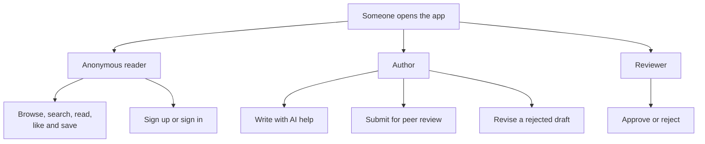

# User journeys

This page is the map of what a person can actually do in Topos, and which
part of the code implements each move. Read it before touching a feature so
you know where the entry point is.

## Three kinds of visitor

Only `/`, `/blog/:id` and `/search` are reachable without a session. Everything
else passes through `ProtectedRoute` or `PublicOnlyRoute`, as described in
[Routing and session](routing-and-session.md).

## Journey 1: read and interact

| Step | Route | Component and controller |
| --- | --- | --- |
| Land on the feed | `/` | `Home.tsx` → `BlogList` or `ForYouList` |
| Switch feed | `/` | `Tabs` with values `latest` and `for-you` |
| Reshuffle the feed | `/` | `ForYouList.handleSurprise` sets `mode = "SURPRISE"` |
| Search from the navbar | `/` | `SearchBar`, `useSearchSuggestionsController` |
| See full results | `/search` | `SearchResultsPage`, `postRepository.useSearch` |
| Open a post | `/blog/:id` | `ViewBlogPage`, `usePostViewerController` |
| Like or save | anywhere | `usePostInteractions` |
| Read the AI summary | `/blog/:id` | `AISummaryDialog` |
| Read related posts | `/blog/:id` | `BlogRelatedSection` |

Two feed modes exist, and only the recommendation feed is personalised:

| Tab | Query | Requires sign-in |
| --- | --- | --- |
| Latest | `postRepository.useList` → `Posts` | No, and it is the fallback |
| For You | `postRepository.useRecommended` → `RecommendedPosts` with `mode` and `seed` | Yes |

`ForYouList` degrades gracefully. If `recommendedPosts` errors or comes back
empty, it sets `useLatestFallback`, shows a destructive toast
`Personalized feed unavailable / Showing latest posts instead.`, and renders
the Latest list instead with a **Retry personalized feed** button. Anonymous
visitors skip the personalised query entirely.

The `seed` is held in session storage, so reloading the page keeps the same
shuffle while **Surprise me** generates a fresh one.

## Journey 2: sign up and sign in

| Step | Route | Component |
| --- | --- | --- |
| Create an account | `/signup` | `features/auth/components/Signup.tsx`, `useSignup` |
| Sign in | `/signin` | `features/auth/components/Signin.tsx`, `useSignin` |
| Validation | both | Zod schemas in `features/auth/model/` |
| Password field | both | `PasswordField.tsx` |
| Post-login landing | any | `location.state.from`, falling back to `/` |
| Session persistence | n/a | `jwt` in `localStorage` |

Both forms use `react-hook-form` with `zodResolver`, and both sanitize
username input through `sanitizeUsernameInput` before submitting.

## Journey 3: write a post

The authoring surface is `/create-blog`, built around
`usePostAuthoringController({ mode: "create" })`:

| Part | Widget or component |
| --- | --- |
| Title | `BlogTitleSection` |
| AI brief | `AIDraftGenerator` (quick) or `WritingStudio` (guided) in tabs |
| Rich text body | `BlogEditor` (`react-quill-new`) |
| Cover image | `FeaturedImageSection` + `useImageUpload` |
| Tags | `BlogTagSection` |
| Publish checklist | `PublishChecklistItem` |
| Submit | `usePostAuthoringSubmit` |

The checklist reads `isTitleReady`, `isContentReady` and `isCoverImageReady`
from controller state. Cover images upload to Cloudinary, except in preview
mode where uploads are disabled and a `picsum` placeholder is used instead.

There are three ways in:

1. **Write it yourself**, then submit. `createContentDraft` sends it to the
   queue.
2. **Describe it** in `AIDraftGenerator` (the *Quick prompt* tab) and press
   **Generate Draft**. The `GeneratePostContent` mutation fills title, body
   and tags, which you then refine in the editor before submitting.
3. **Guide it** in the `WritingStudio` (the *Guided studio* tab). You fill a
   brief — audience, tone, length, structure, keywords, key points — and
   generate a full draft. Each section can then be regenerated on its own
   with adjusted instructions until it reads right. Submitting sends
   `createContentDraft` with the studio's brief attached as `generation`,
   so reviewers see the `GUIDED_STUDIO` origin and settings.

Either way the result is `PENDING` in the review queue. See
[Request flows](request-flows.md#2-publishing-a-post).

## Journey 4: review a peer's post

| Step | Route | Component |
| --- | --- | --- |
| Open the queue | `/review` | `ReviewQueuePage`, `useReviewQueueController` |
| Read a draft | `/review/:draftId` | `DraftDetailPage` |
| Approve or reject | `/review` | `ApproveConfirmDialog` / reject dialog |
| Fix a rejection | `/review/:draftId/edit` | `DraftResubmitPage` |

The queue has two independent paginated sections, each with its own `page`
state and its own `loading | error | ready` status:

| Section | Query | Shows |
| --- | --- | --- |
| Community | `PostDrafts` | Everything waiting for review |
| Mine | `MyPostDrafts` | Drafts you authored |

Status changes are written optimistically onto the normalised `PostDraft`
entity, so the row reacts immediately, then both lists refetch. Details in
[Request flows](request-flows.md#3-approving-rejecting-and-withdrawing).

## Journey 5: manage your profile

| Step | Route | Component |
| --- | --- | --- |
| Open your profile | `/profile` | `UserProfile.tsx` |
| Edit details | `/profile` | `useProfileEditorController` |
| Your posts | `/profile` | `MyPosts` |
| Account menu | any | `AccountMenu.tsx`, `MobileMenu.tsx` |

Profile edits reuse the `UpdateProfile` operation from
`src/shared/graphql/operations/update-profile.graphql`, so its types come from
codegen rather than a hand-written interface.

## Journey 6: chat with citations

| Step | Route | Component |
| --- | --- | --- |
| Open chat | `/chat` | `ChatPage.tsx` |
| Pick or create a thread | `/chat` | `useChatController.selectChat` / `createChat` |
| Ask | `/chat` | `useChatController.ask` |
| Stop the answer | `/chat` | `useChatController.stop` |
| Read citations | `/chat` | `citedPostIds` on each `ChatMessage` |

The answer appears to stream but does not: see
[Request flows](request-flows.md#7-chat).

## Cross-cutting behaviours

These appear in several journeys at once:

| Behaviour | Where it shows up |
| --- | --- |
| Destructive toast on failure | Every mutation, via `useAppError` |
| Skeleton instead of a spinner | Route shells, feed cards, draft rows, the detail page |
| Optimistic UI with rollback | Like, save, approve, reject |
| Cache eviction plus refetch | After any post or draft mutation |
| Feed attribution | Views and interactions in the For You feed |
| Preview banner and disabled uploads | Anywhere when `VITE_ENV_TYPE=preview` |

## Where to look first

| You want to change… | Start in |
| --- | --- |
| What appears on the home page | `src/pages/Home.tsx`, then `src/features/blog/components/` |
| A form or a mutation | `src/features/<area>/` controller hook |
| How data is fetched | `src/entities/<name>/api/<name>Repository.ts` |
| A GraphQL operation | `src/shared/graphql/` or the entity's `api/` directory |
| A shared visual element | `src/shared/ui/` |
| The navigation bar | `src/widgets/navbar/` |
| A route | `src/App.tsx`, then the guard in `src/app/routing/` |

## Next step

Continue with [Mock and preview modes](mock-and-preview.md).
