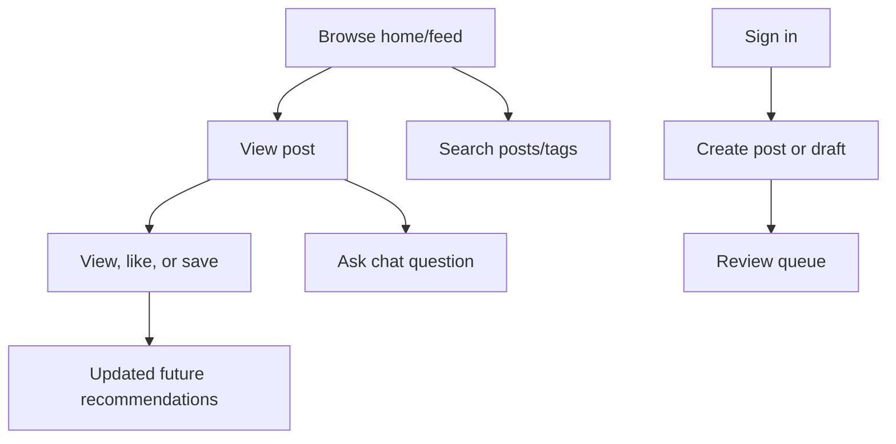

# Frontend user journeys

The route pages and feature modules reveal the product surface: authoring,
review, search, profile, chat, and feed features are separate frontend areas.
The backend sequence details are documented in the corresponding service guides
rather than duplicated here.
