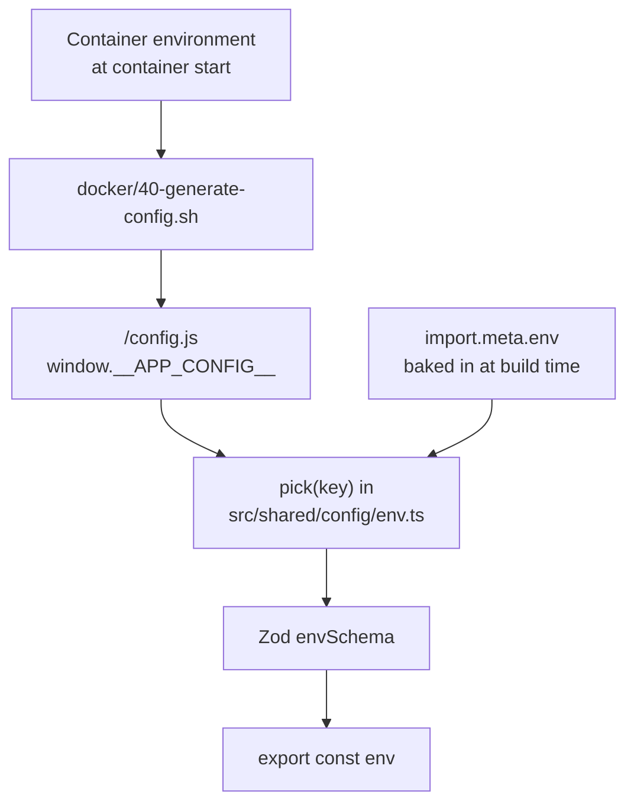

# Configuration

The frontend reads six environment variables. Two of them are mandatory, and
the rest only matter for specific features. This page explains what each one
does, where the values come from, and what happens when they are wrong.

## The six variables

| Variable | Required | Default | What it controls |
| --- | --- | --- | --- |
| `VITE_GRAPHQL_URL` | Yes | none | The gateway endpoint every operation is sent to |
| `VITE_ENV_TYPE` | No | `dev` | One of `preview`, `dev`, `prod`. Drives mocks, preview UI and build flavour |
| `VITE_ENABLE_MOCKS` | No | empty | `"true"` turns MSW on in `dev` mode |
| `VITE_CLOUDINARY_CLOUD_NAME` | No | empty | Cloudinary cloud used for image uploads |
| `VITE_CLOUDINARY_UPLOAD_PRESET` | No | empty | Unsigned upload preset for those images |
| `VITE_BACKEND_URL` | No | empty | Reserved. Validated and injected, but no application code reads it |

Copy the template to get started:

```bash
cp .env.example .env
```

Vite loads `.env`, `.env.local` and `.env.<mode>` automatically for any
variable prefixed with `VITE_`. Only `VITE_` variables are exposed to browser
code; everything else stays on the server side.

## Where the values come from

A value can arrive from one of two places, and the runtime one wins.



The rule, implemented by `pick()` in `src/shared/config/env.ts`, is:

```text
if (window.__APP_CONFIG__ has the key) use it, otherwise use import.meta.env
```

That is what lets **one built image** serve development, preview and
production. The bundle contains the same JavaScript everywhere; only the
small `config.js` file that nginx writes at container start changes.

`index.html` loads it with `<script src="/config.js"></script>` before the
app bundle. In the Vite dev server that file does not exist, so the request
404s and `window.__APP_CONFIG__` stays undefined. That is harmless: the app
falls back to `import.meta.env` and behaves exactly as before.

## Validation

`src/shared/config/env.ts` validates the merged values with a Zod schema
before anything else runs:

```text
VITE_ENV_TYPE    enum preview | dev | prod, defaults to dev
VITE_GRAPHQL_URL string with at least 1 character
everything else  optional string
```

The result is exported as `hasValidEnv`. When validation fails:

- `logger.error("Invalid environment configuration", …)` runs in the console,
  and `getEnvError()` returns the flattened Zod issues.
- `App` renders a full-screen `role="alert"` that says
  `VITE_GRAPHQL_URL is not configured` and stops there. No routes render.
- `AppApolloProvider` logs `Missing VITE_GRAPHQL_URL` as well.

So a misconfigured deployment shows an explicit message rather than a blank
page full of failed network requests.

## `VITE_ENV_TYPE`

This single value decides three things:

| `VITE_ENV_TYPE` | `shouldEnableMocks` | Preview banner | Typical use |
| --- | --- | --- | --- |
| `dev` | only if `VITE_ENABLE_MOCKS=true` | no | Everyday development |
| `preview` | yes, always | yes | Demo with local data |
| `prod` | never, hard-disabled | no | Real deployment |

`shouldEnableMocks` is `!isProdEnv && (isPreviewEnv || VITE_ENABLE_MOCKS === "true")`.
`src/main.tsx` checks it and dynamically imports `@/mocks/browser` to start
the MSW service worker before rendering. Production builds can therefore
never accidentally ship the mock layer, even if someone sets
`VITE_ENABLE_MOCKS=true` in the container environment.

## Cloudinary

`src/entities/upload/lib/use-image-upload.tsx` builds a
`cloudinaryImageProvider` from the two Cloudinary variables. The provider
posts a `FormData` body straight to

```text
https://api.cloudinary.com/v1_1/<cloudName>/image/upload
```

using the unsigned `upload_preset`. If either value is missing the provider
throws `"Cloudinary configuration is missing. Please check your environment
variables."` before any network call. Preview mode refuses earlier still,
with `PREVIEW_DISABLED_REASON = "Not available in preview mode"`.

## Ports

| Port | Used by | Set by |
| --- | --- | --- |
| `5173` | Vite dev server, and nginx's default when the image runs standalone | Vite; `ENV PORT=5173` in `frontend/Dockerfile` |
| `3000` | nginx inside the compose stack | `FRONTEND_INT_PORT` and `FRONTEND_EXT_PORT` in `.env` |
| `4000` | The gateway the app talks to | `VITE_GRAPHQL_URL` |

`docker/default.conf.template` writes `listen ${PORT};`, so the container
environment decides which port nginx binds. Compose sets `PORT=3000`;
running the image bare leaves it at `5173`.

## Configuration in tests

`vitest.config.ts` does not read `.env`. It hard-codes the values with Vite's
`define` block:

| Key | Test value |
| --- | --- |
| `import.meta.env.VITE_GRAPHQL_URL` | `http://localhost:4000/graphql` |
| `import.meta.env.VITE_BACKEND_URL` | `http://localhost:8787` |
| `import.meta.env.VITE_CLOUDINARY_CLOUD_NAME` | empty string |
| `import.meta.env.VITE_CLOUDINARY_UPLOAD_PRESET` | empty string |

Tests therefore always pass validation and never depend on your machine's
environment. Note that `VITE_BACKEND_URL` is `8787` in tests but `4000` in
`.env.example`; because nothing reads it, the difference has no effect.

## Next step

Continue with [Application architecture](../concepts/architecture.md).
