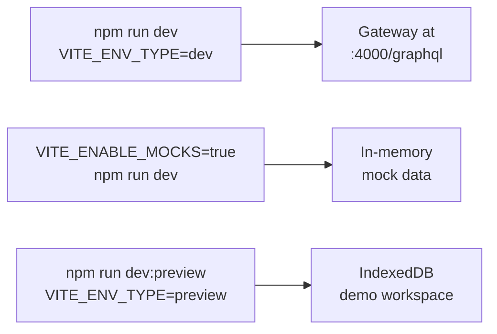

# Quick start

By the end of this page you will have the frontend running in your browser
with data on screen, and you will know which of the three run modes to use.

## What you need

| Tool | Version used by this repo | Check it |
| --- | --- | --- |
| Node.js | 20 (what CI and the Dockerfile use) | `node --version` |
| npm | comes with Node | `npm --version` |
| GNU Make | any | `make --version` |
| Docker | only if you want the whole platform | `docker --version` |

All commands below run from the `frontend/` directory.

## Install

```bash
cd frontend
npm ci
```

`npm ci` installs exactly what `package-lock.json` says. Use `make install` if
you prefer the Makefile alias.

## Pick a run mode

The frontend has three development modes. They differ in where the data comes
from, not in what the code looks like.



| Mode | Command | Data source | Needs a back end? |
| --- | --- | --- | --- |
| Real | `make dev` | The gateway on `localhost:4000` | Yes |
| Mock | `VITE_ENABLE_MOCKS=true npm run dev` | MSW handlers with in-memory data | No |
| Preview | `make dev-preview` | MSW handlers over IndexedDB | No |

All three start Vite on <http://localhost:5173>.

- **Real** is what you want when you are working on the gateway or the
  subgraphs and need true responses.
- **Mock** is a clean slate that resets on every page reload. Good for
  iterating on layout and state without fighting real data.
- **Preview** persists to IndexedDB, seeds a demo workspace, and shows a
  banner. Good for demonstrations on a laptop with no Docker running.

The differences are described in
[Mock and preview modes](../concepts/mock-and-preview.md).

## Run against the whole platform

If you want the real thing, start the stack from the repository root, then
start the dev server next to it:

```bash
# from the repository root
make local-up

# in a second terminal
cd frontend
make dev
```

`make local-up` merges `frontend/infra/compose.yml` together with the user,
content, AI and gateway compose files into one project, so the gateway is
already listening on `localhost:4000` when Vite starts.

If `VITE_GRAPHQL_URL` is missing or empty the app boots to a full-screen
alert instead of the UI. See [Configuration](configuration.md).

## Regenerate GraphQL types

Run this whenever you change a GraphQL operation, a fragment, or one of the
schemas the codegen reads from:

```bash
npm run codegen
```

Codegen reads two files that live *outside* `frontend/`:

- `../services/user/schema.graphql`
- `../services/content/graph/schema.graphqls`

It does not contact a running gateway. That means codegen fails loudly when a
query you wrote no longer matches the sibling service's schema, which is
exactly the check you want before opening a pull request. See
[Data model](../concepts/data-model.md).

## Check your work

```bash
npm run lint      # eslint
npm test          # unit tests, integration tests excluded
npm run build     # codegen, then tsc -b, then vite build
```

Three things worth remembering:

1. `npm run lint` runs ESLint only. It does not type-check.
2. `npm run build` is the only command that runs `tsc`, so run it before you
   push.
3. Tests are hermetic: they start an MSW server in Node and never open a
   socket to your machine.

More in [Testing overview](../testing/overview.md).

## Common problems

| Symptom | Cause | Fix |
| --- | --- | --- |
| Full-screen alert about configuration | `VITE_GRAPHQL_URL` is not set | Copy `.env.example` to `.env`, or use `VITE_ENABLE_MOCKS=true npm run dev` |
| Port 5173 already in use | Another Vite is running | Stop it, or run `npm run dev -- --port 5174` |
| Blank page and a 404 for `/config.js` in dev | The dev server has no `config.js`; only Docker generates one | Harmless. The app falls back to `import.meta.env` |
| `Cannot use import statement outside a module` | Dependencies out of sync | `npm ci` |
| Types out of date after editing a query | Codegen not re-run | `npm run codegen` |
| Tests fail but the app works | Stale generated types | `npm run codegen` then `npm test` |

## Next step

Continue with [Configuration](configuration.md), or jump to
[Application architecture](../concepts/architecture.md).
