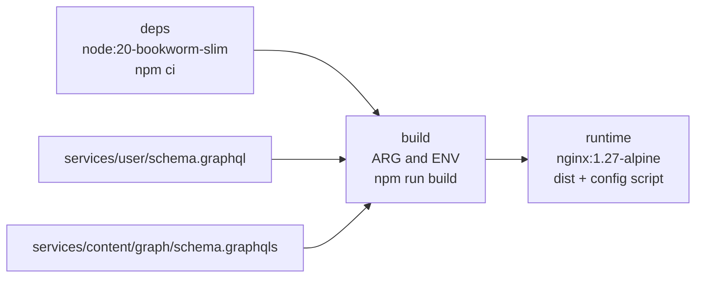
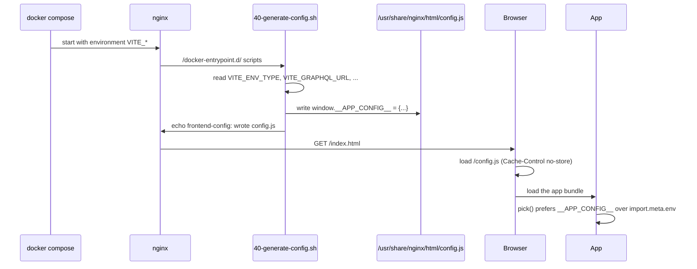
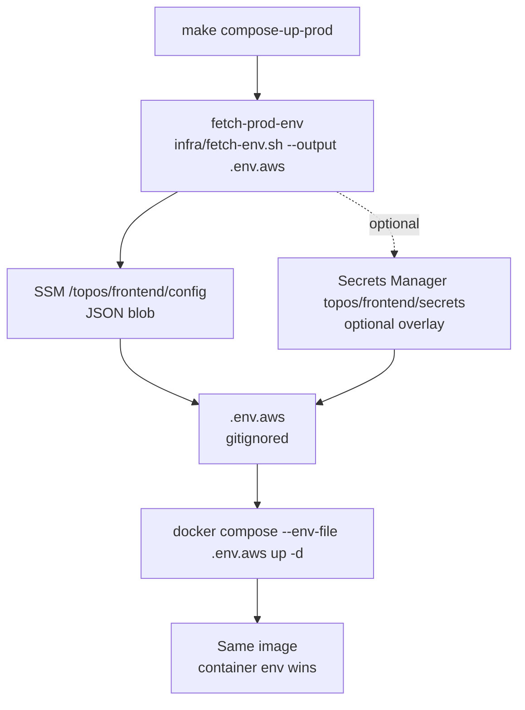
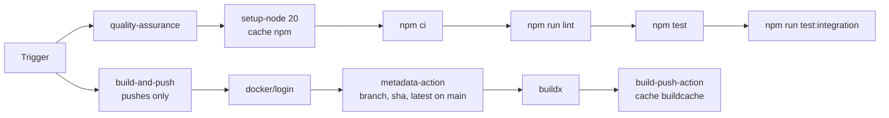

# Build and deployment

The frontend ships as one Docker image that serves development, preview and
production. The bundle is identical in all three; only a small `config.js`
written at container start changes.

## Image stages

`frontend/Dockerfile` has three stages:

| Stage | Base | Purpose |
| --- | --- | --- |
| `deps` | `node:20-bookworm-slim` | `npm ci` from `frontend/package*.json` only, so dependency installation is cached |
| `build` | inherits `deps` | Copies `frontend/` plus the two sibling schemas, then runs `npm run build` |
| `runtime` | `nginx:1.27-alpine` | Serves `/usr/share/nginx/html`, exposes 5173 |

Copying the two schema files is what makes `npm run codegen` work inside the
image: the build fails if the frontend's operations no longer match the
subgraph schemas.

> **Note.** There is no `.dockerignore`, so `COPY frontend/ ./` brings in
> whatever is in your working tree, including `frontend/node_modules` and
> `frontend/dist` when you have built locally. CI is unaffected because its
> checkout has neither.

## Runtime configuration

`index.html` contains `` before the module
entry point, so configuration exists before `env.ts` evaluates.

The script escapes backslashes and single quotes and strips newlines, then
writes six keys. Anything left unset becomes an empty string rather than
`undefined`, which is fine because the Zod schema marks five of the six
optional.

## nginx behaviour

`docker/default.conf.template` is rendered by the nginx image's template
mechanism, so `${PORT}` comes from the container environment:

| Location | Behaviour |
| --- | --- |
| `= /config.js` | `Cache-Control: no-store` so a restart is visible immediately |
| `/assets/` | `Cache-Control: public, max-age=31536000, immutable` |
| `/` | `try_files $uri $uri/ /index.html` so deep links work |

The SPA fallback is why `/blog/abc` can be loaded directly. The immutable
asset header is why Vite's hashed filenames must never be served stale.

| Where `PORT` comes from | Value |
| --- | --- |
| `Dockerfile` `ENV PORT` | `5173` |
| Compose `environment.PORT` | `3000`, from `FRONTEND_INT_PORT` |
| `.env.example` | `FRONTEND_INT_PORT=3000`, `FRONTEND_EXT_PORT=3000` |

## Compose targets

All targets run from `frontend/` and use `infra/compose.yml`.

| Target | What it does |
| --- | --- |
| `make compose-up` | `docker compose up -d --build` for dev |
| `make compose-up-preview` | Same image, `VITE_ENV_TYPE=preview`, no rebuild |
| `make compose-build` | Build once with dummy baked values |
| `make compose-down` / `compose-ps` / `compose-logs` | Lifecycle |
| `make compose-restart` | Down then up with build |
| `make compose-clean` | Down with `--volumes --remove-orphans` |
| `make compose-config` | Validate and print the resolved config |

### Production

| Setting | Default |
| --- | --- |
| `AWS_REGION` | `ap-south-1` |
| `AWS_ENDPOINT_URL` | empty, meaning real AWS; set it for LocalStack |
| `FRONTEND_SSM_PARAM` | `/topos/frontend/config` |
| `FRONTEND_SM_SECRET` | `topos/frontend/secrets`, missing is not an error |

`fetch-env.sh` is a no-op unless `VITE_ENV_TYPE=prod`, so the dev and
preview targets never touch AWS. It requires `aws` and `jq`. The output file
`.env.aws` is gitignored.

### Running the whole platform

From the repository root, `make local-up` merges
`frontend/infra/compose.yml` with the user, content, AI and gateway compose
files. The frontend service definition lives in `frontend/infra/compose.yml`:

| Setting | Value |
| --- | --- |
| `build.context` | `../..` (the repository root) |
| `dockerfile` | `frontend/Dockerfile` |
| Build args | all six `VITE_*` variables, defaulted from the environment |
| Environment | the same six, plus `PORT` |
| Ports | `${FRONTEND_EXT_PORT}:${FRONTEND_INT_PORT}` |
| Network | `app-network`, shared with the rest of the stack |
| `container_name` | `${FRONTEND_CONTAINER:-local-frontend}` |

Build args and environment deliberately carry the same values, so
`docker compose up` without `--build` still picks up an environment change
through `config.js`.

## CI

`.github/workflows/service-frontend.yaml` runs two jobs.

| Job | Runs on | Steps |
| --- | --- | --- |
| `quality-assurance` | every trigger | `npm ci`, `npm run lint`, `npm test`, `npm run test:integration` |
| `build-and-push` | push to `main` or `staging`, and `workflow_dispatch` | login, metadata, buildx, push |

| Detail | Value |
| --- | --- |
| Image | `kunalpisolkar/topos-frontend` |
| Tags | branch ref, commit SHA, and `latest` on `main` |
| Build cache | `:buildcache` in the registry, `mode=max` |
| Node | 20, cached on `frontend/package-lock.json` |
| Path filters | `frontend/**`, `services/user/schema.graphql`, `services/content/graph/schema.graphqls`, and the workflow file itself |

The path filters matter: editing either subgraph schema re-runs the frontend
workflow, because codegen would otherwise be the only thing to notice.

Note that **the image is built with secrets as build args**, so the values
baked into `dist/` are not the runtime truth for a compose deployment.
Compose still supplies container environment, and `config.js` wins.

## Local build commands

| Command | Result |
| --- | --- |
| `npm run build` | codegen, `tsc -b`, `vite build` with `VITE_ENV_TYPE=dev` |
| `npm run build:preview` | same with `VITE_ENV_TYPE=preview` |
| `npm run build:prod` | same with `VITE_ENV_TYPE=prod` |
| `npm run preview` | Serves `dist/` locally with `vite preview` |
| `make clean` | Removes `dist`, `coverage`, `node_modules/.vite` |

## Checklist for shipping a change

1. `npm run lint`.
2. `npm test` and `npm run test:integration`.
3. `npm run build`, so codegen and `tsc` both run.
4. If you changed a schema, confirm the sibling service is in the same
   commit or already merged, since codegen reads it from disk.
5. If you added an environment variable, update `.env.example`,
   `docker/40-generate-config.sh`, `infra/compose.yml` (both `build.args`
   and `environment`), `vitest.config.ts` and `src/vite-env.d.ts`.

## Next step

Continue with [Testing overview](../testing/overview.md).
