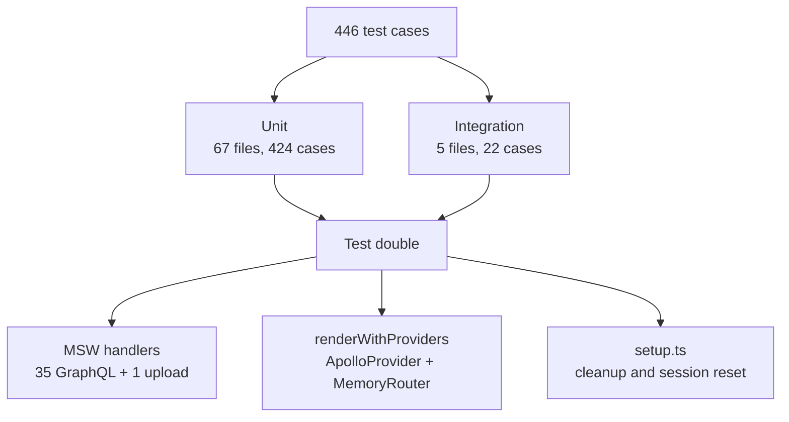

# Testing overview

Tests run with Vitest in jsdom, against MSW handlers instead of a network.
Everything is hermetic: no Docker, no gateway, no database.

## Commands

All from `frontend/`:

| Command | What it runs |
| --- | --- |
| `npm test` | Everything except `*.integration.test.*` |
| `npm run test:watch` | The same, in watch mode |
| `npm run test:coverage` | Coverage with an 80% threshold |
| `npm run test:integration` | Only files whose name contains `integration` |
| `npm run lint` | ESLint |
| `npm run build` | `codegen`, `tsc -b`, `vite build` |

`make test`, `make test-integration`, `make test-coverage` and `make lint` are
aliases for the same scripts.

## The numbers



| Kind | Files | Test cases |
| --- | --- | --- |
| Unit | 67 | 424 |
| Integration | 5 | 22 |
| **Total** | **72** | **446** |

Integration files are named `*.integration.test.tsx` and live next to the
code they cover:

| File | Area |
| --- | --- |
| `features/auth/components/__tests__/AuthFlow.integration.test.tsx` | Sign-up and sign-in round trip |
| `pages/__tests__/CreateNewBlog.integration.test.tsx` | Authoring and submission |
| `pages/__tests__/Home.integration.test.tsx` | Feed and search entry |
| `pages/__tests__/SearchResultsPage.integration.test.tsx` | Results paging |
| `pages/__tests__/ViewBlogPage.integration.test.tsx` | Detail page and interactions |

They are **not** testcontainers tests. They use the same MSW handlers as unit
tests, just across a whole page, so `npm run test:integration` needs no Docker.

### Where the tests live

Counted by file, so the split stays true as tests are added:

| Directory | Test files | of which integration |
| --- | --- | --- |
| `src/features/` | 39 | 1 |
| `src/shared/` | 11 | 0 |
| `src/pages/` | 7 | 4 |
| `src/entities/` | 6 | 0 |
| `src/widgets/` | 5 | 0 |
| `src/mocks/` | 3 | 0 |
| `src/app/` | 1 | 0 |

Features carry most of the weight, which matches the architecture: controllers
in `features/blog` and `features/user` contain the behaviour worth asserting.

## Configuration

`vitest.config.ts` sets four things up:

| Setting | Value | Why |
| --- | --- | --- |
| `environment` | `jsdom` | DOM APIs without a browser |
| `globals` | `true` | `describe`, `it`, `expect` without imports |
| `setupFiles` | `./src/test/setup.ts` | MSW server, cleanup, session reset |
| `css` | `true` | Styles are parsed so class-based assertions work |

The `define` block hard-codes the environment:

| Key | Value |
| --- | --- |
| `import.meta.env.VITE_GRAPHQL_URL` | `http://localhost:4000/graphql` |
| `import.meta.env.VITE_BACKEND_URL` | `http://localhost:8787` |
| `import.meta.env.VITE_CLOUDINARY_CLOUD_NAME` | `""` |
| `import.meta.env.VITE_CLOUDINARY_UPLOAD_PRESET` | `""` |

Tests therefore pass Zod validation regardless of your shell.

## Test plumbing

Three files under `src/test/`:

| File | Role |
| --- | --- |
| `setup.ts` | Starts the MSW server, cleans up React, resets the session |
| `server.ts` | `setupServer(...handlers)` from the shared handler array |
| `render-with-providers.tsx` | `renderWithProviders(ui, { route, state })` |

### Lifecycle hooks

```text
beforeAll   server.listen({ onUnhandledRequest: "error" })

afterEach   cleanup()
            server.resetHandlers()
            sessionStoreActions.resetForTests()
            resetSessionBootstrapForTests()

afterAll    server.close()
```

`onUnhandledRequest: "error"` is the important setting: a test that triggers
a request nobody handles fails immediately rather than silently hitting the
network.

`resetSessionBootstrapForTests()` clears the module-level
`bootstrapPromise`, which is what stops single-flight state from leaking
between tests.

### Rendering

```text
renderWithProviders(<MyPage />, { route: "/blog/123", state: { from: ... } })
```

wraps the component in an `ApolloProvider` plus a `MemoryRouter`. Two
consequences:

1. The router is memory-based, so `useNavigate` and `Link` work without a DOM
   history.
2. `getToken` is hard-coded to `() => null`, so components render as an
   anonymous visitor unless a test injects a session itself.

### What the handlers cover

The same 35 GraphQL handlers used by `dev:mock` and `dev:preview` serve the
tests, plus the Cloudinary stub. See
[Mock and preview modes](../concepts/mock-and-preview.md).

## Contract tests

`src/shared/graphql/__tests__/schema.contract.test.ts` reads the sibling
service schemas directly from disk with `readFileSync` and asserts that
operations the frontend depends on still exist:

| Schema file | Asserts |
| --- | --- |
| `../services/user/schema.graphql` | `updateProfile` |
| `../services/content/graph/schema.graphqls` | `createPost`, `updatePost`, `deletePost`, `postsByTag`, `tags(query: String, limit: Int)`, `searchPosts`, `SearchResult` |

These run in the normal unit suite and fail on a checkout where a sibling
service removed a field, even before codegen notices.

## Coverage

```text
provider   v8
reporters  text, html, json-summary
output     ./coverage
thresholds lines 80, functions 80, branches 80, statements 80
```

The exclude list is long and worth reading before you chase a low number:

| Excluded | Reason |
| --- | --- |
| `src/main.tsx` | Composition root |
| `src/test/**`, `*.test.*`, `*.spec.*` | Test code |
| Barrel files (`index.ts`), `types.ts`, `*.d.ts` | Re-exports and declarations |
| `src/shared/ui/primitives/**` | Vendored shadcn components |
| `src/shared/ui/theme/**` | Theme provider |
| `src/shared/lib/cn.ts`, `logger.ts`, `storage.ts` | Trivial or environment-bound |
| `src/shared/api/httpClient.ts` | Thin fetch wrapper |
| `src/shared/graphql/generated/**` | Codegen output |
| `src/entities/tag/model/**` | Constants |
| `src/widgets/blog-author-sidebar/**` | Presentational |
| `BlogTagSection.tsx`, `FeaturedImageSection.tsx` | Presentational |

If you add a file that is pure markup, the honest options are to test it or
to add it to this list with a reason.

## Conventions

| Convention | Detail |
| --- | --- |
| Co-locate | `__tests__` next to the file, name `*.test.ts(x)` |
| Split integration | `*.integration.test.tsx` so `npm test` can exclude it |
| Reset state | Let `setup.ts` do it; add a reset helper if you introduce module state |
| Prefer fake timers over sleeps | The controllers take intervals as arguments (`intervalMs`, `chunkSize`) so tests can override them |
| Assert on user-visible output | `@testing-library` queries by role and text |
| Mock at the MSW boundary | Add a handler rather than stubbing a repository |

## CI

The `quality-assurance` job in `.github/workflows/service-frontend.yaml`
runs, in order:

```text
npm ci
npm run lint
npm test
npm run test:integration
```

on Node 20 with npm caching keyed on `frontend/package-lock.json`. The
`build-and-push` job only runs on pushes to `main` or `staging`, and only
after `quality-assurance` succeeds.

The workflow triggers on `frontend/**`, on changes to either schema file, and
on changes to the workflow itself.

## Adding a test

1. Put it in `__tests__/` next to the code, or in `src/pages/__tests__/` for
   a page.
2. Use `renderWithProviders` when the component touches routing or Apollo.
3. Let the shared handlers answer; add one if the operation is new.
4. Use `screen.getByRole` / `getByText`; avoid class-name selectors.
5. For async, `await screen.findBy…` rather than arbitrary timeouts.
6. Run `npm test`, then `npm run test:coverage` if you changed an excluded
   file.

## Next step

Back to the [documentation index](../README.md).
