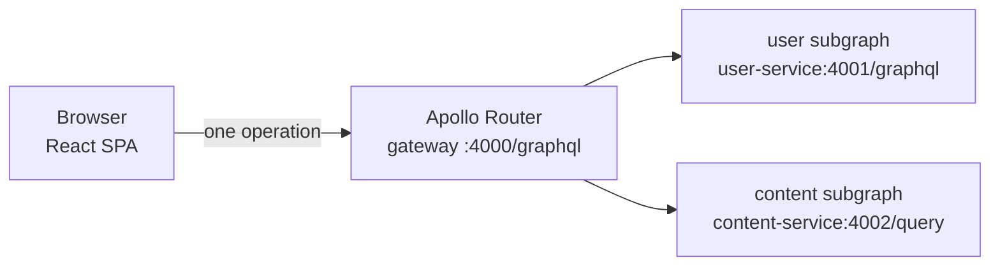

# Gateway documentation

The gateway is Topos's single GraphQL endpoint. Apollo Router sits in front of
the `user` and `content` subgraphs, composes them into one schema, plans every
operation, fans the work out to whichever subgraphs own the fields, and stitches
the answers back together.

There is no application code here. The whole service is **five files, 117
lines in total**: `router.yaml`, `supergraph.yaml`, two Compose files, and a
Dockerfile that composes the schema at build time. Everything these pages
explain comes from those files, and from running the real router to confirm
what it does.

## New to this service?

Start here:

1. **[Quick start](getting-started/quickstart.md)** — bring the gateway up and
   prove it answers, with copy-pasteable commands.
2. **[Federation](concepts/federation.md)** — what "one schema, two services"
   actually means, and how a single query reaches both.
3. **[Request flows](concepts/request-flows.md)** — one operation followed
   from HTTP request to subgraph and back.

## Documentation by topic

### Getting started

| Document | What you'll learn | When to read |
| --- | --- | --- |
| [Quick start](getting-started/quickstart.md) | Run the gateway and verify it with curl | First time touching the gateway |
| [Configuration](getting-started/configuration.md) | Every key in `router.yaml` and `supergraph.yaml`, and each environment variable | Changing a setting |

### Concepts

| Document | What you'll learn | When to read |
| --- | --- | --- |
| [Architecture](concepts/architecture.md) | What the router is, how the image is built, and how it is wired into each stack | Understanding the moving parts |
| [Federation](concepts/federation.md) | Entities, `@key`, composition, and entity resolution in both directions | Anything about schema ownership |
| [Request flows](concepts/request-flows.md) | The lifecycle of one operation, with the exact subgraph calls captured | Debugging a slow or wrong response |

### Components

| Document | What you'll learn | When to read |
| --- | --- | --- |
| [Errors and limits](components/errors-and-limits.md) | What each error code means, what is deliberately not enforced | Decoding a failed response |

### Operations

| Document | What you'll learn | When to read |
| --- | --- | --- |
| [Health and observability](operations/health-and-observability.md) | Where health, metrics and traces really live | Monitoring or debugging |
| [Deployment](operations/deployment.md) | The image, both Compose files, and the production wiring | Shipping a change |

### Testing

| Document | What you'll learn | When to read |
| --- | --- | --- |
| [Testing overview](testing/overview.md) | The composition check CI runs, and how to validate a change yourself | Before you open a PR |

## Endpoints

Verified against a running router built from these files:

| Endpoint | Bound to | Published to the host? | Result |
| --- | --- | --- | --- |
| `POST /graphql` | `0.0.0.0:4000` | Yes, `4000:4000` | The federated API |
| `GET /` | `0.0.0.0:4000` | Yes | `404` — there is no landing page |
| `GET /health` | `0.0.0.0:8088` | **No** | `200` `{"status":"UP"}` |
| `GET /metrics` | `0.0.0.0:8088` | **No** | Prometheus text, `0.0.0.4` |

Only port `4000` is published by `compose.yml` and `compose.local.yml`. Port
`8088` stays on the Docker network, where `otel-collector` scrapes
`gateway:8088` (`infrastructure/docker/prod/otel-collector-config.yaml`). To
reach it from your machine you have to `docker exec` into the container.

> **Common gotcha:** health is **not** on port 4000.
> `health_check.listen` is `0.0.0.0:8088`, and `GET :4000/health` returns
> `404`. Probe it with
> `docker exec <container> wget -qO- http://localhost:8088/health` — see
> [Health and observability](operations/health-and-observability.md).

## Where the gateway sits

The frontend knows exactly one URL. It never dials a subgraph directly, and it
never sees which one answered.

## Source files

| File | Lines | Role |
| --- | --- | --- |
| [`router.yaml`](../router.yaml) | 42 | CORS, listeners, health, telemetry, header propagation |
| [`supergraph.yaml`](../supergraph.yaml) | 12 | Federation version and the subgraph routing table |
| [`Dockerfile`](../Dockerfile) | 25 | Compose the schema, then run the stock router |
| [`compose.yml`](../compose.yml) | 19 | Standalone definition; every variable is mandatory |
| [`compose.local.yml`](../compose.local.yml) | 19 | Local stack definition |

## Reading order by role

### New developer

1. [Quick start](getting-started/quickstart.md) — get it running
2. [Federation](concepts/federation.md) — understand the model
3. [Architecture](concepts/architecture.md) — see how it is assembled

### Changing a setting

1. [Configuration](getting-started/configuration.md) — find the key
2. [Deployment](operations/deployment.md) — know which stack rebuilds
3. [Testing overview](testing/overview.md) — validate the change

### Debugging an incident

1. [Health and observability](operations/health-and-observability.md) — probe it
2. [Errors and limits](components/errors-and-limits.md) — read the payload
3. [Request flows](concepts/request-flows.md) — trace the fan-out

### Onboarding to federation

1. [Federation](concepts/federation.md)
2. [Request flows](concepts/request-flows.md)
3. [Platform architecture](../../docs/concepts/architecture.md)
