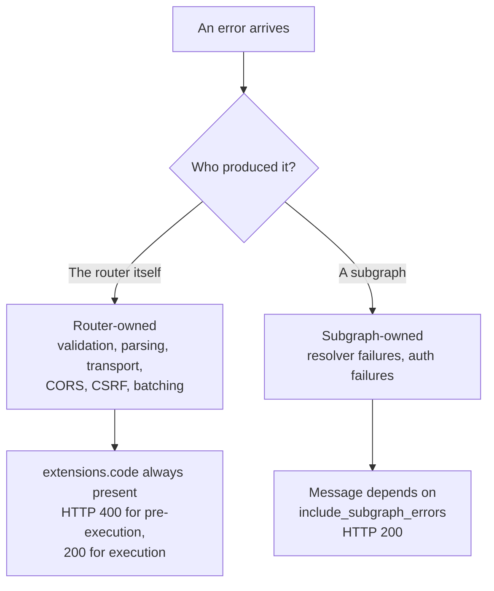
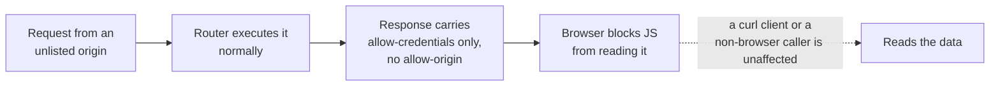
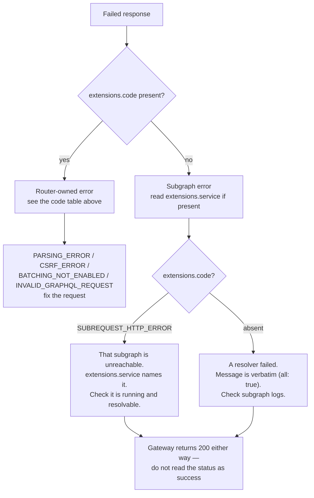

# Errors and limits

Every error the gateway returns was captured from a running router using this
`router.yaml`. This page is the reference: which code means what, where the
error originated, and — just as important — what the gateway deliberately does
**not** stop.

## Two sources of errors



The distinction matters because the two behave differently:
router-owned errors are always self-describing, while subgraph errors are
passed through or hidden depending on one configuration flag.

## Router-owned error codes

Every one of these was reproduced:

| `extensions.code` | HTTP | Trigger | Body |
| --- | --- | --- | --- |
| `PARSING_ERROR` | 400 | Unknown field, e.g. `{ nosuchfield }` | `parsing error: no field \`nosuchfield\` in type \`Query\`` |
| `INVALID_GRAPHQL_REQUEST` | 400 | Body is not JSON | includes the raw Rust deserialisation message |
| `BATCHING_NOT_ENABLED` | 400 | Body is a JSON array | `batching not enabled` |
| `CSRF_ERROR` | 400 | `GET /graphql?query=...` without a `content-type` | asks for `x-apollo-operation-name` or `apollo-require-preflight` |
| `SUBREQUEST_HTTP_ERROR` | 200 | A subgraph could not be reached | includes `service` and `reason` |

Two of these leak more than you might expect:

- `INVALID_GRAPHQL_REQUEST` echoes the raw parser message
  (`expected ident at line 1 column 2`). Harmless, but it is implementation
  detail in a public response.
- `SUBREQUEST_HTTP_ERROR` exposes the **internal hostname**. With the subgraphs
  unreachable the real message reads
  `dns error: ... Name("content-service.")`, which tells an outside caller that
  the internal service is called `content-service`.

Neither is a vulnerability on its own, but both are worth knowing when you
publish this endpoint to the internet.

## `include_subgraph_errors`

`router.yaml` sets:

```yaml
include_subgraph_errors:
  all: true
```

This is the switch that decides whether subgraph failure detail reaches the
client. Both states, measured against a resolver that throws
`MongoDB connection lost at content-service:27017`:

**With `all: true` (the current setting):**

```json
{"data":{"post":null},
 "errors":[{"message":"MongoDB connection lost at content-service:27017",
            "locations":[{"line":1,"column":2}],
            "path":["post"]}]}
```

**With `all: false`:**

```json
{"data":{"post":null},
 "errors":[{"message":"Subgraph errors redacted",
            "locations":[{"line":1,"column":2}],
            "path":["post"]}]}
```

| Behaviour | `all: true` | `all: false` |
| --- | --- | --- |
| Subgraph error `message` | Verbatim | Replaced with `Subgraph errors redacted` |
| `path` and `locations` | Kept | Kept |
| Router-owned errors (`PARSING_ERROR` etc.) | Unaffected | Unaffected |
| HTTP status | Unaffected | Unaffected |

### Why `true` here

`all: true` is the developer-friendly setting and the right default for local
work: you see exactly which resolver broke and why.

It is also why the frontend has a message to display. Its error handler,
`getGraphQLErrorMessage`, joins the GraphQL error `message` fields into a
sentence — that only produces something useful because subgraph text is passed
through.

**Trade-off to be aware of:** internal messages, table names, hostnames and
stack details all reach the browser. Flipping to `all: false` in a public
deployment loses that detail but keeps `path`, so the client can still tell
*which* field failed. Whether Topos should flip it is a product decision, not a
bug.

## CORS failures do not block the request

This surprises people. Measured with an origin that is not in the allow-list:

| Origin | Preflight `allow-origin` | Does the operation execute? |
| --- | --- | --- |
| `http://localhost:5173` | echoed back | yes |
| `http://localhost:3000` | echoed back | yes |
| `http://localhost:9999` (via `FRONTEND_PUBLIC_ORIGIN`) | echoed back | yes |
| `https://studio.apollographql.com` | echoed back | yes |
| `http://localhost:1234` | **absent** | **yes** |
| `http://evil.example` | **absent** | **yes** |

For a disallowed origin the router still processes the body and returns the
data — it simply omits `access-control-allow-origin`, so the *browser* refuses
to hand the response to JavaScript.



**CORS is browser enforcement, not access control.** Anything that can reach
port `4000` can execute queries. The only thing actually gating data is the JWT
the subgraphs check.

## Limits that do not exist

`router.yaml` configures none of the following. Each was confirmed by probing a
router built from it:

| Missing | Consequence | What you would add |
| --- | --- | --- |
| Rate limiting | One caller can saturate the subgraphs | `limits` section, or a proxy in front |
| Query depth / complexity limits | Deeply nested or very large queries are accepted | `limits.query_depth` / `limits.experimental_query_complexity` |
| Response caching | Every identical query re-hits the subgraphs | `cache` with Redis |
| Persisted queries / APQ | Clients must send the full document every time | `persisted_queries` |
| Operation batching | JSON arrays are rejected (`BATCHING_NOT_ENABLED`) | `batching` |
| Authentication | An absent or garbage `Authorization` header is still forwarded | `authentication` section |
| Introspection disabled in prod | `{ __typename }` and full introspection work everywhere | `supergraph.introspection: false` |
| Sandbox / landing page | `GET /` returns `404` | `sandbox` / `homepage` |

### Introspection is on

```console
$ curl -s http://localhost:4000/graphql \
    -H 'content-type: application/json' \
    -d '{"query":"{ __typename }"}'
{"data":{"__typename":"Query"}}
```

`supergraph.introspection: true` in `router.yaml` makes the full schema
queryable from any origin that can reach the port. Combined with the absence of
rate limits, that means anyone with network access can enumerate the entire
API. For an internal or demo deployment that is convenient; for a public one it
is usually turned off.

## Reading a failure, step by step



Quick triage:

| Symptom | Likely cause |
| --- | --- |
| `PARSING_ERROR` after a schema change | The gateway image was not rebuilt — it is still serving the old supergraph |
| `SUBREQUEST_HTTP_ERROR` with a `dns error` | The subgraph hostname in `supergraph.yaml` does not resolve on that network |
| `CSRF_ERROR` from a script | You used `GET ?query=`; switch to a JSON POST |
| `BATCHING_NOT_ENABLED` | You posted an array; send one operation per request |
| `Subgraph errors redacted` | Someone set `include_subgraph_errors.all: false` |
| Empty body with `404` | You asked for `/` or `/health` on port `4000` |

The first entry is the one that bites most often after a schema edit — see
[Testing overview](../testing/overview.md) for the rebuild step.

## Next step

Continue with [Health and observability](../operations/health-and-observability.md).
