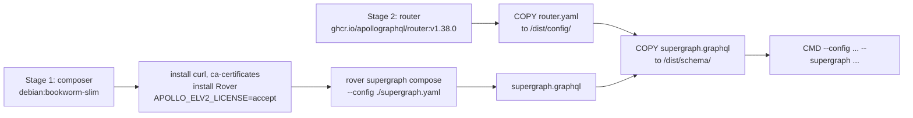
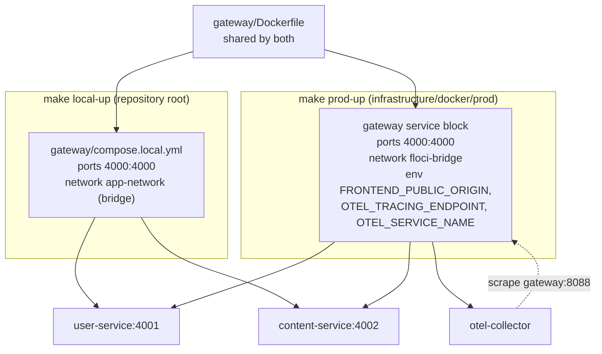
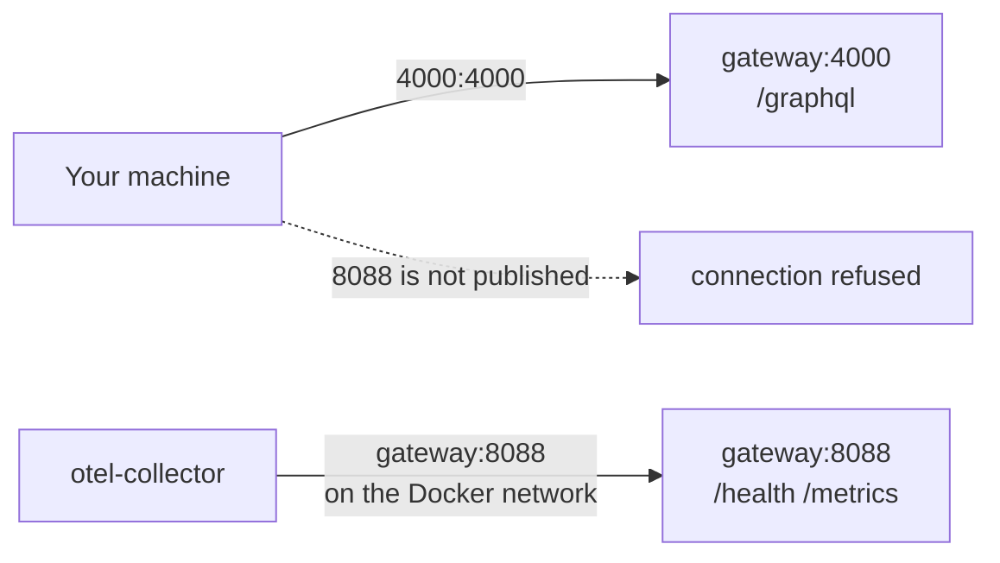

# Architecture

The gateway is the odd one out in Topos: it is a configuration-only service.
Understanding it well means understanding three things — what the router binary
is, how the image is assembled, and which stack is wiring it up.

## A router, not a codebase

| Property | A code service (user, content, ai) | The gateway |
| --- | --- | --- |
| Source files | Hundreds to thousands | **Zero** |
| Build step | Compile or transpile | Compose a schema, then copy config |
| Configuration | Environment variables read by your code | A single YAML file read by the binary |
| Test suite | Unit + integration | One composition check |
| Version pinned by | `package.json` / `go.mod` / `pyproject.toml` | Docker image tag + `federation_version` |
| Custom logic | Whatever you write | None — no plugins, no Rhai scripts |

Apollo Router is a Rust binary distributed as a container image. It reads
`router.yaml` and a composed supergraph schema, and every behaviour Topos gets
from the gateway is a consequence of those two files.

Because there is no code, there is no layering to reason about and no
`__tests__` directory. The equivalent of "the code" is the configuration, and
[Configuration](../getting-started/configuration.md) documents it key by key.

## Building the image

`gateway/Dockerfile` has two stages:



Three details worth knowing:

1. **The schema is baked in at build time.** The image copies
   `services/user/schema.graphql` and `services/content/graph/schema.graphqls`,
   composes them, and ships the result. The router never asks the subgraphs for
   their schemas at runtime.
2. **That makes image rebuilds mandatory for schema changes.** Editing a
   subgraph schema without rebuilding the gateway means the router keeps
   planning against the old supergraph, and new fields will answer with
   `PARSING_ERROR`.
3. **The compose step is the build's only failure point.** If the two schemas
   disagree — a field renamed on one side, a type referenced but never
   defined — the image does not build at all. That is a feature: the break is
   caught before deployment.

`APOLLO_ELV2_LICENSE=accept` is set for the Rover install, which ships under
the ELv2 licence. The router reports its licence state as a metric:
`apollo_router_lifecycle_license{license_state="unlicensed"} 1`, which is the
community tier.

## Runtime layout

The final stage does not contain Rover, source, or a package manager. It is the
upstream router image plus two files:

```text
/dist/config/router.yaml          copied from gateway/router.yaml
/dist/schema/supergraph.graphql   produced by stage 1
```

and two environment variables telling the binary where to find them:

```text
APOLLO_ROUTER_CONFIG_PATH=/dist/config/router.yaml
APOLLO_ROUTER_SUPERGRAPH_PATH=/dist/schema/supergraph.graphql
```

The `CMD` repeats both paths explicitly as `--config` and `--supergraph`, so
the flags win even if someone overrides the environment.

## How it is wired into the stacks

There are three ways the gateway is described in Compose, and only two are
wired into a stack:



| Setting | Local (`gateway/compose.local.yml`) | Production (inline block in `infrastructure/docker/prod/compose.yml`) |
| --- | --- | --- |
| Included from | `infrastructure/docker/local/compose.yml` | the prod file itself |
| Container name | `${GATEWAY_CONTAINER:-local-gateway}` | `${GATEWAY_CONTAINER:-prod-gateway}` |
| Ports | `4000:4000` | `4000:4000` |
| Network | `app-network` (local bridge) | `floci-bridge` |
| Extra env | none | `FRONTEND_PUBLIC_ORIGIN`, `OTEL_TRACING_ENDPOINT`, `OTEL_SERVICE_NAME=gateway` |
| Depends on | `user-service`, `content-service` | the two subgraphs plus `otel-collector` |

The third file, `gateway/compose.yml`, is a standalone variant with no
defaults: `${GATEWAY_CONTAINER}`, `${GATEWAY_EXT_PORT}` and `${APP_NETWORK}`
must all be set by the environment or Compose refuses to start it. Nothing
includes it — it exists for running the gateway against an already-running
network.

`FRONTEND_PUBLIC_ORIGIN` is the interesting one: `router.yaml` reads it with a
default, so the *same image* can allow a different browser origin without a
rebuild. See [Configuration](../getting-started/configuration.md).

### No health check is declared

Neither compose file defines a `healthcheck` for the gateway, and
`depends_on` uses no `condition`. That means:

- `make local-up` runs `up -d --build --wait`, and `--wait` treats the gateway
  as ready as soon as the container is running, because there is no healthcheck
  for it to wait on.
- Nothing automatically restarts it based on probe results, though
  `restart: unless-stopped` still covers a crash.

If you want a probe, add one against `http://localhost:8088/health` **inside**
the container network — the port is not published.

## Ports: published versus internal



| Port | Listen | Published | Consumed by |
| --- | --- | --- | --- |
| `4000` | `0.0.0.0:4000` | Yes | Browser, `curl`, the frontend's `VITE_GRAPHQL_URL` |
| `8088` | `0.0.0.0:8088` | No | `otel-collector` Prometheus scrape at `gateway:8088`; `docker exec` for manual probes |

This is the single most common source of confusion when verifying a change, so
[Health and observability](../operations/health-and-observability.md) gives the
exact commands.

## What the router logs at boot

From a real run of this configuration:

```text
Apollo Router v1.38.0 // ... Licensed as ELv2 ...
Prometheus endpoint exposed at http://0.0.0.0:8088/metrics
WARN  telemetry.instrumentation.spans.mode is currently set to 'deprecated' ...
Health check exposed at http://0.0.0.0:8088/health
GraphQL endpoint exposed at http://0.0.0.0:4000/graphql
```

Those four lines are the whole startup contract. The `WARN` is expected: the
configuration does not set `telemetry.instrumentation.spans.mode`, so the router
uses the deprecated default and asks you to pick `spec_compliant` explicitly. It
is harmless, and it is silenced by adding one key — see
[Configuration](../getting-started/configuration.md#telemetry).

## Next step

Continue with [Federation](federation.md).
