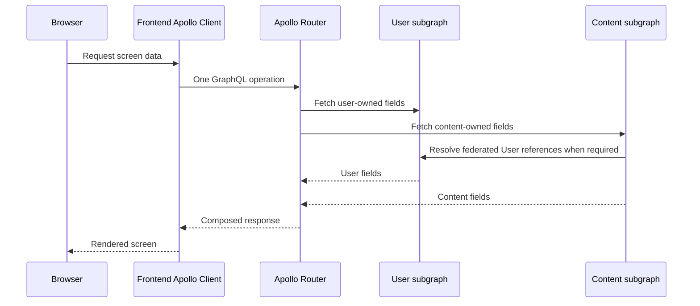

# Federation architecture

The supergraph maps `user` to `http://user-service:4001/graphql` and `content`
to `http://content-service:4002/query`. The content schema extends the user
entity by its `id` key. This permits one client operation without giving the
frontend direct subgraph URLs.
