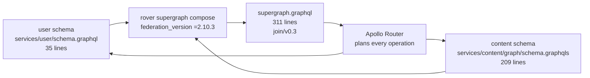
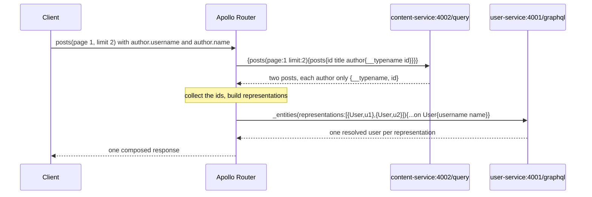
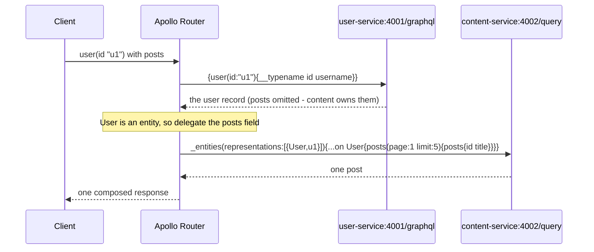

# Federation

Federation is how Topos exposes **one GraphQL schema while keeping two separate
services**. This page explains the model, the three directives that matter
here, and — with requests captured from a running router — how a single query
physically reaches both subgraphs.

## The problem it solves

The browser needs `Post.author.username` in one round trip. But `Post` lives in
the content service (Go, MongoDB) and `username` lives in the user service
(TypeScript, Postgres). Without federation you would need two requests, two
URLs in the frontend, and client-side joining.

Federation moves that work to the gateway: the frontend asks once, and the
router works out who owns what.

## Subgraphs and the supergraph



| Term | Meaning | In Topos |
| --- | --- | --- |
| **Subgraph** | A service that owns part of the API | `user`, `content` |
| **Supergraph** | The composed schema the router serves | Built in the image, 311 lines |
| **Entity** | An object with a `@key`, resolvable by any owning subgraph | `User`, `Post` |
| **Composition** | Merging subgraph schemas into one, validating that they agree | `rover supergraph compose` |

Composition happens **once, at image build time** — not at boot, and never at
request time. The router is handed a finished schema.

## Who owns what

| Type or field | Owner | Evidence |
| --- | --- | --- |
| `Query.me`, `Query.user`, `Query.users` | user | `@join__field(graph: USER)` in the composed schema |
| `Query.posts`, `post`, `tags`, `postsByTag`, `searchPosts`, `recommendedPosts` | content | `@join__field(graph: CONTENT)` |
| `Query.chats`, `chat`, `chatMessages`, `postDrafts`, `myPostDrafts` | content | same |
| `Mutation.signup`, `signin`, `updateProfile` | user | the three user mutations |
| All other mutations (posts, likes, drafts, chat, AI helpers) | content | 18 of them |
| `User.username`, `email`, `name`, `bio`, `avatarUrl`, `bannerUrl`, `createdAt` | user | `@join__field(graph: USER)` |
| `User.posts` | **content** | `@join__field(graph: CONTENT)` |
| `Post` (every field) | content | `Post` has a single `@join__type(graph: CONTENT, key: "id")` |

Counting it up: **user owns 3 queries and 3 mutations; content owns 11 queries
and 18 mutations.** The asymmetry is normal — the gateway adds no fields of its
own.

## The three directives

Both subgraph schemas link the federation v2 spec:

```graphql
extend schema @link(url: "https://specs.apollo.dev/federation/v2.0",
                    import: ["@key", "@shareable", "@provides", "@external"])
```

Only two of those four are actually used:

| Directive | Used? | Meaning |
| --- | --- | --- |
| `@key(fields: "id")` | Yes, on `User` (both) and `Post` (content) | "This type is identifiable by `id`, and can be fetched back by it" |
| `@external` | Yes, once: `User.id` inside content | "This field is owned elsewhere; I only need it to build a reference" |
| `@shareable` | Imported but never applied | Would allow two subgraphs to define the same field |
| `@provides` | Imported but never applied | Would let one subgraph promise another's fields |

The two `@key` declarations, side by side:

```graphql
# services/user/schema.graphql
type User @key(fields: "id") { id: ID!  username: String! ... }

# services/content/graph/schema.graphqls
type Post     @key(fields: "id") { id: ID!  title: String!  author: User! ... }
extend type User @key(fields: "id") { id: ID! @external
                                      posts(page: Int, limit: Int): PaginatedPosts! }
```

`extend type User` is the hinge of the whole design: content does not define
`username`, but it *does* define what `User.posts` returns. The `id` marked
`@external` is what lets content recognise a user it did not fetch.

## What composition produced

Running `rover supergraph compose` on the two schemas yields 311 lines. The
parts that matter:

```graphql
enum join__Graph {
  CONTENT @join__graph(name: "content", url: "http://content-service:4002/query")
  USER    @join__graph(name: "user",    url: "http://user-service:4001/graphql")
}

type User
  @join__type(graph: CONTENT, key: "id", extension: true)
  @join__type(graph: USER,    key: "id")
{
  id         ID!                                # no @join__field: both graphs have it
  posts      (page, limit): PaginatedPosts!     @join__field(graph: CONTENT)
  username   String!                            @join__field(graph: USER)
  email      String                             @join__field(graph: USER)
  name       String                             @join__field(graph: USER)
  bio        String                             @join__field(graph: USER)
  avatarUrl  String                             @join__field(graph: USER)
  bannerUrl  String                             @join__field(graph: USER)
  createdAt  String!                            @join__field(graph: USER)
}
```

Three things to read out of that block:

- **`extension: true` on the CONTENT entry** is `extend type User` surviving
  composition. Content contributes a field, not the type's identity.
- **`id` has no `@join__field`** because it is the key, and both subgraphs
  already know it. There is nothing to fetch.
- **The routing URLs live here.** `http://content-service:4002/query` and
  `http://user-service:4001/graphql` are the addresses the router will dial —
  note the different path suffixes, which come from `supergraph.yaml`.

If composition ever fails, this file is never produced and the image does not
build. See [Testing overview](../testing/overview.md).

## Entity resolution, direction one

For `{ posts { id title author { id username name } } }` the router must get
`username` from a subgraph that did not return the posts. Here is what actually
crossed the wire, captured from a live router built from this configuration
(the ids below come from a stand-in subgraph, not from production data):



Two details that are easy to miss:

1. **The router asked content for only `__typename` and `id` on the author.**
   It already knew it had to cross over, so it deliberately did not request
   fields content cannot resolve.
2. **Both authors were batched into a single `_entities` call.** Two posts by
   two different people produced one request, not two.

## Entity resolution, direction two

The mirror image: `{ user(id: "u1") { id username posts { posts { id title } } } }`.



The direction of the fan-out is decided **per query**, by which fields you
asked for. The same pair of services, in the opposite order.

## Why `Post` never crosses over

`Post` is keyed only in content:

```graphql
type Post
  @join__type(graph: CONTENT, key: "id")
```

So a query for `Post.title` never generates an `_entities` call to user. If you
wanted `Post.somethingOwnedByUser`, composition would fail outright, because
user has no `Post` type to resolve it against.

Conversely `User.posts` never round-trips through user for the *data*; user
only supplies the identity.

## What the gateway does not add

Federation can also host cross-cutting concerns in the router. Topos uses none
of them:

| Capability | Router supports it | Topos configures it |
| --- | --- | --- |
| Field-level authorization | Yes (`authorization` plugin) | **No** — each subgraph checks the JWT itself |
| Rate limiting | Yes | **No** |
| Response caching | Yes | **No** |
| Query depth/complexity limits | Yes | **No** |
| Header injection (`context`) | Yes | Only `Authorization` propagation |
| Custom Rhai/plugin logic | Yes | **No** |

The gateway's job here is purely structural: plan, fetch, merge.

## Next step

Continue with [Request flows](request-flows.md) to see the whole lifecycle of a
single request, including how `Authorization` rides along.
