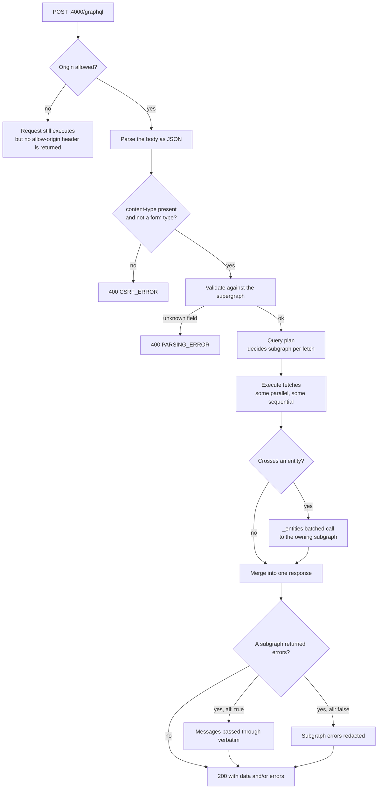
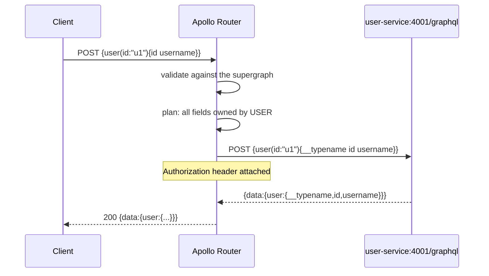
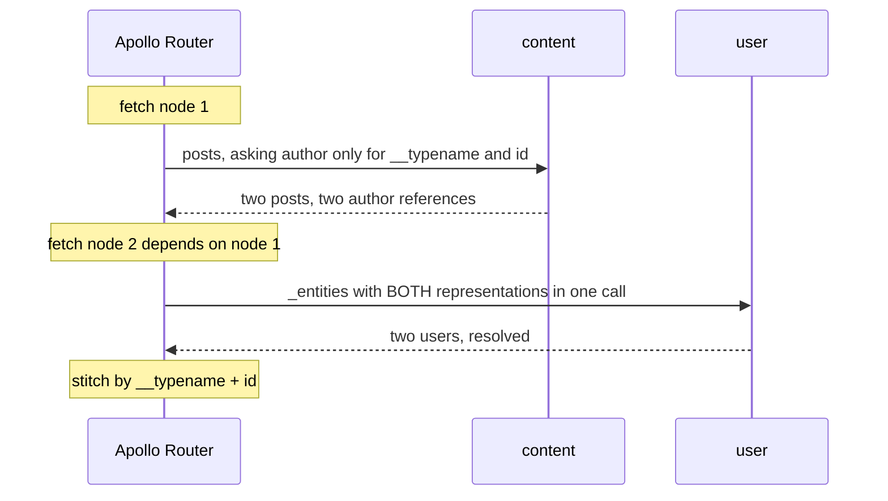
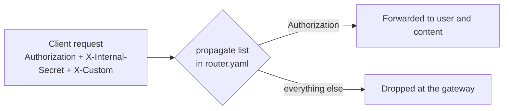

# Request flows

This page follows a single operation from the socket to the subgraphs and back.
Every request below was captured from a real router running this exact
`router.yaml`, with the two subgraphs standing in behind it.

## The lifecycle



Note where the failure modes sit: **everything before "validate" returns
`400`**, and everything after it returns `200` — even when a subgraph is
unreachable. That split is the single most useful thing to know when reading a
response.

## Status codes, measured

| Situation | HTTP | `extensions.code` | Body |
| --- | --- | --- | --- |
| Valid query, subgraphs healthy | `200` | — | `{"data":{...}}` |
| `{"query":"{ nosuchfield}"}` | `400` | `PARSING_ERROR` | `parsing error: no field ...` |
| Malformed JSON body | `400` | `INVALID_GRAPHQL_REQUEST` | raw deserialisation message |
| JSON array (batching) | `400` | `BATCHING_NOT_ENABLED` | `batching not enabled` |
| `GET ?query=...` without `content-type` | `400` | `CSRF_ERROR` | see below |
| Subgraph unreachable | `200` | `SUBREQUEST_HTTP_ERROR` | `{"data":null,"errors":[...]}` |
| Subgraph returned a GraphQL error | `200` | — | message depends on `include_subgraph_errors` |
| `GET /` | `404` | — | empty |
| `GET :4000/health` | `404` | — | empty — health is on `8088` |

### The CSRF rule bites curl users

```console
$ curl 'http://localhost:4000/graphql?query={__typename}'
{"errors":[{"message":"This operation has been blocked as a potential
Cross-Site Request Forgery (CSRF). ...","extensions":{"code":"CSRF_ERROR"}}]}
```

The router refuses "simple" GET requests. Any of these unblocks it:

| Fix | Header |
| --- | --- |
| Send a JSON body with POST (what the frontend does) | `content-type: application/json` |
| Sign the GET request | `x-apollo-operation-name: <name>` |
| Opt out explicitly | `apollo-require-preflight: true` |

The clean way to smoke-test is:

```bash
curl -s http://localhost:4000/graphql \
  -H 'content-type: application/json' \
  -d '{"query":"{ __typename }"}'
```

## Flow one: a single-subgraph query

`{ user(id: "u1") { id username } }` touches only the user service.



One hop, one subgraph. The router still adds value: it validated the field
names, attached the bearer token, and normalised the response shape.

## Flow two: crossing an entity

`{ posts(page:1, limit:2) { posts { id title author { id username name } } } }`
— the full captured exchange:

```text
(1) POST http://content-service:4002/query
    {"query":"{posts(page:1 limit:2){posts{id title author{__typename id}}}}"}

(2) POST http://user-service:4001/graphql
    {"query":"query($representations:[_Any!]!){_entities(representations:
      $representations){...on User{username name}}}",
     "variables":{"representations":[
        {"__typename":"User","id":"u1"},
        {"__typename":"User","id":"u2"}]}}
```



**Steps 1 and 2 cannot be parallel.** The router cannot know which
representations it needs until step 1 returns. Within step 1, though, fetches
for unrelated root fields *do* run in parallel — ask for `posts` and `tags` in
the same document and both go out at once.

The batching is why entity crossing is cheap: 100 posts by 7 authors produce
7 representation entries in one `_entities` call, not 100 calls.

## Flow three: the reverse crossing

`{ user(id:"u1") { id username posts { posts { id title } } } }`:

```text
(1) POST http://user-service:4001/graphql
    {"query":"{user(id:\"u1\"){__typename id username}}"}

(2) POST http://content-service:4002/query
    {"query":"query($representations:[_Any!]!){_entities(representations:
      $representations){...on User{posts(page:1 limit:5){posts{id title}}}}}",
     "variables":{"representations":[{"__typename":"User","id":"u1"}]}}
```

The direction of the crossing is chosen **per query**, from the fields you
asked for — never from a fixed topology. See [Federation](federation.md) for
why.

## Headers

`router.yaml` declares exactly one propagated header:

```yaml
headers:
  all:
    request:
      - propagate:
          named: "Authorization"
```

Verified by sending three headers through the gateway and logging what arrived:

| Header sent by the client | Received by subgraphs |
| --- | --- |
| `Authorization: Bearer test-token-123` | `Bearer test-token-123` on **both** |
| `X-Internal-Secret: shh-do-not-leak` | **absent** |
| `X-Custom: custom-value` | **absent** |
| `Origin: http://localhost:5173` | **absent** (the subgraph sees the router as the caller) |



### Why `X-Internal-Secret` appears in CORS at all

`allow_headers` in the CORS block does list `X-Internal-Secret`, which suggests
the browser can send it onward. It cannot — the gateway strips it before
contacting a subgraph.

The header exists for a different path entirely: **service-to-service calls that
never touch the gateway.** The AI service calls
`content /internal/posts/{id}` with `X-Internal-Secret` set, and content's
`InternalAuthMiddleware` checks it with a constant-time comparison. Browsers
are not involved in that flow.

So: CORS allowing it is harmless, propagation not including it is correct.

## Auth is not enforced here

The gateway forwards `Authorization`. It does not **interpret** it.

| Layer | Responsibility |
| --- | --- |
| Gateway | Attach the header to every subgraph request |
| `user` subgraph | Validate the JWT, issue `401`/`403` for protected fields |
| `content` subgraph | Read the same JWT for `likedByMe`, drafts, and authorisation |

There is no `authentication` section in `router.yaml`. Removing the header
still lets you reach the gateway; you simply get unauthenticated data, because
every protected resolver decides on its own.

## Partial failure

When a subgraph is down the gateway still answers `200`:

```json
{
  "data": null,
  "errors": [{
    "message": "HTTP fetch failed from 'content': error trying to connect: tcp connect error: Connection refused (os error 111)",
    "path": [],
    "extensions": { "code": "SUBREQUEST_HTTP_ERROR", "service": "content", "reason": "..." }
  }]
}
```

Three things worth noticing:

1. **`extensions.service` names the subgraph** — the fastest way to tell which
   one failed.
2. **`extensions.code` is `SUBREQUEST_HTTP_ERROR`**, distinct from the
   `PARSING_ERROR` you get for a bad query.
3. **`data` is `null`, not absent**, and a nullable root field does *not* give
   you `{ "user": null }` — a failed root fetch nulls the whole `data` envelope.

If a subgraph answers with a GraphQL error instead of a transport error, the
shape depends on `include_subgraph_errors`; see
[Errors and limits](../components/errors-and-limits.md).

## What each request costs

Every operation increments Prometheus counters on the same listener as health:
`apollo_router_http_requests_total`, `apollo_router_operations_total`,
`apollo_router_query_planning_time_*`, `apollo_router_cache_*`. They are
described in [Health and observability](../operations/health-and-observability.md).

## Next step

Continue with [Errors and limits](../components/errors-and-limits.md).
