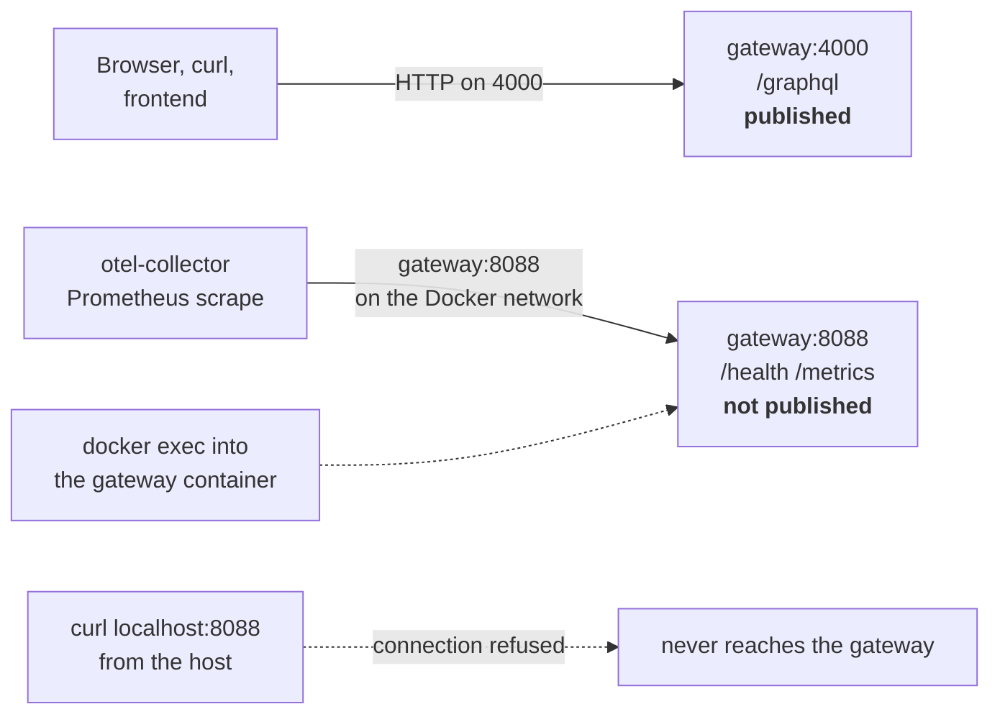

# Health and observability

Two listeners, three signals, and one trap: **nothing on port 4000 will tell
you whether the gateway is healthy.** This page gives the exact paths, the
commands that reach them, and what each signal can and cannot tell you.

## New to this service?

Start with [Quick start](../getting-started/quickstart.md), which includes the
one-line health check. This page is the full reference.

## The listener split



`router.yaml` puts both the health check and the Prometheus exporter on
`0.0.0.0:8088`, and both Compose files publish only `4000:4000`. That is why
every probe below goes through Docker.

| Probe | Command | Expected |
| --- | --- | --- |
| Health | `docker exec local-gateway wget -qO- http://localhost:8088/health` | `{"status":"UP"}` |
| Metrics | `docker exec local-gateway wget -qO- http://localhost:8088/metrics` | ~365 lines, `# TYPE apollo_router_...` |
| Liveness of the API | `curl -s localhost:4000/graphql -H 'content-type: application/json' -d '{"query":"{ __typename }"}'` | `{"data":{"__typename":"Query"}}` |
| Wrong health path | `curl -s localhost:4000/health` | `404`, empty body |

### The `:4000/health` myth

Two pages in this directory used to claim health was on 4000. It is not. With
this configuration, measured:

```console
$ curl -s -o /dev/null -w '%{http_code}\n' http://localhost:4000/health
404
$ docker exec local-gateway wget -qO- http://localhost:8088/health
{"status":"UP"}
```

If you have a monitor, a load-balancer probe, or a Compose `healthcheck`
pointing at `:4000/health`, it has been failing all along.

## Health: what it does and does not mean

`{"status":"UP"}` means **the router process is serving HTTP**. It does not
mean:

| Not covered | How to check instead |
| --- | --- |
| Subgraphs reachable | Run a real query and look for `SUBREQUEST_HTTP_ERROR` |
| Supergraph loaded correctly | `{ __typename }` returning `200` |
| OTLP exporter working | Look for `OpenTelemetry trace error` in the logs |
| Compose declared a probe | It did not — neither Compose file has a `healthcheck` |

Because `depends_on` uses no `condition: service_healthy` and there is no
`healthcheck` block, `make local-up` considers the gateway ready as soon as the
container is running. **Startup order is not health.**

A meaningful readiness check is a query:

```bash
curl -s http://localhost:4000/graphql \
  -H 'content-type: application/json' \
  -d '{"query":"{ __typename }"}' | grep -q '"data"' && echo READY
```

## Metrics

### Endpoint

```console
$ docker exec local-gateway wget -qO- http://localhost:8088/metrics | head -3
# HELP apollo_router_lifecycle_license
# TYPE apollo_router_lifecycle_license gauge
apollo_router_lifecycle_license{license_state="unlicensed",otel_scope_name="apollo/router"} 1
```

Content type is `text/plain; version=0.0.4`. Roughly 365 lines with this
configuration, all of them self-scraped — the router does not need an external
Prometheus.

### What is available

| Metric | Type | Use it for |
| --- | --- | --- |
| `apollo_router_http_requests_total` | counter | Request rate and status distribution |
| `apollo_router_http_request_duration_seconds_*` | histogram | Latency percentiles |
| `apollo_router_operations_total` | counter | Operations by query/mutation/subscription |
| `apollo_router_operations_validation_total` | counter | How many operations fail validation |
| `apollo_router_query_planning_time_*` | histogram | Time spent planning — high values mean complex documents |
| `apollo_router_cache_hit_count_total` / `apollo_router_cache_miss_count_total` | counter | Cache efficiency |
| `apollo_router_cache_size` | gauge | Current cache occupancy |
| `apollo_router_session_count_active` | gauge | In-flight sessions |
| `apollo_router_opened_subscriptions` | gauge | Should stay 0; Topos has no subscriptions |
| `apollo_router_lifecycle_license` | gauge | `license_state="unlicensed"` is the community tier |

### How it is collected in production

`infrastructure/docker/prod/otel-collector-config.yaml` configures a Prometheus
receiver on `gateway:8088` — reached **inside** the Docker network, which is
exactly why port 8088 does not need publishing:

```yaml
scrape_configs:
  - job_name: gateway
    scrape_interval: 5s
    static_configs:
      - targets: ["gateway:8088"]
```

Locally there is no collector, so metrics simply sit on 8088 waiting for
something to fetch them.

### Quick metric queries

```bash
# Requests since boot
docker exec local-gateway wget -qO- http://localhost:8088/metrics \
  | grep '^apollo_router_http_requests_total'

# Cache hit ratio
docker exec local-gateway wget -qO- http://localhost:8088/metrics \
  | grep -E 'apollo_router_cache_(hit|miss)_count_total'
```

## Tracing

```yaml
telemetry:
  exporters:
    tracing:
      otlp:
        enabled: true
        endpoint: ${env.OTEL_TRACING_ENDPOINT:-http://otel-collector:4317}
```

| Aspect | Detail |
| --- | --- |
| Protocol | OTLP over **gRPC**, port 4317 |
| Default target | `http://otel-collector:4317` |
| Override | `OTEL_TRACING_ENDPOINT`, no rebuild required |
| Service name | `OTEL_SERVICE_NAME` (production sets `gateway`) |

### Locally, traces are dropped

There is no collector on the local network, so the exporter retries and logs:

```text
level=ERROR message="OpenTelemetry trace error occurred ... dns error ..."
```

Recurring roughly every 25 seconds. `router.yaml` carries the comment
explaining this is intentional — export failures are logged and dropped and the
router keeps serving. A local stack showing this is **healthy but noisy**; a
production stack showing it means `OTEL_TRACING_ENDPOINT` is wrong or the
collector is down.

### Service naming

Measured both ways:

| `OTEL_SERVICE_NAME` | Log resource |
| --- | --- |
| set to `gateway` | `"service.name":"gateway"` |
| unset | `"service.name":"unknown_service:router"` |

If traces arrive in the collector with no service name, the variable is
missing from the container's environment.

## Logs

### Boot sequence

From a real run, in order:

```text
Apollo Router v1.38.0 // (c) Apollo Graph, Inc. // Licensed as ELv2 ...
Anonymous usage data is gathered to inform Apollo product development.
Prometheus endpoint exposed at http://0.0.0.0:8088/metrics
Configuring Otlp tracing: BatchConfig { scheduled_delay=5s, ... }
WARN telemetry.instrumentation.spans.mode is currently set to 'deprecated' ...
Health check exposed at http://0.0.0.0:8088/health
GraphQL endpoint exposed at http://0.0.0.0:4000/graphql
```

Read those four `exposed` lines as the startup contract: they confirm the
listeners actually bound. The `WARN` is expected — see
[Configuration](../getting-started/configuration.md#telemetry).

### What shows up during operation

| Level | Example | Action |
| --- | --- | --- |
| `ERROR` (repeating) | `OpenTelemetry trace error ... dns error` locally | Expected without a collector; investigate in prod |
| `WARN` at boot | `telemetry.instrumentation.spans.mode ... 'deprecated'` | Expected; optionally set the key |
| `INFO` | `GraphQL endpoint exposed at http://0.0.0.0:4000/graphql` | Normal |

The router does **not** log individual GraphQL operations by default — there is
no per-request log line. For request-level detail you rely on metrics and
traces, or on the subgraphs' own logs.

## Diagnostic table

| You suspect | Check | Healthy signal |
| --- | --- | --- |
| Gateway not running | `docker ps` / `docker compose ... ps` | `local-gateway ... Up` |
| Listener failed to bind | `docker logs local-gateway \| grep exposed` | Three `exposed` lines |
| Supergraph did not load | `curl ... -d '{"query":"{ __typename }"}'` | `{"data":{"__typename":"Query"}}` |
| A subgraph is down | Same query for a real field | No `SUBREQUEST_HTTP_ERROR` |
| Port confusion | `curl -s -o /dev/null -w '%{http_code}' localhost:4000/health` | `404` — this is normal |
| Metrics unreachable from host | `curl localhost:8088/metrics` | Connection refused — also normal; use `docker exec` |
| Traces not arriving | `docker logs local-gateway \| grep -i opentelemetry` | No repeating errors |
| CORS origin rejected | `curl -s -D - -o /dev/null -X OPTIONS -H 'Origin: ...' -H 'Access-Control-Request-Method: POST' localhost:4000/graphql` | `access-control-allow-origin` echoed |
| Stale schema after an edit | Rebuild the gateway image | `PARSING_ERROR` disappears |

The port-confusion row is the two entries marked *normal* — both are expected
behaviour of this configuration, not faults.

## Correlating with the other services

The gateway's telemetry is one slice of the platform's. For log shipping,
Grafana, and the collector topology, see
[Observability](../../../docs/operations/observability.md) in the root docs —
which also documents that the gateway exposes health and metrics on 8088 while
its GraphQL API listens on 4000.

## See also

| Topic | Page |
| --- | --- |
| Which listener serves what | [Architecture](../concepts/architecture.md) |
| Every configuration key | [Configuration](../getting-started/configuration.md) |
| Reading error payloads | [Errors and limits](../components/errors-and-limits.md) |
| Probing without Docker | [Deployment](deployment.md) |
