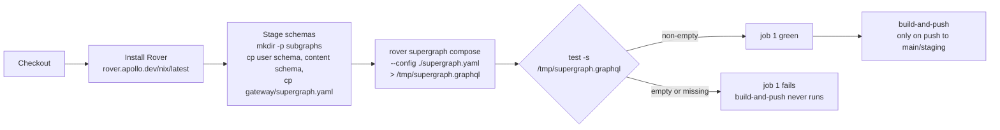

# Testing overview

The gateway has **no unit tests and no integration tests**, because it has no
code. Its entire automated verification is one composition check — and knowing
exactly what that check does and does not prove is the point of this page.

## New to this service?

Read [Quick start](../getting-started/quickstart.md) first so you have a
running gateway to probe. Then come back here before opening a PR.

## What exists

| Layer | Tool | Command | Needs Docker? |
| --- | --- | --- | --- |
| Composition | Rover, in CI | `rover supergraph compose --config ./supergraph.yaml` | No |
| Image build | Docker | `docker build -f gateway/Dockerfile .` | Yes |
| Manual probes | `curl` in a throwaway container | see [the matrix](#manual-test-matrix) | Yes |
| Unit tests | — | none | — |
| Integration tests | — | none | — |

There is no `make test` target in `gateway/`, no `__tests__` directory, and no
`test` job in `.github/workflows/service-gateway.yaml`. That is not an omission
— a stock router reading two YAML files has nothing to unit-test. The risks are
*configuration* risks, and they are covered differently.

## The composition check, step by step

CI job `quality-assurance` ("Verify Supergraph Composition"):



Two details worth noticing:

1. **The staging directory mirrors the Dockerfile.** CI copies
   `services/user/schema.graphql` to `subgraphs/user.graphql` and
   `services/content/graph/schema.graphqls` to `subgraphs/content.graphql`,
   matching the `COPY` lines exactly. If someone renames a schema file, both
   the build and CI break together — which is the correct outcome.
2. **`test -s` is the whole assertion.** It fails if the file is missing *or*
   zero bytes. Composition itself either succeeds or exits non-zero, and the
   `run:` block is `set -e` by default.

## Reproduce it locally

### Option A: exactly what CI does

```bash
mkdir -p /tmp/supergraph-check/subgraphs
cp services/user/schema.graphql           /tmp/supergraph-check/subgraphs/user.graphql
cp services/content/graph/schema.graphqls /tmp/supergraph-check/subgraphs/content.graphql
cp gateway/supergraph.yaml                /tmp/supergraph-check/supergraph.yaml
cd /tmp/supergraph-check

APOLLO_ELV2_LICENSE=accept rover supergraph compose --config ./supergraph.yaml
```

Install Rover first if you do not have it:

```bash
curl -sSL https://rover.apollo.dev/nix/latest | sh
```

Expected: a 311-line schema on stdout, and a log line confirming the pinned
plugin downloaded:

```text
merging supergraph schema files
downloading the 'supergraph' plugin from .../v2.10.3
the 'supergraph' plugin was successfully installed
```

### Option B: build the image

```bash
docker build -f gateway/Dockerfile -t topos-gateway .
```

This runs Option A inside stage 1 and then assembles the runtime image. It
proves the build works, not that the gateway behaves — but a failure here is
usually a schema problem.

### Option C: run it and probe

```bash
make local-up
```

Then work through [the matrix](#manual-test-matrix). This is the only option
that exercises the actual router.

## What composition proves and does not

| Caught by the composition check | Not caught |
| --- | --- |
| A type referenced but never defined | `routing_url` pointing at the wrong path |
| A field removed from one subgraph that another still returns | A hostname that does not resolve on the Docker network |
| A key mismatch between `@key` declarations | A wrong port in `routing_url` |
| Two subgraphs claiming the same field with no `@shareable` | CORS, health, or telemetry misconfiguration |
| Directive syntax errors | `include_subgraph_errors` doing the wrong thing |
| Federation version incompatibilities | Header propagation regressions |
| | Anything about runtime behaviour |

In short: **the check validates the schema, never the service.** Everything in
the right-hand column needs the manual matrix.

## Manual test matrix

Run these against a stack started with `make local-up`. Each one has a known,
verified answer.

### Transport and listeners

| # | Command | Expected |
| --- | --- | --- |
| 1 | `curl -s localhost:4000/graphql -H 'content-type: application/json' -d '{"query":"{ __typename }"}'` | `{"data":{"__typename":"Query"}}` |
| 2 | `curl -s -o /dev/null -w '%{http_code}' localhost:4000/` | `404` |
| 3 | `curl -s -o /dev/null -w '%{http_code}' localhost:4000/health` | `404` |
| 4 | `docker run --rm --network container:local-gateway curlimages/curl:latest -fsS http://localhost:8088/health` | `{"status":"UP"}` |
| 5 | `docker run --rm --network container:local-gateway curlimages/curl:latest -fsS http://localhost:8088/metrics \| head -1` | a `# HELP`/`# TYPE` line |
| 6 | `curl -s -o /dev/null -w '%{http_code}' localhost:8088/health` | connection refused (8088 is not published) |

### Validation versus execution

| # | Command | Expected |
| --- | --- | --- |
| 7 | `... -d '{"query":"{ nosuchfield }"}'` | HTTP `400`, `PARSING_ERROR` |
| 8 | `... -d 'not json'` | HTTP `400`, `INVALID_GRAPHQL_REQUEST` |
| 9 | `... -d '[{"query":"{__typename}"},{"query":"{__typename}"}]'` | HTTP `400`, `BATCHING_NOT_ENABLED` |
| 10 | `curl -s 'localhost:4000/graphql?query={__typename}'` | HTTP `400`, `CSRF_ERROR` |

`...` in the table means the standard POST:

```bash
curl -s localhost:4000/graphql -H 'content-type: application/json' -d '<body>'
```

### Federation

| # | Command | Expected |
| --- | --- | --- |
| 11 | `{ posts(page:1, limit:2) { posts { id title author { id username } } } }` | composed data; two `_entities` representations batched into one call to user |
| 12 | `{ user(id:"u1") { id username posts { posts { id title } } } }` | composed data; one `_entities` call to content |
| 13 | `docker logs local-gateway \| grep -c 'GraphQL endpoint exposed'` | `1` |

For 11 and 12, the strongest assertion is that the response contains fields
from **both** subgraphs in one `data` object with no `errors` key.

### CORS

| # | Command | Expected |
| --- | --- | --- |
| 14 | preflight with `Origin: http://localhost:5173` | `access-control-allow-origin: http://localhost:5173` |
| 15 | preflight with `Origin: http://localhost:1234` | no `access-control-allow-origin` header |

```bash
curl -s -D - -o /dev/null -X OPTIONS \
  -H "Origin: http://localhost:5173" \
  -H "Access-Control-Request-Method: POST" \
  localhost:4000/graphql | grep -i allow-origin
```

### Header propagation

| # | Check | Expected |
| --- | --- | --- |
| 16 | Send `Authorization` plus an arbitrary `X-Custom` header | Only `Authorization` arrives at the subgraph |

There is no easy one-liner for this — it requires logging headers on the
subgraph side. If you change `headers.all.request`, verify by adding a
temporary `console.log(req.headers)` in a subgraph or by capturing traffic on
the Docker network.

## Before you open a PR

```text
[ ] rover supergraph compose succeeds locally          (Option A)
[ ] docker build -f gateway/Dockerfile . succeeds      (Option B)
[ ] make local-up brings the stack up cleanly
[ ] Test 1 returns {"data":{"__typename":"Query"}}
[ ] Test 4 returns {"status":"UP"} via the throwaway curl container
[ ] A cross-entity query (test 11 or 12) returns no errors
[ ] docker logs local-gateway shows no new ERROR lines
[ ] Only .md or intended files are changed (git status)
```

There is no repository-wide documentation linter, so the checks are the usual
ones: every relative link resolves to a file that exists, every anchor matches
a real heading, and every mermaid block renders on GitHub (quoted labels, no
exotic node shapes).

## What to add if you change behaviour

If you ever add a Rhai script, a custom plugin, or an `authentication` block —
none of which exist today — the "no tests" story stops being true. At that
point the right additions are:

| Change | Test to add |
| --- | --- |
| `authentication` | Integration test: no token → rejected, valid token → passes |
| Rate limits | Integration test: burst requests, assert throttling |
| Header propagation changes | Assert exactly the intended headers reach the subgraph |
| New CORS origin | Preflight assertion |

Until then, the composition check plus the matrix above is a complete
verification strategy for a configuration-only service.

## See also

| Topic | Page |
| --- | --- |
| The CI workflow in full | [Deployment](../operations/deployment.md) |
| What each probe means | [Health and observability](../operations/health-and-observability.md) |
| Error codes you will see while probing | [Errors and limits](../components/errors-and-limits.md) |
| Composition and entities | [Federation](../concepts/federation.md) |
