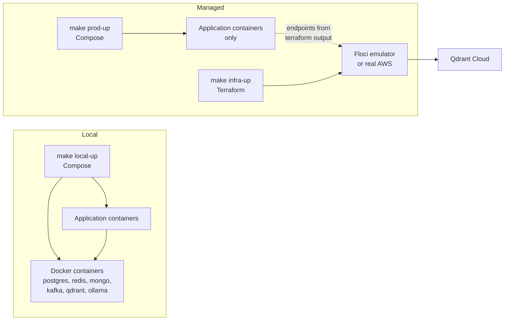

# Infrastructure

`infrastructure/` is where Topos decides **where things run**. Every other
directory in this repository holds application code; this one holds the
arrangements that application code runs inside.

It answers three separate questions:

1. **How do I run everything on one laptop?** Docker Compose.
2. **How do the databases and brokers exist outside that laptop?** Terraform.
3. **How does anyone find out what production is doing?** An OpenTelemetry
   collector and New Relic.

There is no application code here at all.

## What it owns

| Concern | Main files | What it decides |
| --- | --- | --- |
| Compose topology | [`docker/local/compose.yml`](docker/local/compose.yml), [`docker/prod/compose.yml`](docker/prod/compose.yml) | Which containers start, on which network, with which ports |
| Shared dependencies | `docker/users-postgres/`, `docker/users-redis/`, `docker/content-mongo/`, `docker/content-kafka/`, `docker/ai-qdrant/`, `docker/ai-embeddings/` | One definition each for the databases, cache, broker, vector store and embedding model, reused by every service that needs them |
| Managed data plane | [`terraform/`](terraform/) | RDS Postgres, RDS Proxy, ElastiCache Redis, DocumentDB, MSK, plus the SSM parameters and Secrets Manager entries the apps read |
| Telemetry | [`docker/prod/otel-collector-config.yaml`](docker/prod/otel-collector-config.yaml), [`observability/`](observability/) | Three collector pipelines, seven New Relic dashboards, one alert policy |

**4,473 tracked lines** of Terraform, Compose and collector configuration:

| Area | Lines |
| --- | --- |
| `infrastructure/terraform/` | 1,907 |
| `infrastructure/observability/` | 1,800 |
| `infrastructure/docker/` | 766 |

## What it does *not* do

- **No service definitions.** Each service owns its own Compose file;
  `docker/local/compose.yml` only pulls them together with `include:`. Editing
  a service's containers means editing that service, not this directory.
- **No application configuration logic.** Terraform writes config into SSM and
  secrets into Secrets Manager; reading and applying them is the services'
  job.
- **No log shipping code.** The collector reads Docker's log files straight off
  the host. Nothing in any service needs to change to be observable.
- **No New Relic dashboards hand-built in a UI.** All seven are Terraform, so
  they are reviewable and reproducible.

## Two planes

The single most useful thing to understand about this directory:



Locally, the data stores **are** Docker containers started by the same Compose
project. In managed mode they are **not** containers: Terraform provisions them
(or Floci emulates them), and the application containers reach them by
endpoint. The production Compose file deliberately contains no database
services.

That is why the two environment files differ so much, and why managed
bootstrapping needs `terraform output` before it can succeed. See
[Local and managed topology](docs/concepts/local-and-managed-topology.md).

## Quick start

From the repository root:

```bash
make local-up
```

That creates `infrastructure/docker/local/.env.local` from its example if it is
missing, then starts the whole stack, 17 containers including dependencies. To
stop:

```bash
make local-down     # keeps volumes
make local-clean    # also deletes volumes: databases, broker, vectors
```

For managed environments, start at
[Managed stack](docs/getting-started/managed-stack.md) instead, because it has
a boot order.

## Safety guards worth knowing before you touch anything

| Guard | Effect |
| --- | --- |
| `make local-down` | Keeps volumes |
| `make local-clean` | Deletes volumes: databases, broker, vectors, embeddings |
| `make infra-destroy ENV=floci` | Allowed without confirmation |
| `make infra-destroy ENV=prod` | **Refuses** unless `CONFIRM_DESTROY=1` |
| `SEED_SECRETS` defaults to `0` | `make prod-up` never overwrites managed secrets unless you ask |
| `WITH_INFRA` defaults to `0` | `make prod-up` never runs Terraform unless you ask |

The last two exist so an ordinary container restart can never become an
infrastructure change or a secret overwrite.

## Documentation

| Start here | |
| --- | --- |
| Index and reading order | [`docs/README.md`](docs/README.md) |
| Run the local stack | [`docs/getting-started/local-stack.md`](docs/getting-started/local-stack.md) |
| Run a managed stack | [`docs/getting-started/managed-stack.md`](docs/getting-started/managed-stack.md) |
| Terraform from scratch | [`docs/operations/terraform-workflow.md`](docs/operations/terraform-workflow.md) |
| What production telemetry looks like | [`docs/concepts/observability-architecture.md`](docs/concepts/observability-architecture.md) |
| What the tests actually prove | [`docs/testing/overview.md`](docs/testing/overview.md) |
