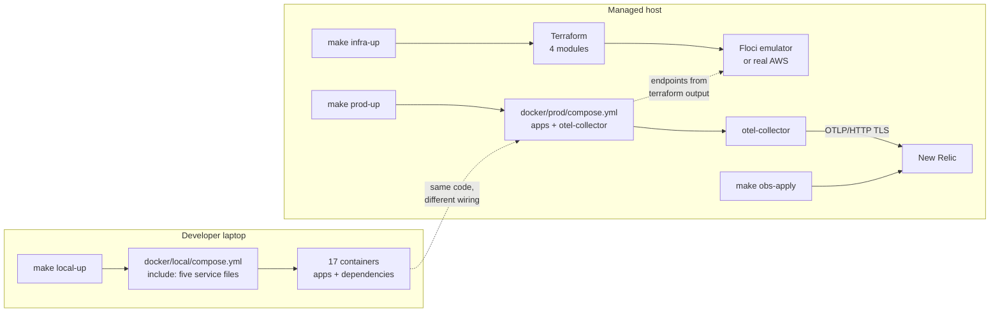

# Infrastructure documentation

Infrastructure defines how Topos runs locally, how application containers reach
managed dependencies, how Terraform provisions those dependencies, and how
telemetry reaches New Relic.

There is no application code in this area. The whole of it is **4,473 tracked
lines** of Terraform, Compose and collector configuration across three
concerns, plus a Makefile that drives all of it from one place. Everything
these pages explain comes from those files, and from running the commands to
confirm what they actually do.

## New to this service?

You do not need to know Terraform or OpenTelemetry to start. Start here:

1. **[Local stack](getting-started/local-stack.md).** Brings all 17 containers
   up with one command, and shows which port answers which request.
2. **[Local and managed topology](concepts/local-and-managed-topology.md).**
   Explains why the same platform has two completely different shapes
   depending on whether you are on a laptop or in a managed environment.
3. **[Terraform architecture](concepts/terraform-architecture.md).** What
   Terraform is, what this project uses it for, and the one variable that
   switches it between an emulator and real AWS.

If the word *state* or *plan* is unfamiliar, page 3 introduces both from
scratch.

## Documentation by topic

### Getting started

| Document | What it covers |
| --- | --- |
| [Local stack](getting-started/local-stack.md) | `make local-up`, the container roster, ports, health checks, tear-down |
| [Managed stack](getting-started/managed-stack.md) | The production boot order, filling `CHANGEME` values, `floci-apps`, seed secrets |

### Concepts

| Document | What it covers |
| --- | --- |
| [Local and managed topology](concepts/local-and-managed-topology.md) | Which of the seven data stores exist where, and who provides them |
| [Terraform architecture](concepts/terraform-architecture.md) | The root module, the Floci switch, config versus secrets, a Terraform primer |
| [Observability architecture](concepts/observability-architecture.md) | The collector's three pipelines and how a log line gets normalized |

### Components

| Document | What it covers |
| --- | --- |
| [Terraform modules](components/terraform-modules.md) | The four provisioning modules and the shared security-group module |
| [Configuration and secrets](components/configuration-and-secrets.md) | Who owns which setting, SSM versus Secrets Manager, precedence |
| [Compose dependencies](components/compose-dependencies.md) | The six shared dependency definitions and the three one-shot init containers |
| [New Relic resources](components/new-relic-resources.md) | Seven dashboards, one alert policy, four conditions, real thresholds |

### Operations

| Document | What it covers |
| --- | --- |
| [Terraform workflow](operations/terraform-workflow.md) | Every `make infra-*` target, plan before apply, destroy guards |
| [Monitoring and telemetry](operations/monitoring-and-telemetry.md) | Collector health, scrape targets, incident triage |
| [Deployment](operations/deployment.md) | `prod-up` phases, port map per environment, failure modes |

### Testing

| Document | What it covers |
| --- | --- |
| [Testing overview](testing/overview.md) | The five verification commands, what each proves and does not, reproducing CI |

## Published ports

Only application-facing ports reach the host. Everything else stays on the
Docker network.

| Port | Service | Local | Managed |
| --- | --- | --- | --- |
| `3000` | Frontend | yes | yes |
| `4000` | Gateway GraphQL | yes | yes |
| `4001` | User service GraphQL | yes | yes |
| `4002` | Content service GraphQL | yes | yes |
| `50051` | AI service gRPC | yes | yes |
| `12666` | AI service metrics | yes | yes |
| `5432` / `5433` | User Postgres (`5433` is the AI checkpoint alias) | yes | **no** |
| `6380` | User Redis | yes | **no** |
| `27017` | Content Mongo | yes | **no** |
| `9092` | Kafka | yes | **no** |
| `6333` | Qdrant | yes | **no** |
| `11434` | Ollama embeddings | yes | **no** |
| `4317` / `4318` | OTel collector OTLP (gRPC / HTTP) | **none** | internal only |
| `13133` | OTel collector health | **none** | internal only |
| `8088` | Gateway health and metrics | **none** | internal only |

The five rows marked **no** are the point of the whole design: in managed mode
those are not containers at all, so there is nothing to publish. Floci serves
Postgres on `7001` and Redis on `6379` inside the `floci-apps` network instead.

## Where infrastructure sits

Note the arrow between Terraform and New Relic: they are **two separate
Terraform projects** with separate state. `infrastructure/terraform/` provisions
data stores and knows nothing about New Relic;
`infrastructure/observability/` creates dashboards and knows nothing about AWS.
One `make` prefix selects between them: `infra-*` versus `obs-*`.

## Source files

| File | Lines | Role |
| --- | --- | --- |
| [`docker/local/compose.yml`](../docker/local/compose.yml) | 26 | Local entry point: `include:` five service files, nothing more |
| [`docker/prod/compose.yml`](../docker/prod/compose.yml) | 93 | Production entry point: apps, `otel-collector`, `floci-bridge` network |
| [`docker/prod/otel-collector-config.yaml`](../docker/prod/otel-collector-config.yaml) | 173 | Three pipelines: receivers, processors, exporters |
| [`terraform/main.tf`](../terraform/main.tf) | 138 | Wires the four provisioning modules |
| [`terraform/config.tf`](../terraform/config.tf) | 63 | Three SSM parameters of non-secret config |
| [`terraform/secrets.tf`](../terraform/secrets.tf) | 144 | Three Secrets Manager entries, with a Floci and a real-AWS branch |
| [`terraform/variables.tf`](../terraform/variables.tf) | 220 | 35 variables |
| [`terraform/outputs.tf`](../terraform/outputs.tf) | 125 | 25 outputs used to fill `.env` |
| [`observability/alerts.tf`](../observability/alerts.tf) | 114 | One policy, four NRQL conditions |
| [`observability/dashboards.tf`](../observability/dashboards.tf) | 129 | The eight-widget overview dashboard |
| [`Makefile`](../../Makefile) | 189 | 26 targets across local, prod, `infra-*` and `obs-*` |

## Reading order by role

### New developer

1. [Local stack](getting-started/local-stack.md). Get 17 containers running.
2. [Compose dependencies](components/compose-dependencies.md). Know what each
   database and broker is for.
3. [Local and managed topology](concepts/local-and-managed-topology.md).
   Understand why your laptop and production differ.

### Operator

1. [Managed stack](getting-started/managed-stack.md). The boot order and where
   every `CHANGEME` value comes from.
2. [Deployment](operations/deployment.md). Phases, ports, failure modes.
3. [Monitoring and telemetry](operations/monitoring-and-telemetry.md). Know
   where to look first.

### DevOps / SRE

1. [Terraform architecture](concepts/terraform-architecture.md). The module
   graph and the Floci switch.
2. [Terraform workflow](operations/terraform-workflow.md). Plan, apply,
   destroy guards.
3. [Configuration and secrets](components/configuration-and-secrets.md). The
   ownership rules that stop Terraform and Seed Secrets fighting.
4. [Testing overview](testing/overview.md). What CI proves before a merge.

### Someone debugging missing telemetry

1. [Observability architecture](concepts/observability-architecture.md). How
   the three signals travel.
2. [Monitoring and telemetry](operations/monitoring-and-telemetry.md). The
   collector's own health check and the scrape target list.
3. [New Relic resources](components/new-relic-resources.md). Which dashboard
   and which alert should have told you.
