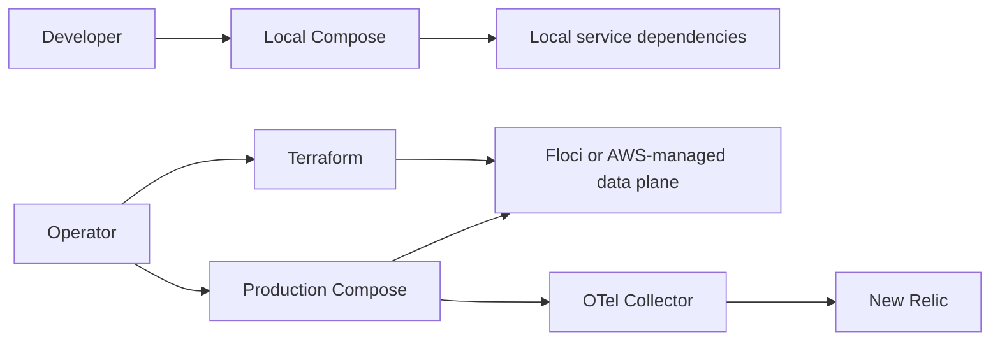

# Infrastructure documentation

Infrastructure defines how Topos runs locally, how application containers use
managed dependencies, how Terraform provisions those dependencies, and how
telemetry reaches New Relic.

## Start here

1. [Local quick start](getting-started/local-stack.md)
2. [Local and managed topology](concepts/local-and-managed-topology.md)
3. [Terraform architecture](concepts/terraform-architecture.md)
4. [Observability architecture](concepts/observability-architecture.md)

## By task

| Task | Read |
| --- | --- |
| Apply or review infrastructure | [Terraform workflow](operations/terraform-workflow.md) |
| Understand config/secrets ownership | [Configuration and secrets](components/configuration-and-secrets.md) |
| Debug telemetry | [Monitoring and telemetry](operations/monitoring-and-telemetry.md) |
| Check reusable infrastructure pieces | [Terraform modules](components/terraform-modules.md) |
| Understand dashboards and alerts | [New Relic resources](components/new-relic-resources.md) |

## High-level topology

