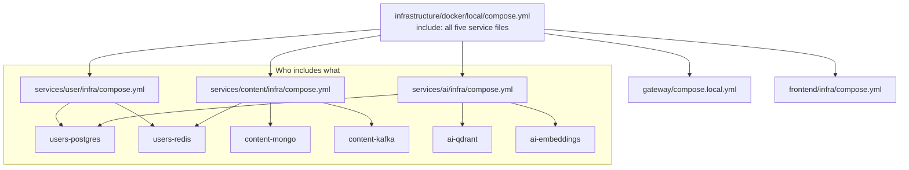

# Compose dependencies

Six Docker Compose files define Topos's local data stores. They live in
`infrastructure/docker/` rather than inside any service because more than one
service needs them, and because managed environments do not run them at all.

This page is what each one starts, how it is shared, and the two things in it
that are not obvious.

## New to this service?

Read [Local stack](../getting-started/local-stack.md) first so you have seen
the 17 containers. This page explains where the seven dependency containers
come from.

## Why they are shared

Three of the six are wanted by two services each:

| Definition | Included by | Deduplicated to |
| --- | --- | --- |
| `users-postgres/postgres.yml` | user stack **and** AI stack | 1 container |
| `users-redis/redis.yml` | user stack **and** content stack | 1 container |
| `content-mongo/mongo.yml` | content stack | 1 container |
| `content-kafka/kafka.yml` | content stack | 1 container |
| `ai-qdrant/qdrant.yml` | AI stack | 1 container |
| `ai-embeddings/embedding.yml` | AI stack | 1 container |



Because `include:` merges everything into **one Compose project**, Compose
starts `user-postgres` once even though two service files ask for it. If each
service defined its own, a full local boot would try to claim port `5432`
twice.

The two host ports on `user-postgres` exist for the same reason:

```yaml
ports:
  - "${USER_POSTGRES_EXT_PORT:-5432}:5432"
  - "${AI_POSTGRES_EXT_PORT:-5433}:5432"
```

The user stack publishes `5432`, the AI stack publishes `5433`, both land on
the same container. Publishing both keeps the two service files identical,
which the merge requires.

## The six

### `users-postgres/postgres.yml`

| | |
| --- | --- |
| Image | `postgres:16-alpine` |
| Host ports | `5432` and `5433`, both → `5432` |
| Volume | `user_postgres_data` |
| Health check | `pg_isready -U topos_user -d topos_users` |
| Memory | limit `512M`, reserve `256M` (override with `USER_POSTGRES_MEM`) |

Creates **two** databases from the start:

| Role / database | Purpose | Override with |
| --- | --- | --- |
| `topos_user` / `topos_users` | Accounts, profiles, JWT material | fixed |
| `ai_checkpointer` / `ai_checkpoints` | AI checkpoint storage, least privilege | `AI_POSTGRES_USER`, `AI_POSTGRES_PASSWORD`, `AI_POSTGRES_DB` |

The second one is the local counterpart of `init-ai-db.sql`. The directory
`init/` is mounted read-only at `/docker-entrypoint-initdb.d`, so the Postgres
entrypoint runs
[`init/10-ai-checkpoints.sh`](../../docker/users-postgres/init/10-ai-checkpoints.sh)
automatically on **first volume initialisation only**.

Consequence worth knowing: deleting the volume re-runs it, but adding a new
script to `init/` against an existing volume does nothing.

### `users-redis/redis.yml`

| | |
| --- | --- |
| Image | `redis:7.2-alpine` |
| Host port | `6380` → `6379` |
| Volume | `user_redis_data` |
| Health check | `redis-cli ping` |
| Memory | limit `128M` (override with `USER_REDIS_MEM`) |

Persistence is configured explicitly rather than left at the image default:

```yaml
command:
  - redis-server
  - --save
  - "${USER_REDIS_SAVE:-3600 1 300 100 60 10000}"
  - --appendonly
  - "${USER_REDIS_APPENDONLY:-yes}"
```

The default is three save rules (after 3600 seconds if 100 keys changed, after
300 if 100, after 60 if 10000) plus append-only file. A cache that loses
everything on restart is fine; a cache holding session data is not, so this is
deliberately durable.

Note the host port is `6380`, not `6379`. That avoids colliding with any Redis
already running on the developer's machine.

### `content-mongo/mongo.yml`

| | |
| --- | --- |
| Image | `mongo:7` |
| Host port | `27017` |
| Volume | `content_mongo_data` |
| Health check | `echo 'db.runCommand("ping").ok' \| mongosh --quiet` |
| Memory | limit `512M` (override with `CONTENT_MONGO_MEM`) |

The health check pipes a command rather than using `mongosh --eval`, because
`mongosh --quiet` with a piped command exits non-zero on connection failure
without needing an extra `|| exit 1`.

### `content-kafka/kafka.yml`

The most involved of the six. One container runs **both** broker and
controller roles, so a single node forms its own quorum:

```yaml
hostname: kafka-1
environment:
  KAFKA_NODE_ID: 1
  KAFKA_PROCESS_ROLES: broker,controller
  KAFKA_LISTENERS: PLAINTEXT://:9092,CONTROLLER://:9093
  KAFKA_ADVERTISED_LISTENERS: PLAINTEXT://kafka-1:9092
  KAFKA_CONTROLLER_QUORUM_VOTERS: 1@kafka-1:9093
  KAFKA_OFFSETS_TOPIC_REPLICATION_FACTOR: 1
  KAFKA_TRANSACTION_STATE_LOG_REPLICATION_FACTOR: 1
  KAFKA_TRANSACTION_STATE_LOG_MIN_ISR: 1
  KAFKA_MIN_INSYNC_REPLICAS: 1
  CLUSTER_ID: ${KAFKA_CLUSTER_ID:-MkU3OEVBNTcwNTJENDM2Qk}
```

Every replication factor is `1` because there is exactly one broker. Raising
`KAFKA_TOPIC` partition counts is safe; raising replication factors is not.

| | |
| --- | --- |
| Image | `apache/kafka:3.7.0` |
| Host port | `9092` |
| Volume | `content_kafka_data` |
| Health check | `kafka-topics.sh --list` (15s timeout, 20s start period) |
| Limits | `0.5` CPU, `512M` memory |

`KAFKA_ADVERTISED_LISTENERS` is set to the hostname `kafka-1`, not
`localhost`. Clients are told to reconnect to `kafka-1`, which resolves only
on the Docker network. A client connecting from the host works only because it
is given that same advertised address, and it works only while `kafka-1`
resolves.

### `ai-qdrant/qdrant.yml`

| | |
| --- | --- |
| Image | `qdrant/qdrant:v1.19.0` |
| Host port | `6333` |
| Volume | `qdrant_data` |
| Health check | TCP connect to `6333` via `/dev/tcp` |
| Memory | limit `1G` (override with `QDRANT_MEM`) |

The health check uses a shell TCP probe rather than an HTTP request:

```yaml
test: ["CMD-SHELL", "bash -c 'exec 3<>/dev/tcp/localhost/${QDRANT_INT_PORT:-6333}'"]
```

### `ai-embeddings/embedding.yml`

| | |
| --- | --- |
| Image | `ollama/ollama:latest` |
| Host port | `11434` |
| Volume | `embedding_data` |
| Health check | `ollama list` |
| Memory | limit `4G`, reserve `2G` (override with `EMBEDDING_MEM`) |

Largest allocation in the stack by a distance, because running an embedding
model in-process needs room. Model default:
`snowflake-arctic-embed2:568m`, vector size `1024`.

## The three one-shot containers

None of these stay running.

| Container | Image | Waits for | Does |
| --- | --- | --- | --- |
| `init-kafka` | `apache/kafka:3.7.0` | Kafka healthy | Creates `posts` (3 partitions), `posts-dlq` (1), `user-interacted` (3), all `--if-not-exists` |
| `embedding-model-init` | `curlimages/curl:latest` | Ollama healthy | Pulls the embedding model through Ollama's REST API |
| `user-migrator` | service image | on demand | Applies database migrations |

### Why `embedding-model-init` uses `curl`, not `ollama pull`

The comment in the file explains a bug that was fixed by doing so:

```text
Pulls via the Ollama REST API (/api/pull) instead of the `ollama pull`
CLI: recent ollama images run the CLI as a TUI that fails without a TTY
("could not open a new TTY") inside a one-shot container, which left
/api/embed returning 404 and the search worker DLQing every post.
```

So a text-interface failure inside a helper container showed up, hours later,
as posts silently landing on the dead-letter topic. If you ever see
`posts-dlq` growing, this container is where to look first.

It also waits for the server before pulling:

```sh
for i in $(seq 1 30); do
  curl -fsS "http://$HOST/api/tags" >/dev/null 2>&1 && break
  sleep 2
done
```

Then it verifies with `/api/show` after the pull.

### `init-kafka` timing

`depends_on` with `condition: service_healthy` means it runs only after
Kafka's own health check passes, and that health check has a 20-second start
period because broker startup is slow. If topics are missing:

```bash
export LOCAL="docker compose --env-file infrastructure/docker/local/.env.local \
  -f infrastructure/docker/local/compose.yml"

$LOCAL logs init-kafka
$LOCAL start init-kafka   # re-runs it; --if-not-exists makes it idempotent
```

## Which variables to reach for

| Variable | Default | Controls |
| --- | --- | --- |
| `USER_POSTGRES_MEM`, `USER_REDIS_MEM`, `CONTENT_MONGO_MEM`, `KAFKA_MEM`, `QDRANT_MEM`, `EMBEDDING_MEM` | `512M`, `128M`, `512M`, `512M`, `1G`, `4G` | Per-container memory limits |
| `USER_POSTGRES_EXT_PORT`, `AI_POSTGRES_EXT_PORT` | `5432`, `5433` | The two Postgres host ports |
| `USER_REDIS_EXT_PORT` | `6380` | Redis host port |
| `KAFKA_TOPIC`, `KAFKA_DLQ_TOPIC`, `KAFKA_USER_INTERACTED_TOPIC` | `posts`, `posts-dlq`, `user-interacted` | Topic names, used by both the init container and the services |
| `KAFKA_CLUSTER_ID` | fixed base64 value | Kafka's internal cluster identity |
| `EMBEDDING_MODEL` / `AI_EMBEDDING_MODEL` | `snowflake-arctic-embed2:568m` | Which model the init container pulls |
| `AI_QDRANT_VECTOR_SIZE` | `1024` | Must match the model's output dimension |

The last row is the easiest one to break: change the model without changing
`AI_QDRANT_VECTOR_SIZE` and Qdrant rejects every insert with a dimension
mismatch.

## In managed mode, none of this runs

`infrastructure/docker/prod/compose.yml` declares no database services. The
seven local-only containers map to external endpoints instead:

| Local container | Managed replacement |
| --- | --- |
| `user-postgres` | Floci RDS proxy on `7001`, or real RDS + RDS Proxy |
| `user-redis` | Floci Valkey on `6379`, or real ElastiCache |
| `content-mongo` | DocumentDB sidecar, or real DocumentDB |
| `kafka` | MSK sidecar, or real MSK |
| `qdrant` | Qdrant Cloud |
| `embedding-service` | Qdrant server-side inference, `AI_EMBEDDING_MODE=inference` |
| `embedding-model-init` | Nothing; there is no local model to pull |

See [Local and managed topology](../concepts/local-and-managed-topology.md)
for the full side-by-side.

## See also

| Topic | Page |
| --- | --- |
| The 17 containers and their ports | [Local stack](../getting-started/local-stack.md) |
| Load-test variants of these files | your service's `infra/compose.load*.yml` |
| Why managed mode drops all seven | [Local and managed topology](../concepts/local-and-managed-topology.md) |
| Which environment file feeds the variables | [Configuration and secrets](configuration-and-secrets.md) |
