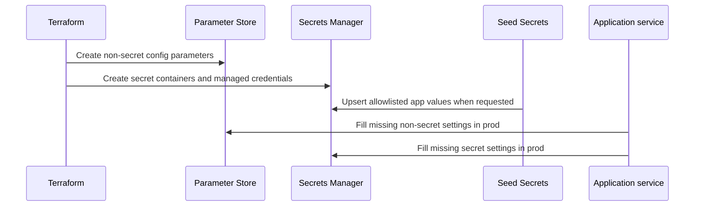

# Configuration and secrets ownership

Topos distinguishes infrastructure-owned resources from application-owned
runtime values.

## Ownership rules

| Owner | Owns | Rule |
| --- | --- | --- |
| Terraform | Resource topology, generated credentials, initial parameter/secret containers | Do not overwrite generated secrets casually. |
| Seed Secrets | Approved application values from an env file | Uses an allowlist and guards. |
| Compose/task environment | Explicit runtime overrides | Takes precedence over managed hydration. |
| Service configuration | Reading and validating final settings | Fills missing values; does not replace explicit values. |

Terraform uses `ignore_changes` for seeded secret strings, allowing a deliberate
seed operation without Terraform immediately reverting the value. The seed tool
refuses known Terraform-managed secret destinations unless explicitly forced.

Read [Seed Secrets safety guards](../../../tools/seed-secrets/docs/components/safety-guards.md).
