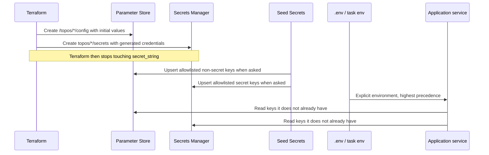

# Configuration and secrets ownership

Four different things can set a value that a Topos container eventually reads.
Knowing which one owns which setting is the difference between a five-minute
change and an afternoon of two systems overwriting each other.

This page is the ownership map.

## New to this service?

If you only want to change a local setting, you probably want
[Local stack](../getting-started/local-stack.md) instead. This page matters
when managed services are involved.

## The four writers



The arrows into the application all point the same way: **an explicit value
always wins.** Services inject managed keys into `process.env` only when the
key is not already set, so Compose or a task definition can override anything.

## Ownership rules

| Owner | Owns | Rule |
| --- | --- | --- |
| **Terraform** | Resource topology, generated passwords, the initial parameter and secret contents | Do not overwrite generated secrets casually |
| **Seed Secrets** | An allowlisted subset of application values from an env file | Writes only what the allowlist permits, and refuses Terraform-owned destinations unless forced |
| **Compose / task environment** | Explicit runtime overrides | Takes precedence over managed hydration |
| **Service configuration** | Reading and validating the final settings | Fills gaps, never replaces an explicit value |

The phrase that makes the whole system work is in `secrets.tf`:

```hcl
lifecycle {
  ignore_changes = [secret_string]
}
```

Terraform writes `secret_string` once and then stops reporting it as changed.
Without that block, every `make infra-up` would revert whatever Seed Secrets
had just written, and the two would fight on every deploy.

The trade-off is real: **Terraform no longer knows what is in the secret.**
If you lose state and re-create it, the value is whatever Terraform generates
next, not what was there.

## Non-secret configuration: SSM Parameter Store

Three parameters, each holding a JSON object:

### `/topos/user/config` (11 keys)

| Key | Value |
| --- | --- |
| `PORT` | `4001` |
| `LOG_LEVEL` | `info` |
| `OTEL_SERVICE_NAME` | `user-service` |
| `JWT_ISSUER` | `user-service` |
| `JWT_AUDIENCE` | `topos` |
| `JWT_EXPIRES_IN` | `7d` |
| `REDIS_CACHE_TTL_MS` | `3600000` |
| `REDIS_MISSING_CACHE_TTL_MS` | `60000` |
| `PG_POOL_MAX` | `10` |
| `PG_POOL_IDLE_TIMEOUT_MS` | `30000` |
| `PG_POOL_CONNECTION_TIMEOUT_MS` | `5000` |

### `/topos/ai/config` (3 keys)

| Key | Value |
| --- | --- |
| `CHECKPOINT_POOL_MIN_SIZE` | `1` |
| `CHECKPOINT_POOL_MAX_SIZE` | `10` |
| `CHECKPOINT_STARTUP_RETRIES` | `12` |

### `/topos/content/config` (15 keys)

| Key | Value |
| --- | --- |
| `PORT` | `4002` |
| `DB_NAME` | `blog_content` |
| `LOG_LEVEL` | `info` |
| `LOG_FORMAT` | `json` |
| `OTEL_SERVICE_NAME` | `content-service` |
| `OTEL_EXPORTER_OTLP_ENDPOINT` | empty |
| `JWT_ISSUER` / `JWT_AUDIENCE` | `user-service` / `topos` |
| `KAFKA_TOPIC` | `posts` |
| `KAFKA_USER_INTERACTED_TOPIC` | `user-interacted` |
| `KAFKA_DLQ_TOPIC` | `posts-dlq` |
| `KAFKA_CONSUMER_GROUP_ID` | `content-summary-worker-group` |
| `KAFKA_SEARCH_CONSUMER_GROUP_ID` | `content-search-worker-group` |
| `KAFKA_PERSONALIZER_CONSUMER_GROUP_ID` | `content-personalizer-worker-group` |
| `WORKER_CONCURRENCY` | `3` |

Everything here is safe to read in a log or a support ticket. That is exactly
why no credential may appear in these three parameters. All three are declared
`type = "String"`, with the comment `Floci's SSM is in-memory; no KMS` explaining
why no key policy is attached.

## Secrets: Secrets Manager

Three JSON objects, each in one `aws_secretsmanager_secret`:

### `topos/user/secrets`

`DATABASE_URL`, `DATABASE_URL_MIGRATE`, `AI_CHECKPOINTER_PASSWORD`,
`REDIS_URL`, `JWT_SECRET`

### `topos/ai/secrets`

`CHECKPOINT_DB_URL`, `CHECKPOINT_DB_URL_MIGRATE`

### `topos/content/secrets`

`MONGO_URI`, `KAFKA_BROKERS`, `REDIS_ADDR`, `REDIS_PASSWORD`, `JWT_SECRET`,
`INTERNAL_TOKEN`, `AI_SERVICE_URL`

Each secret has **two completely different value sets**, selected by one
condition in `secrets.tf`:

```hcl
secret_string = jsonencode(
  var.environment == "floci" ? {
    # Floci data plane: floci:7001, floci:6379, sidecar hostnames
    } : {
    # Real AWS: proxy endpoint with sslmode=require, TLS bundles, MSK brokers
  }
)
```

| Key | Floci value shape | Real AWS value shape |
| --- | --- | --- |
| `DATABASE_URL` | `postgresql://...@floci:7001/topos_users` | `postgresql://...@<proxy>:5432/topos_users?sslmode=require` |
| `REDIS_URL` | `redis://:<token>@floci:6379` | `rediss://:<token>@<elasticache>` |
| `MONGO_URI` | `mongodb://...@floci-docdb-...:27017/...?authSource=admin` | `mongodb://...@<cluster>:27017/...?tls=true&tlsCAFile=...&retryWrites=false` |
| `KAFKA_BROKERS` | `floci-msk-<id>:9092` | MSK bootstrap brokers |
| `JWT_SECRET` | the shared `local.floci_jwt_secret` placeholder | `random_password.jwt.result` |
| `INTERNAL_TOKEN` | the shared `local.floci_internal_token` placeholder | `random_password.internal_token.result` |

Two entries in that table deserve attention:

1. **`JWT_SECRET` and `INTERNAL_TOKEN` on Floci are literals declared in
   `main.tf`**, not generated values. `main.tf` calls them *"Placeholder secret
   for Floci-only URLs"* and notes they are a single source *"so user and
   content stacks stay in sync"*. They are safe by construction only because
   Floci is not exposed to anything.
2. **`REDIS_ADDR` on real AWS is `user-redis:6379`, a Docker hostname**, not an
   ElastiCache endpoint. The content service's cache client points at the local
   container even in the real-AWS branch, while the user service gets the
   managed endpoint through `REDIS_URL`. If you migrate content caching to
   ElastiCache, this is the line to change.

## Where the passwords come from

`terraform output` will not give them to you. Five `random_password` resources
generate them:

| Resource | Lives in | Used by |
| --- | --- | --- |
| `module.user_database.random_password.master` | `user_database` | `DATABASE_URL`, `DATABASE_URL_MIGRATE` |
| `module.user_database.random_password.ai` | `user_database` | `AI_CHECKPOINTER_PASSWORD`, `CHECKPOINT_DB_URL` |
| `module.user_cache.random_password.auth` | `user_cache` | `REDIS_URL`, `REDIS_PASSWORD` |
| `module.content_database.random_password.master` | `content_database` | `MONGO_URI` |
| `random_password.jwt` / `random_password.internal_token` | root `secrets.tf` | `JWT_SECRET`, `INTERNAL_TOKEN` |

They are written into the secret and into state. To read one you must go
through the Secrets Manager API:

```bash
aws --endpoint-url http://localhost:4566 --region ap-south-1 \
  secretsmanager get-secret-value --secret-id topos/user/secrets
```

Never paste that output into a file you intend to commit.

## Precedence, highest first

| Rank | Source | Example |
| --- | --- | --- |
| 1 | Explicit container environment | `environment: - USER_LOG_LEVEL=debug` in Compose |
| 2 | The env file (`--env-file`) | `infrastructure/docker/prod/.env` |
| 3 | SSM Parameter Store | `/topos/user/config` |
| 4 | Secrets Manager | `topos/user/secrets` |
| 5 | Built-in application default | whatever the service falls back to |

Locally, ranks 3 and 4 do not exist: `ENV_TYPE=dev` makes the services read
the env file and make zero AWS calls.

## Seed Secrets

Seed Secrets is the only writer permitted to change managed values after
Terraform has created them, and it is deliberately constrained:

| Guard | Effect |
| --- | --- |
| Allowlist | Only known keys are considered; anything else is rejected |
| `--dry-run` | Prints destination names and key counts, never values |
| Terraform-owned destinations | Refused unless explicitly forced |
| Endpoint distinguishes target | Non-empty means emulator; empty means real AWS |

`make prod-up` runs it only when you pass `SEED_SECRETS=1`, because the
direction is *file into managed storage*. An ordinary restart must never do
that, or a half-filled local `.env` would overwrite real credentials.

The full guard list lives in the Seed Secrets documentation:
[Safety guards](../../../tools/seed-secrets/docs/components/safety-guards.md).

## Practical rules

- **Changing a tuning value in production**: edit `config.tf`, run
  `make infra-plan ENV=prod`, review, apply. Or add it to the env file to
  override locally without touching Terraform.
- **Rotating a credential**: generate a new value, update Secrets Manager,
  restart the affected containers. Terraform will not revert it.
- **Adding a new secret**: create it in `secrets.tf` *with* the
  `ignore_changes` lifecycle, then add it to the Seed Secrets allowlist if
  applications should be able to update it.
- **Never** put a password, token or connection string with credentials in
  `config.tf`, in a tfvars file, or in a tracked `.env.example`.

## See also

| Topic | Page |
| --- | --- |
| Which environment file your command uses | [Managed stack](../getting-started/managed-stack.md) |
| The modules that generate these values | [Terraform modules](terraform-modules.md) |
| Applying changes safely | [Terraform workflow](../operations/terraform-workflow.md) |
| Why local mode skips all of this | [Local and managed topology](../concepts/local-and-managed-topology.md) |
