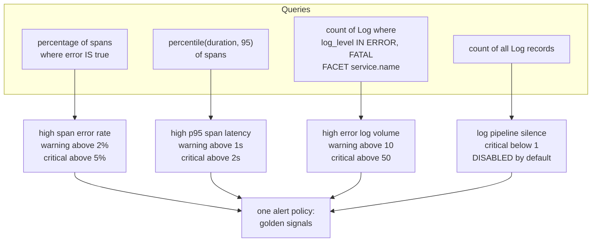

# New Relic dashboards and alerts

Seven dashboards and one alert policy, all defined as Terraform. Nothing in
this area was built by hand in the New Relic UI, which means it is reviewable,
reproducible, and identical in every environment.

This page is what exists, what each alert actually watches, and the defaults
you would otherwise have to read `variables.tf` to find out.

## New to this service?

Read [Observability architecture](../concepts/observability-architecture.md)
first. Dashboards are only useful once you know where their data comes from.

## The seven dashboards

Rendered from [`observability/`](../../observability/) resource names and
widget titles:

| Dashboard | Defined in | Page | Widgets |
| --- | --- | --- | --- |
| `Topos <env> observability` | `dashboards.tf` | Overview | 8 |
| `Topos <env> - User Service` | `dashboards_user.tf` | User overview | 14 |
| `Topos <env> - Content API` | `dashboards_content.tf` | API overview | 14 |
| `Topos <env> - Workers & Kafka` | `dashboards_workers.tf` | Workers overview | 11 |
| `Topos <env> - AI Service` | `dashboards_ai.tf` | AI overview | 13 |
| `Topos <env> - Gateway` | `dashboards_gateway.tf` | Gateway overview | 8 |
| `Topos <env> - Logs` | `dashboards_logs.tf` | Logs overview | 5 |

**73 widgets total**, one page per dashboard. `<env>` comes from
`var.environment`, default `prod`.

Each file exists because each service emits a different mix of signals:

| Dashboard | Its sources |
| --- | --- |
| Observability | Spans only, so it works as soon as traces flow, before any Prometheus scrape |
| User Service | Spans for RED, plus Prometheus metrics scoped by scrape target |
| Content API | Spans for RED, Prometheus for data-store activity |
| Workers & Kafka | Worker outcomes, consumer lag, DLQ depth |
| AI Service | gRPC spans, LLM calls, retrieval, Qdrant |
| Gateway | Router spans and `apollo_router_*` metrics |
| Logs | The normalized `log_level` and `trace.id` attributes |

Two of those files open with a comment explaining the scoping:

```hcl
# Spans (service.name = 'content-service') for RED; Prometheus metrics
# ... scoped by scrape target ...
```

```hcl
# ... by user-service under the same names; those widgets scope by scrape target
```

That distinction matters: `user-service` and `ai-service` both expose metrics
with the same names, because both were configured by the same collector job.
The widgets that could collide are scoped by scrape target rather than by
metric name alone.

## How the queries are built

Three locals in [`observability/locals.tf`](../../observability/locals.tf)
generate every query:

```hcl
locals {
  span_source   = "Span WHERE deployment.environment = '${var.environment}'"
  metric_source = "Metric WHERE deployment.environment = '${var.environment}'"
  log_source    = "Log WHERE deployment.environment = '${var.environment}'"
  lookback      = "SINCE ${var.dashboard_lookback}"
}
```

A widget then reads:

```sql
SELECT percentage(count(*), WHERE error IS true) AS `error %`
FROM Span WHERE deployment.environment = 'prod' AND service.name = 'user-service'
SINCE 1 hour ago
```

Consequences worth knowing:

- **`deployment.environment` is the only environment filter.** Change
  `var.environment` and the entire dashboard surface moves with it. The
  collector stamps that attribute on every signal, so the two are always in
  agreement.
- **`dashboard_lookback` defaults to `1 hour ago`** and is appended to every
  widget. Widen it to see more history without editing 73 queries.
- **Logs widgets filter on `log_level`**, which the collector's
  `transform/log-attrs` processor guarantees is one of `TRACE`, `DEBUG`,
  `INFO`, `WARN`, `ERROR`, `FATAL` regardless of which framework logged it.

## The alert policy

One policy, `Topos <env> golden signals`, with four NRQL conditions in
[`observability/alerts.tf`](../../observability/alerts.tf):



### Thresholds

All of these are Terraform variables with defaults in `variables.tf`, not
hard-coded in the query:

| Condition | Warning | Critical | Window | Enabled |
| --- | --- | --- | --- | --- |
| Span error rate | above `2`% | above `5`% | 300s | yes |
| p95 span latency | above `1`s | above `2`s | 300s | yes |
| Error log volume | above `10` | above `50` | 300s | yes |
| Log pipeline silence | none | below `1` record | 600s | **no** |

Shared behaviour:

- `threshold_occurrences = "AT_LEAST_ONCE"`: one breach inside the window is
  enough.
- `violation_time_limit_seconds = 86400`: a violation stops re-notifying after
  a day.
- The three latency and error conditions use `alert_threshold_duration_seconds`
  (default `300`); the silence condition uses its own
  `log_silence_threshold_duration_seconds` (default `600`).

### Why the silence alert is off

Its `enabled` value comes from `log_silence_alert_enabled`, default `false`,
and `alerts.tf` says why:

```hcl
# Log alerts ride the same policy. Thresholds count ERROR/FATAL lines per
# evaluation window; the silence alert is off until logs are confirmed
# flowing in production (see log_silence_alert_enabled).
```

An alert that fires when *nothing arrives* is only useful once you are certain
things are supposed to arrive. Turning it on too early produces a permanent
false positive.

Turn it on with:

```bash
TF_VAR_log_silence_alert_enabled=true make obs-apply
```

## Permissions

```hcl
variable "dashboard_permissions" {
  default     = "PRIVATE"
  validation {
    condition = contains(["PRIVATE", "PUBLIC_READ_ONLY", "PUBLIC_READ_WRITE"],
      var.dashboard_permissions)
  }
}
```

`PRIVATE` by default, and the contract tests assert it stays that way for all
seven dashboards. The validation block means an invalid value fails at plan
time rather than being rejected by the New Relic API later.

Widen it deliberately, and only when someone else genuinely needs to see the
dashboard:

```bash
TF_VAR_dashboard_permissions=PUBLIC_READ_ONLY make obs-apply
```

## Applying

```bash
export NEW_RELIC_API_KEY=...        # never committed
make obs-plan                        # review first
make obs-apply
```

Both targets inject the key as `TF_VAR_newrelic_api_key`, so it never appears
in a `.tf` or `.tfvars` file. They also default
`NEW_RELIC_ACCOUNT_ID` to `8557859` and `NEW_RELIC_REGION` to `US`.

| Command | Needs credentials | What it does |
| --- | --- | --- |
| `make obs-plan` | yes | Shows the dashboard and alert diff |
| `make obs-apply` | yes | Creates or updates them |
| `make obs-test-unit` | **no** | `validate` plus mocked contract tests |
| `make obs-test-live` | yes, plus `NEW_RELIC_ACCOUNT_ID` | Read-only verification against the real API |
| `make obs-test-collector` | no | Validates the collector config and prod Compose file |

`obs-test-unit` is the one to run locally. It needs no New Relic account and
asserts the things you would most likely break by accident:

```hcl
assert {
  condition     = jsondecode(newrelic_one_dashboard_json.topos.json).permissions == "PRIVATE"
  error_message = "Dashboards must be private by default."
}
assert {
  condition     = length(jsondecode(newrelic_one_dashboard_json.topos.json).pages[0].widgets) == 8
  error_message = "The overview dashboard must retain its eight golden-signal widgets."
}
```

## Using them safely

- **Tune thresholds as variables, not edits.** Every number in the table above
  is overridable with `TF_VAR_*`, so an experiment does not require editing
  114 lines of HCL.
- **Never commit `NEW_RELIC_API_KEY`.** Keep it in the environment or a
  secret injector. `terraform.tfvars` is gitignored precisely because it would
  otherwise be the obvious place to put it.
- **`obs-test-live` is read-only by design**, and CI runs it only on manual
  dispatch behind an `observability` environment guard. That is a signal that
  it is meant to be invoked deliberately.
- **Removing a dashboard is a `terraform destroy` of one resource**, not a
  click. Run `obs-plan` and read the destroy list before applying.

## See also

| Topic | Page |
| --- | --- |
| Where the data comes from | [Observability architecture](../concepts/observability-architecture.md) |
| Operating the collector during an incident | [Monitoring and telemetry](../operations/monitoring-and-telemetry.md) |
| The commands behind `obs-*` | [Testing overview](../testing/overview.md) |
| The gateway metrics behind the Gateway dashboard | [Gateway health and observability](../../../gateway/docs/operations/health-and-observability.md) |
