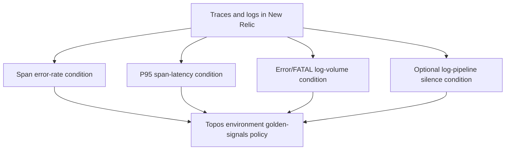

# New Relic dashboards and alerts

The observability Terraform project creates service-focused dashboards and a
single environment-specific golden-signals alert policy.

## Dashboard coverage

Dashboard definitions are split by concern under `infrastructure/observability/`:

| Definition | Focus |
| --- | --- |
| `dashboards_user.tf` | Account service requests, cache, and dependency signals |
| `dashboards_content.tf` | Content API and data-store activity |
| `dashboards_workers.tf` | Summary, indexing, personalizer, and worker outcomes |
| `dashboards_ai.tf` | gRPC, LLM, retrieval, and Qdrant signals |
| `dashboards_gateway.tf` | Federated API and router signals |
| `dashboards_logs.tf` | Normalised structured log exploration |

## Alert policy

Thresholds are variables, not hard-coded documentation values. The source is
[`observability/alerts.tf`](../../observability/alerts.tf). The log-silence
condition is intentionally configurable because it should be enabled only after
production log delivery is confirmed.

## Use the resources safely

Run `make obs-plan` before `make obs-apply`. Both require a New Relic API key
from the environment. Use `make obs-test-live` for read-only verification after
a deployment.
