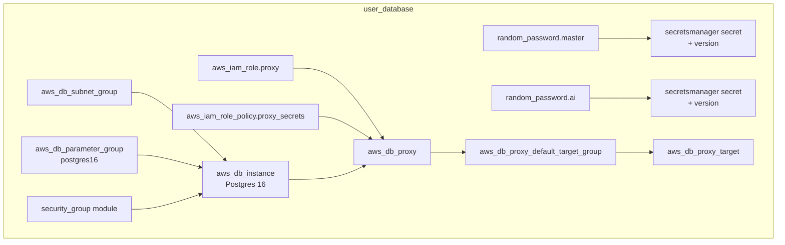

# Terraform modules

The root module is 138 lines of wiring. Everything it creates lives in five
directories under [`infrastructure/terraform/modules/`](../../terraform/modules/).
This page is the reference for what each one provisions, what it takes in, and
what it hands back.

## New to this service?

Read [Terraform architecture](../concepts/terraform-architecture.md) first if
you have not seen the module graph. This page zooms in on one module at a time.

## The five at a glance

| Module | Resources | Provisions | Called from |
| --- | --- | --- | --- |
| `user_database` | 14 | RDS Postgres, RDS Proxy, proxy IAM role, master and AI credentials, `ai_checkpoints` database support | root |
| `user_cache` | 6 | ElastiCache replication group, its parameter and subnet groups, auth token | root |
| `content_database` | 6 | DocumentDB cluster and instance, master credentials | root |
| `content_streaming` | 1 | MSK Kafka cluster | root |
| `security_group` | 1 | One security group with parameterized ingress | all four of the above |

Resource counts exclude `module` blocks themselves. The `moved.tf` files in four
of the directories contain no resources; they record state address changes.

## `user_database`

The largest module by a distance, at 14 resources.



### Notable inputs

| Variable | Why it exists |
| --- | --- |
| `is_floci` | Switches port (`7001` vs `5432`), `storage_type`, and the diagnostic parameter |
| `proxy_require_tls` | Proxy connections require TLS on real AWS |
| `proxy_max_connections_percent` | Pool sizing as a percentage of the instance's `max_connections`, so it survives an instance class change |
| `proxy_connection_borrow_timeout` | How long a caller waits for a pooled connection |
| `ai_db_name`, `ai_username` | The second, least-privilege database on the same instance |

### Outputs

`db_subnet_group`, `writer_endpoint`, `reader_endpoint`, `proxy_endpoint`,
`master_secret_arn`, `master_password`, `ai_username`, `ai_db_name`,
`ai_password`, `ai_secret_arn`, `security_group_id`.

The two passwords are outputs **only within Terraform**. They are consumed by
`secrets.tf` to build connection URLs and are never exposed at the root, so
`make infra-output` cannot print them.

### The AI checkpoint database

The RDS instance creates one database, `topos_users`. The AI service needs a
second one, `ai_checkpoints`, owned by a role that cannot touch anything else.
Terraform creates the *credentials* but not the *database*, because RDS only
creates the initial database at instance creation time.

Two files bridge that gap, one per environment:

| Environment | Mechanism |
| --- | --- |
| Real AWS | [`init-ai-db.sql`](../../terraform/modules/user_database/init-ai-db.sql), run once against the writer endpoint with master credentials. It creates the `ai_checkpointer` role and the `ai_checkpoints` database, both idempotently |
| Local Docker | [`docker/users-postgres/init/10-ai-checkpoints.sh`](../../docker/users-postgres/init/10-ai-checkpoints.sh), executed automatically by the Postgres entrypoint on first volume init |

Floci does not need either file.

### Two URLs, deliberately

```
DATABASE_URL         -> RDS Proxy, pooled, ?sslmode=require
DATABASE_URL_MIGRATE -> direct writer,  ?sslmode=require
```

Application traffic goes through the proxy so connection pooling happens
server-side and does not exhaust the instance. Migrations go direct, because
DDL cannot run through a pooler that may hand you a different connection
mid-transaction.

`main.tf` derives the pooled host in one place:

```hcl
user_db_host = try(coalesce(module.user_database.proxy_endpoint, ""), "") != "" ?
  module.user_database.proxy_endpoint : module.user_database.writer_endpoint
```

Proxy endpoint if there is one, direct writer otherwise.

## `user_cache`

Six resources: a `random_password` auth token, its Secrets Manager entry and
version, the subnet group, the parameter group, and the replication group.

| Input | Floci value | Real AWS |
| --- | --- | --- |
| `num_cache_clusters` | `1` | typically `2` |
| `automatic_failover_enabled` | `false` | requires `2+` clusters |
| `multi_az_enabled` | `false` | `true` |
| `snapshot_retention_limit` | `0` | non-zero |

Outputs: `primary_endpoint`, `reader_endpoint`, `redis_url`,
`auth_token_secret_arn`, `auth_token`, `security_group_id`.

`redis_url` is the value that becomes `USER_REDIS_URL`, and on real AWS it is
`rediss://` with the auth token embedded. It is sensitive, so it prints as
`<sensitive>` from `make infra-output`.

The cache serves two consumers: the user service's cache, and the content
service's cache client. Both are application concerns; this module owns only
the endpoint and the token.

## `content_database`

Six resources: `random_password`, its secret and version, the subnet group,
the cluster, and one cluster instance.

```hcl
resource "aws_docdb_cluster_instance" "content" {
  count = 1
  # ...
}
```

`count = 1` and the comment above it explain the emulator's limit: Floci's
DocumentDB mock is single-node. Real AWS would raise the count to add a reader.

Two lifecycle blocks suppress drift the emulator causes regardless of
configuration:

```hcl
lifecycle {
  ignore_changes = [db_subnet_group_name]
}
lifecycle {
  ignore_changes = [cluster_identifier]
}
```

Floci returns `"default"` for the subnet group whatever you set, and reports a
cluster identifier that differs from the one requested.

Outputs: `cluster_id`, `cluster_endpoint`, `reader_endpoint`, `port`,
`master_secret_arn`, `master_username`, `master_password`,
`security_group_id`, `subnet_group_name`.

On real AWS the connection string must carry TLS options that DocumentDB
requires and that Floci does not:

```text
?tls=true&tlsCAFile=/app/certs/rds-combined-ca-bundle.pem&retryWrites=false
```

`retryWrites=false` is there because DocumentDB does not support retryable
writes.

## `content_streaming`

One resource, the MSK cluster, plus the shared security group module opening
two ports:

| Port | Purpose |
| --- | --- |
| `9092` | Kafka broker |
| `9098` | Broker TLS/auth listener |

```hcl
encryption_info {
  encryption_in_transit {
    client_broker = var.aws_endpoint_url != "" ? "TLS_PLAINTEXT" : "TLS"
  }
}
```

This is the clearest example of the emulator switch. Floci provisions the
broker as `TLS_PLAINTEXT`; if the configuration said `TLS`, every plan would
propose an update that Floci rejects with HTTP `405`, forever.

Outputs: `cluster_arn`, `cluster_name`, `bootstrap_brokers`,
`bootstrap_brokers_tls`, `security_group_id`.

`bootstrap_brokers` becomes `KAFKA_BROKERS`. Its value contains a **container
hostname that changes when the cluster is recreated**, which is why
`.env.example` carries that warning inline.

## `security_group`

The only nested module, called four times:

| Caller | Name | Ingress |
| --- | --- | --- |
| `user_database` | `<prefix>-db-sg` | Postgres port, or `7001` on Floci |
| `user_cache` | `<prefix>-cache-sg` | Redis port |
| `content_database` | `<prefix>-docdb-sg` | `27017` |
| `content_streaming` | `<prefix>-msk-sg` | `9092`, `9098` |

Its whole body is one resource with a dynamic ingress block:

```hcl
dynamic "ingress" {
  for_each = var.ingress_rules
  content {
    from_port   = ingress.value.from_port
    to_port     = ingress.value.to_port
    protocol    = ingress.value.protocol
    cidr_blocks = var.allowed_cidr_blocks
  }
}
```

`allowed_cidr_blocks` comes from the environment: `["172.31.0.0/16"]` for
Floci. Egress is wide open to `0.0.0.0/0`, which is normal for a security
group whose job is inbound restriction only.

## `moved.tf`

Four modules carry `moved` blocks, nine in total:

| File | Blocks | Records |
| --- | --- | --- |
| `user_database/moved.tf` | 6 | Removing `count = 1` from the proxy, its IAM role, policy, target group and target; and extracting the DB security group |
| `user_cache/moved.tf` | 1 | Extracting the cache security group |
| `content_database/moved.tf` | 1 | Extracting the DocDB security group |
| `content_streaming/moved.tf` | 1 | Extracting the MSK security group |

The comment at the top of `user_database/moved.tf` states the intent:

```hcl
# Removing unconditional count = 1 from these resources improves their module
# interface. Preserve the existing state addresses so this refactor never
# replaces the RDS Proxy or its IAM role.
```

Without these, a cosmetic refactor would plan the destruction of a database
proxy. When you see `terraform plan` output a `move` instead of a `create`,
this is why.

## Choosing an environment

Each module takes `is_floci` or `aws_endpoint_url` from the root, and the root
gets it from the tfvars file:

```bash
make infra-plan ENV=floci    # envs/floci.tfvars, aws_endpoint_url set
make infra-plan ENV=prod     # envs/prod.tfvars, aws_endpoint_url empty
```

The `floci.tfvars` values are deliberately small: `db.t4g.micro`,
`cache.t4g.micro`, `db.t3.medium`, `kafka.t3.small`, one broker, one cache
cluster, `multi_az = false`, `deletion_protection = false`, one day of backups.
Its own comment says why: *"Keep costs and emulation load minimal."*

## See also

| Topic | Page |
| --- | --- |
| Why the emulator switch exists | [Terraform architecture](../concepts/terraform-architecture.md) |
| Running the commands | [Terraform workflow](../operations/terraform-workflow.md) |
| Where the passwords from these modules end up | [Configuration and secrets](configuration-and-secrets.md) |
| The local equivalent of `init-ai-db.sql` | [Compose dependencies](compose-dependencies.md) |
