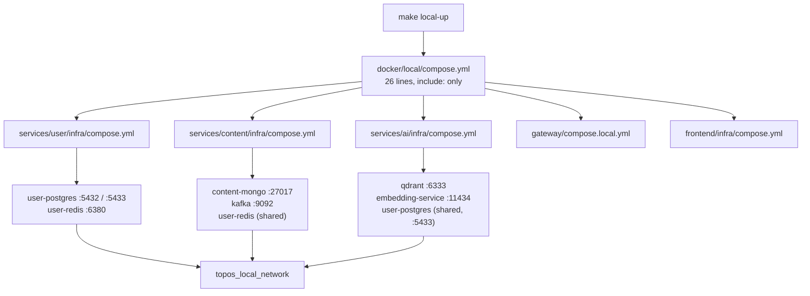
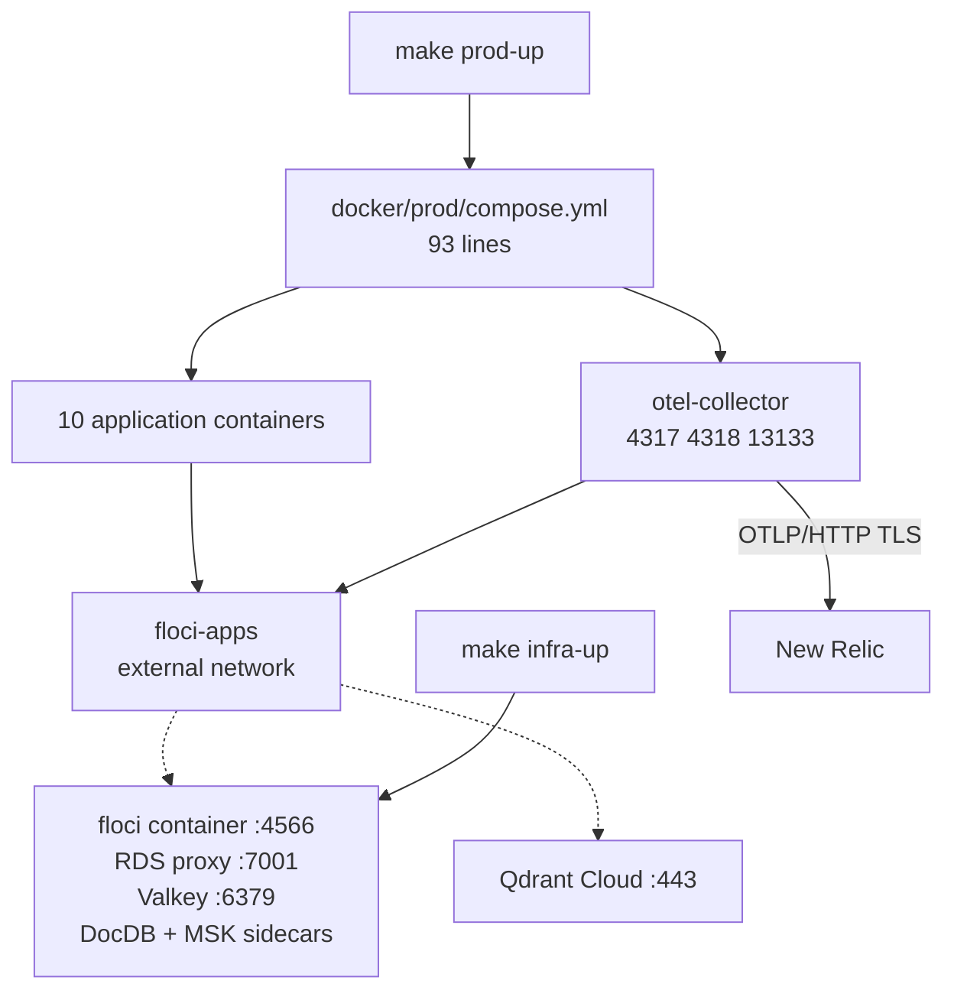
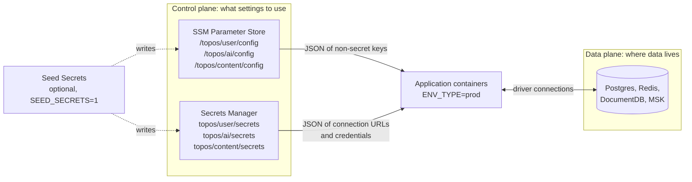

# Local and managed topology

The same application containers run in two very different arrangements. One is
a self-contained Docker project on a laptop; the other is application containers
floating on top of managed services they did not start. This page is the
side-by-side.

## New to this service?

Read [Local stack](../getting-started/local-stack.md) first so you have seen
one of the two shapes in person. This page explains why the other one differs.

## Two shapes, ten shared containers

Rendered from the real files:

```bash
docker compose --env-file infrastructure/docker/local/.env.local \
  -f infrastructure/docker/local/compose.yml config --services      # 17
docker compose --env-file infrastructure/docker/prod/.env.example \
  -f infrastructure/docker/prod/compose.yml config --services       # 11
```

Ten containers appear in both: the four application services, three content
workers, the gateway, the frontend, the Kafka topic initialiser, and the user
migrator.

| | Local | Managed |
| --- | --- | --- |
| Containers | 17 | 11 |
| Shared with the other plane | 10 | 10 |
| Data-store containers | 7 | **0** |
| Telemetry collector | absent | 1 (`otel-collector`) |

The seven local-only containers are `user-postgres`, `user-redis`,
`content-mongo`, `kafka`, `qdrant`, `embedding-service`, and the one-shot
`embedding-model-init`. Managed mode replaces all seven with external endpoints
and adds exactly one new container, the collector.

## The local plane



Everything shares one bridge network that Compose creates. Hostnames are
container names: `user-postgres`, `user-redis`, `content-mongo`, `kafka-1`,
`qdrant`, `embedding-service`.

The `include:` merge is what makes the shared containers work. Both the user
stack and the AI stack want `user-postgres`; merging them into one project
means Compose starts it once instead of twice.

That shared dependency is also why `user-postgres` publishes two host ports:

```yaml
- "${USER_POSTGRES_EXT_PORT:-5432}:5432"
- "${AI_POSTGRES_EXT_PORT:-5433}:5432"
```

Both land on the same container. Publishing both keeps the user and AI Compose
definitions byte-identical, which the merge requires.

## The managed plane



No database appears anywhere in `docker/prod/compose.yml`. The data plane is
reached, not started.

## Store by store

This is the table worth pinning somewhere:

| Store | Local | Floci emulator | Real AWS |
| --- | --- | --- | --- |
| Postgres (accounts) | `user-postgres` container, `5432`/`5433` | RDS Proxy on `floci:7001` | RDS + RDS Proxy, `?sslmode=require` |
| Postgres checkpoints (AI) | same container, `ai_checkpoints` database | same proxy, `floci:7001` | same instance, least-privilege `ai_checkpointer` role |
| Redis cache | `user-redis` container, `6380` | Valkey on `floci:6379` with AUTH | ElastiCache, `rediss://` with token |
| MongoDB (content) | `content-mongo` container, `27017` | DocumentDB sidecar, `floci-docdb-...:27017` | DocumentDB with TLS and CA bundle |
| Kafka | `kafka` container, `9092` | MSK sidecar, `floci-msk-<id>:9092` | MSK bootstrap brokers |
| Vector store | `qdrant` container, `6333` | Qdrant Cloud (`AI_QDRANT_URL`) | Qdrant Cloud |
| Embeddings | `embedding-service` (Ollama), `11434` | Server-side inference, no container | Server-side inference, no container |

Three rows change *kind*, not just address:

- **Embeddings** go from a local Ollama container with a pulled model to
  Qdrant's server-side inference, which is why `prod/compose.yml` has no
  `embedding-service` and no `embedding-model-init`.
- **Kafka brokers** are a hostname that can change when the MSK cluster is
  recreated, which is why `.env.example` carries a comment saying so next to
  `KAFKA_BROKERS`.
- **Postgres access** switches from a plain connection string to two URLs: a
  pooled one through the RDS Proxy for application traffic, and a direct
  writer URL for migrations and DDL that a pooler cannot run.

## Networks

| | Local | Managed |
| --- | --- | --- |
| Name | `topos_local_network` | `floci-apps` |
| Created by | Compose, automatically | Nothing. It is `external: true` |
| Who joins it | Every container in the project | App containers, `otel-collector`, `floci` and its sidecars |
| Hostname style | Container name, e.g. `user-postgres` | Emulator hostnames, e.g. `floci`, `floci-docdb-...` |

Because `floci-apps` is external, Compose will refuse to start with
`network with name floci-apps does not exist` unless Terraform (via
`infra-floci-ensure`) or you have created it.

## Control plane and data plane

Two different things flow from managed services into the containers:



- **Control plane**: settings. Terraform creates the containers and initial
  values; Seed Secrets may overwrite the application-owned subset when asked.
- **Data plane**: actual storage. Terraform creates it; nothing else writes to
  it except the applications.

Locally, `ENV_TYPE=dev` makes the services read their environment file
directly and make **zero AWS calls**. That single line is the difference
between the two planes from the application's point of view.

## Why the split exists

| Reason | Consequence |
| --- | --- |
| Compose is poor at stateful services | No realistic Postgres failover or MSK broker management in a container file |
| One definition per environment | The local file never has to conditionally declare databases |
| Secrets never sit in Compose | `.env` holds placeholders; real values live in Secrets Manager |
| Emulator parity | Floci implements the same AWS API contracts, so one Terraform configuration targets both |

The last point is the design's centre: `var.aws_endpoint_url` empty means real
AWS, non-empty means Floci. Everything else, including the resource names and
module wiring, is identical. See
[Terraform architecture](terraform-architecture.md).

## See also

| Topic | Page |
| --- | --- |
| The seven dependency definitions in detail | [Compose dependencies](../components/compose-dependencies.md) |
| Booting the managed plane | [Managed stack](../getting-started/managed-stack.md) |
| How configuration reaches the containers | [Configuration and secrets](../components/configuration-and-secrets.md) |
| Ports across environments | [Deployment](../operations/deployment.md) |
