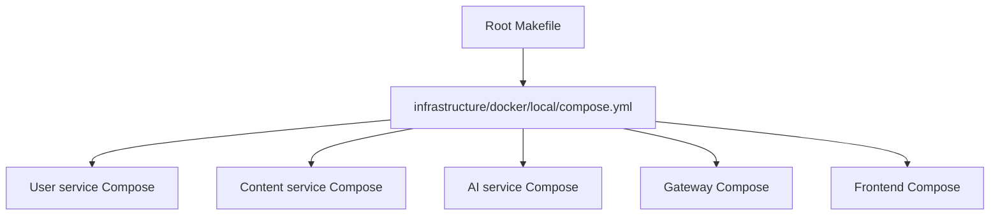
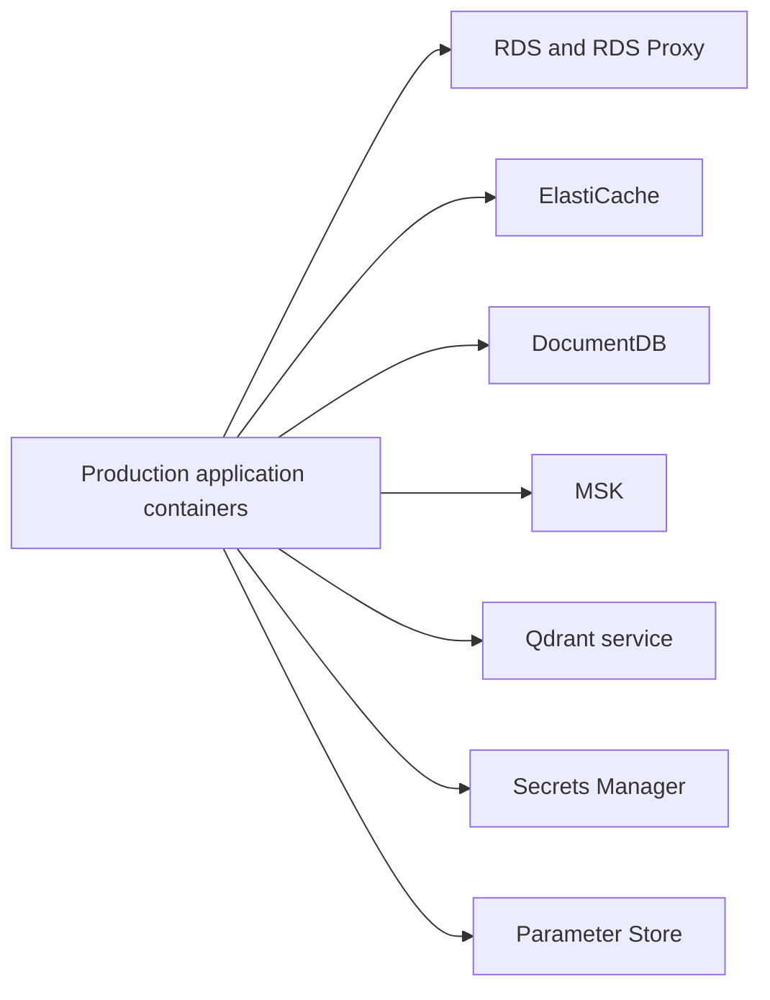

# Local and managed topology

## Local stack

Local Compose runs application containers alongside local databases, broker,
cache, and vector dependencies.

## Managed stack

The production Compose file intentionally contains app containers and the
collector, not Docker copies of the managed data plane. Floci can emulate the
managed control/data-plane contracts for local verification; real AWS uses the
same service configuration shape with production endpoints and credentials.
