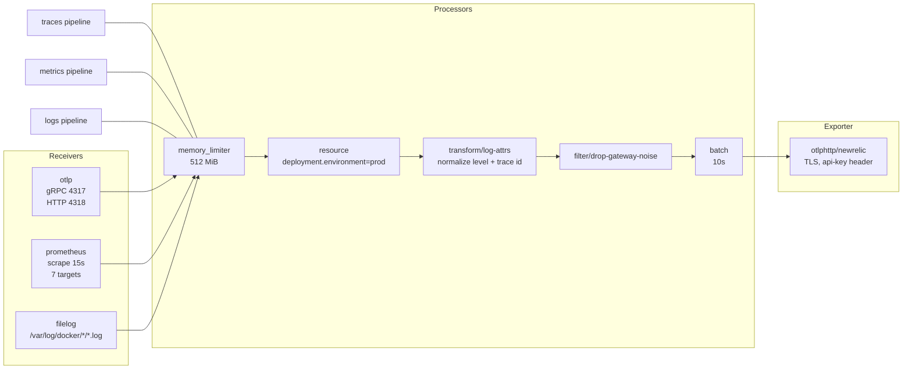

# Observability architecture

Production Topos sends traces, metrics and logs to a single OpenTelemetry
collector, which normalizes them and exports them to New Relic. Local
development runs no collector at all, so you can work on Topos forever without
a New Relic account.

This page explains the three pipelines, what happens to a log line on its way
through, and why the configuration is written the way it is.

## New to this service?

Read [Local and managed topology](local-and-managed-topology.md) first if the
difference between local and managed telemetry is unclear. This page assumes
you are looking at the managed side.

## The shape of it



Arrow directions matter here: **the collector scrapes the services**, not the
other way round. Services push traces and logs to it, while metrics are pulled
from them on a schedule.

## Three pipelines

From [`docker/prod/otel-collector-config.yaml`](../../docker/prod/otel-collector-config.yaml):

| Pipeline | Receivers | Processors, in order | Exporter |
| --- | --- | --- | --- |
| `traces` | `otlp` | `memory_limiter`, `resource`, `batch` | `otlphttp/newrelic` |
| `metrics` | `otlp`, `prometheus` | `memory_limiter`, `resource`, `batch` | `otlphttp/newrelic` |
| `logs` | `otlp`, `filelog` | `memory_limiter`, `resource`, `transform/log-attrs`, `filter/drop-gateway-noise`, `batch` | `otlphttp/newrelic` |

Notice the asymmetry: normalization and filtering happen **only on logs**.
Traces and metrics arrive already structured from the SDKs, so they just get
tagged, bounded and batched.

### Traces: push

Services speak OTLP to the collector. One environment variable covers every
service, which is the trick the config comment calls out:

```text
Single OTEL_EXPORTER_OTLP_ENDPOINT=http://otel-collector:4318 works for
every service: user uses it as HTTP base, content/ai normalize to gRPC
:4317 internally, gateway uses OTEL_TRACING_ENDPOINT (gRPC).
```

The collector exposes both protocols, so each service can use whichever one it
speaks natively.

### Metrics: pull

```yaml
scrape_configs:
  - job_name: topos
    scrape_interval: 15s
    static_configs:
      - targets:
          - user-service:4001
          - content-service:4002
          - content-worker:4003
          - content-search-worker:4004
          - content-personalizer:4005
          - ai-service:12666
          - gateway:8088
```

Seven targets, every 15 seconds. Ports are the **container** ports, reachable
on the Docker network without publishing anything to the host.

One detail worth knowing: `content-worker` is `4003` here, but the local
environment file sets `CONTENT_WORKER_INT_PORT=4012`. Both are correct. The
collector config is prod-only, and the prod environment file uses `4003`.
Copying this scrape list into a local setup would silently miss that target.

### Logs: read from disk

The collector does not receive logs from the services. It reads Docker's own
log files:

```yaml
filelog:
  include:
    - /var/log/docker/*/*.log
  start_at: end
  poll_interval: 500ms
```

Mounted in Compose as `/var/lib/docker/containers:/var/log/docker:ro`. Three
consequences:

| Requirement | Why |
| --- | --- |
| The container runs as `user: "0:0"` | `/var/lib/docker` is mode `0700`; only root can traverse it |
| The mount must be read-only | It only reads logs |
| Docker must use the `json-file` driver on the host | `filelog` tails `*.log`; another driver means no files |
| `start_at: end` | A collector restart does not re-ship history |

The collector's *own* logs use the `local` driver rather than `json-file`:

```yaml
logging:
  driver: local
```

That breaks a feedback loop: if the collector's logs were in `json-file`, its
own parser failures would generate more log lines, which would generate more
failures. You still get them through `docker logs prod-otel-collector`.

## What happens to a log line

A service writes one structured line to stdout. Docker wraps it:

```json
{"log":"{\"level\":30,\"msg\":\"request complete\",\"service\":\"user-service\",\"trace_id\":\"...\"}\n","stream":"stdout","time":"..."}
```

The `logs` pipeline then applies, in order:

### 1. `json_parser` (docker-wrapper)

Unwraps Docker's envelope into attributes. `on_error: send` means a line that
is not JSON still travels on rather than being dropped.

### 2. `json_parser` (app-json)

If there is a `log` field, parse *that* as JSON too. `on_error: send_quiet`,
because non-JSON lines are expected (nginx access logs, Floci internals) and
must not spam the collector log.

### 3. Three `copy` operators choose the body

| Condition | Body becomes |
| --- | --- |
| `msg` present | `msg` (the pino/slog convention) |
| else `message` present | `message` |
| else `log` present | the raw `log` string |

Copies, not moves, on purpose: sequential moves would let a later branch
clobber an earlier body. `drop-raw-json` then removes the raw `log` attribute.

### 4. `severity_parser` maps the level

| Source | Becomes |
| --- | --- |
| `trace`, `TRACE`, `10` | trace |
| `debug`, `DEBUG`, `20` | debug |
| `info`, `INFO`, `30` | info |
| `warn`, `WARN`, `warning`, `WARNING`, `40` | warn |
| `error`, `ERROR`, `err`, `ERR`, `50` | error |
| `fatal`, `FATAL`, `critical`, `CRITICAL`, `60` | fatal |

Numeric values are pino's (`30` is info, `50` is error). Text values are slog,
Python's logging, and the router's. One mapping table handles all four
conventions.

### 5. `service.name` is attached

Every application service logs a `service` field, which gets moved into
`resource["service.name"]`. Lines with **no** `service` field are assumed to be
the gateway's and get `gateway`:

```yaml
- type: add
  id: service-gateway-default
  field: resource["service.name"]
  value: gateway
  if: 'attributes["service"] == nil'
```

### 6. `transform/log-attrs` normalizes for NRQL

```text
set(attributes["log_level"], "TRACE")  where Int(severity_number) >= 1  and Int(severity_number) <= 4
set(attributes["log_level"], "DEBUG")  where Int(severity_number) >= 5  and Int(severity_number) <= 8
set(attributes["log_level"], "INFO")   where Int(severity_number) >= 9  and Int(severity_number) <= 12
set(attributes["log_level"], "WARN")   where Int(severity_number) >= 13 and Int(severity_number) <= 16
set(attributes["log_level"], "ERROR")  where Int(severity_number) >= 17 and Int(severity_number) <= 20
set(attributes["log_level"], "FATAL")  where Int(severity_number) >= 21 and Int(severity_number) <= 24
set(attributes["trace.id"], attributes["trace_id"]) where attributes["trace_id"] != nil and attributes["trace.id"] == nil
```

This is why dashboards can ask for `log_level IN ('ERROR', 'FATAL')` without
caring which framework produced the line, and why the New Relic UI can jump
from a log straight to its trace.

### 7. `filter/drop-gateway-noise` removes two patterns

```text
^\S+ - - \[                                   # nginx access lines
^\d{4}-\d{2}-\d{2} \d{2}:\d{2}:\d{2},\d{3}   # Java-style timestamps
```

Both only when `service.name == "gateway"`. Without this, the gateway's facet
in New Relic would be dominated by frontend access logs and Floci internals,
neither of which is an application log. `error_mode: ignore` means a
non-matching line is never treated as an error.

### 8. `resource` stamps the environment

```yaml
- key: deployment.environment
  value: prod
  action: upsert
```

Every signal, in every pipeline, gets `deployment.environment=prod`. All New
Relic queries filter on it:

```sql
Span WHERE deployment.environment = 'prod'
Log   WHERE deployment.environment = 'prod'
```

Change that one value to move the whole telemetry surface to another
environment label.

## Exporting

```yaml
exporters:
  otlphttp/newrelic:
    endpoint: ${env:NEW_RELIC_OTLP_HTTP_ENDPOINT}
    headers:
      api-key: ${env:NEW_RELIC_LICENSE_KEY}
```

| Variable | Default in `.env.example` |
| --- | --- |
| `NEW_RELIC_OTLP_HTTP_ENDPOINT` | `https://otlp.nr-data.net` (EU: `https://otlp.eu01.nr-data.net`) |
| `NEW_RELIC_OTLP_ENDPOINT` | `https://otlp.nr-data.net:4317` |
| `NEW_RELIC_LICENSE_KEY` | empty; never committed |

Only this container speaks TLS to New Relic. Everything inside the Docker
network talks plain OTLP to it.

## Ports

The collector exposes three ports and publishes **none of them**:

| Port | Purpose | Reachable from |
| --- | --- | --- |
| `4317` | OTLP gRPC receiver | containers on `floci-apps` |
| `4318` | OTLP HTTP receiver | containers on `floci-apps` |
| `13133` | Health check | any container on `floci-apps` |

There is no `ports:` block in Compose, only `expose:`, so host tools cannot
reach the collector. And because the image is built on `scratch`, there is no
shell inside it for `docker exec` either. Probes have to originate from a
sibling container:

```bash
docker compose --env-file infrastructure/docker/prod/.env \
  -f infrastructure/docker/prod/compose.yml \
  exec user-service curl -fsS http://otel-collector:13133/
```

That returns `{"status":"UP"}` when healthy. `user-service` works because its
image ships `curl` for its own Compose health check.

## Local has none of this

`.env.local` sets `USER_OTLP_ENDPOINT=` and `AI_OTLP_ENDPOINT=` to empty, and
the local Compose file declares no collector. Empty endpoint means tracing is
disabled, not failing. This is deliberate: no collector, no license key, no
New Relic account, no error spam.

## See also

| Topic | Page |
| --- | --- |
| Operating the collector and responding to incidents | [Monitoring and telemetry](../operations/monitoring-and-telemetry.md) |
| Dashboards and alerts built on this data | [New Relic resources](../components/new-relic-resources.md) |
| The Prometheus targets on the application side | [Gateway](../../../gateway/docs/operations/health-and-observability.md) |
| Running the validation that checks this config | [Testing overview](../testing/overview.md) |
