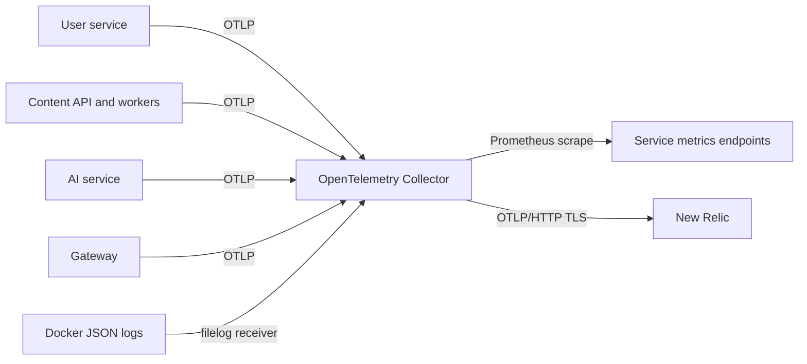

# Observability architecture

Production Topos sends traces, metrics, and logs to an OpenTelemetry Collector.
The collector normalizes and exports them to New Relic. Local Compose leaves the
telemetry endpoint empty by default, so local development does not require a
New Relic account.

## Signal paths

| Signal | Producer | Collector receiver | Destination |
| --- | --- | --- | --- |
| Traces | Instrumented services and gateway | OTLP | New Relic |
| Metrics | OTLP instruments and Prometheus endpoints | OTLP and Prometheus | New Relic |
| Logs | Service stdout and gateway/container logs | OTLP and filelog | New Relic |

The collector listens on gRPC `4317` and HTTP `4318`, scrapes the listed
service targets every 15 seconds, and labels production telemetry with its
deployment environment. Its exact pipeline is
[`docker/prod/otel-collector-config.yaml`](../../docker/prod/otel-collector-config.yaml).
