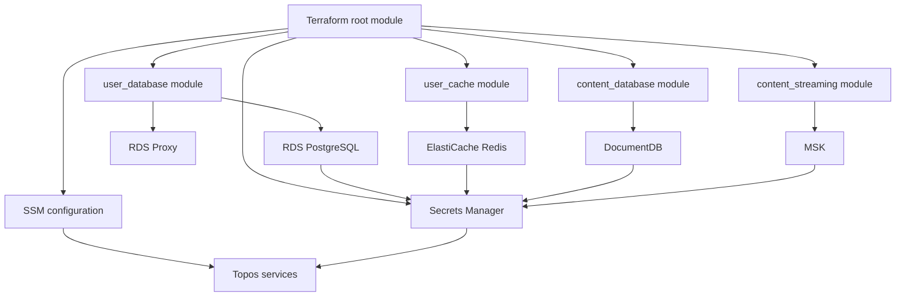

# Terraform architecture

Terraform provisions the user and content data-plane resources. Its root module
wires focused modules rather than putting every resource into one file.

## Module responsibilities

| Module | Provisions | Consumers |
| --- | --- | --- |
| `user_database` | PostgreSQL, proxy, credentials, AI checkpoint database support | User service and AI checkpointing |
| `user_cache` | Redis-compatible cache and auth material | User and content cache clients |
| `content_database` | Mongo-compatible DocumentDB resources | Content service |
| `content_streaming` | Kafka-compatible MSK resources | Content API and workers |
| `security_group` | Reusable network access rules where used | Managed resources |

The actual root wiring is in [`terraform/main.tf`](../../terraform/main.tf).
Terraform output values expose endpoints and resource identifiers; sensitive
outputs must not be copied into docs or committed env files.
