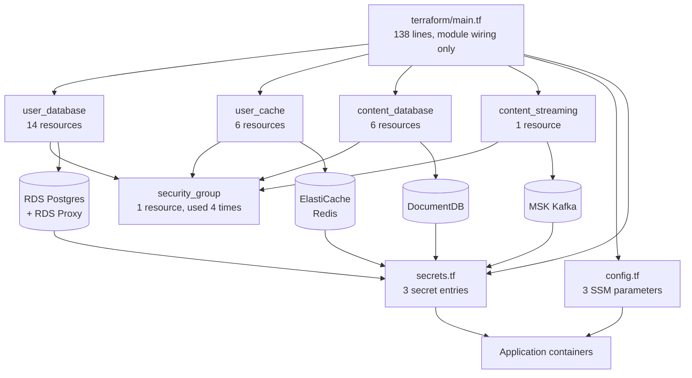
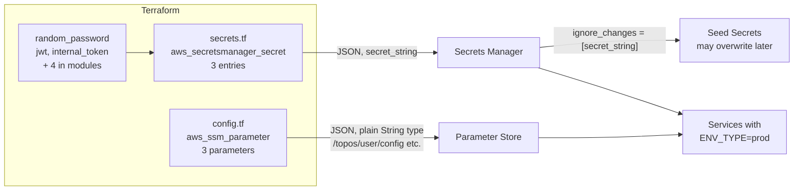

# Terraform architecture

Terraform is how the databases, cache and broker come to exist outside a
laptop. This page explains what Terraform is if you have never used it, what
this project builds with it, and the one variable that lets the same
configuration target either an emulator or real AWS.

## New to this service?

Start with [Local and managed topology](local-and-managed-topology.md) so you
know *which* resources we are talking about. This page is about how they get
created.

## A two-minute Terraform primer

If you have never run Terraform, these five ideas explain everything below.

| Concept | What it means here |
| --- | --- |
| **Configuration** | `.tf` files declaring what *should* exist. Editing them changes nothing by itself |
| **State** | A record of what Terraform believes *does* exist, in `terraform.tfstate`. Gitignored. It is how Terraform knows `topos-user-floci-db` is yours |
| **`plan`** | Diff configuration against state and show you what would change. Changes nothing |
| **`apply`** | Make the world match the plan. Writes to state |
| **Provider** | The plugin that talks to an API. This project uses `hashicorp/aws` and `hashicorp/random` |

Two supporting ideas:

- **Module** = a reusable directory of configuration with inputs (`variable`)
  and outputs (`output`). `modules/user_database/` is one.
- **tfvars file** = a set of variable values for one environment.
  `envs/floci.tfvars` and a future `envs/prod.tfvars` are two of them.

The single most important consequence: **state lives locally and is not
committed.** A fresh clone has no state, so its first `apply` creates
everything from zero. A machine with stale state will try to reconcile against
whatever it remembers, which is why `plan` needs the target to be reachable.

## There are two separate projects

| | `infrastructure/terraform/` | `infrastructure/observability/` |
| --- | --- | --- |
| Provider | `hashicorp/aws`, `hashicorp/random` | `newrelic/newrelic` |
| Creates | Postgres, Redis, DocumentDB, MSK, SSM, Secrets Manager | Dashboards, alert policy |
| Knows about | AWS APIs | New Relic APIs |
| Make prefix | `infra-*` | `obs-*` |
| Lines | 1,907 | 1,800 |
| Variables / outputs | 35 / 25 | 16 / 8 |
| Backend | Local state; `backend.hcl.example` shows how to move to S3 | Local state |

They never share state, never import each other, and are applied independently.
If you only need to change a dashboard threshold, you never touch the AWS
project.

## The root module

[`terraform/main.tf`](../../terraform/main.tf) is 138 lines of wiring and
nothing else. It declares four modules:



`security_group` is the only nested module. Each of the four provisioning
modules calls it rather than declaring its own ingress rules, so network policy
has one definition.

Resource counts come from the source:

| Module | Resources | Notable |
| --- | --- | --- |
| `user_database` | 14 | RDS instance, proxy, IAM role for the proxy, subnet group, parameter group, two `random_password` values, master and AI secrets |
| `user_cache` | 6 | Replication group, subnet group, parameter group, auth-token secret |
| `content_database` | 6 | DocumentDB cluster and instance, subnet group, master secret |
| `content_streaming` | 1 | The MSK cluster (its security group comes from the nested module) |
| `security_group` | 1 | Ingress rules from `allowed_cidr_blocks` |
| Root `config.tf` + `secrets.tf` | 6 | Three SSM parameters, three secret entries |

## The Floci switch

This is the idea that makes the whole project work. Two mechanisms, one
variable.

### Mechanism 1: provider endpoints

```hcl
provider "aws" {
  region = var.aws_region

  access_key = var.aws_endpoint_url != "" ? "test" : null
  secret_key = var.aws_endpoint_url != "" ? "test" : null

  skip_credentials_validation = var.aws_endpoint_url != ""
  skip_metadata_api_check     = var.aws_endpoint_url != ""
  skip_requesting_account_id  = var.aws_endpoint_url != ""
  s3_use_path_style           = var.aws_endpoint_url != ""

  endpoints {
    docdb          = var.aws_endpoint_url != "" ? var.aws_endpoint_url : null
    elasticache    = var.aws_endpoint_url != "" ? var.aws_endpoint_url : null
    kafka          = var.aws_endpoint_url != "" ? var.aws_endpoint_url : null
    rds            = var.aws_endpoint_url != "" ? var.aws_endpoint_url : null
    ssm            = var.aws_endpoint_url != "" ? var.aws_endpoint_url : null
    # ... ten more
  }
}
```

Empty `aws_endpoint_url` means every call goes to real AWS. Non-empty means
every call goes to `http://localhost:4566` instead, with placeholder
credentials because an emulator does not care.

### Mechanism 2: `is_floci`

The root passes the same expression into the modules:

```hcl
is_floci = var.aws_endpoint_url != ""
```

Nine settings then differ between the two targets:

| Location | Floci | Real AWS | Why |
| --- | --- | --- | --- |
| DB security group port | `7001` | `var.port` | Floci exposes RDS through a proxy port |
| RDS instance port | `7001` | `var.port` | Same reason |
| RDS `storage_type` | `"gp2"` | `"gp3"` | Floci reports gp2 for its Docker-backed storage |
| `log_min_duration_statement` parameter | **omitted** | `1000` | Floci accepts the group but does not persist parameters, so including it would create a permanent diff |
| Cache security group | `[]` | `[module.security_group.id]` | Floci does not enforce it |
| DocumentDB `db_subnet_group_name` | `"default"` | The created subnet group | Floci's mock returns `"default"` regardless, so using anything else causes replacement drift after import |
| MSK `client_broker` | `"TLS_PLAINTEXT"` | `"TLS"` | Floci provisions the broker as `TLS_PLAINTEXT`. Leaving the provider default would create a perpetual diff whose `UpdateSecurity` call Floci rejects with `405` |
| `skip_final_snapshot` | `true` | `false` | No snapshot worth keeping from an emulator |
| Secrets content | `floci:7001`, `floci:6379`, sidecar hostnames | Real endpoints with `sslmode=require` and TLS bundles | See `secrets.tf` |

The first seven use `is_floci` or the endpoint URL directly; the last two
branch on `var.environment == "floci"`. That table is the practical answer to
"what does switching environments actually change".

Two of these are paired with `lifecycle { ignore_changes = ... }` in
`content_database`, because the emulator returns the same value no matter what
you configure and an un-ignored difference would show up as permanent drift on
every plan.

### The env file picks the target

```bash
make infra-plan ENV=floci    # -var-file=envs/floci.tfvars
make infra-plan ENV=prod     # -var-file=envs/prod.tfvars
```

`ENV` is a Make variable, not a Terraform one. It selects which tfvars file is
passed, and `check-tfvars` fails early if that file does not exist.

## Configuration versus secrets

The split is deliberate and lives in separate files:



| File | Holds | Examples |
| --- | --- | --- |
| `config.tf` | Non-secret tuning, as a JSON object in one `String` parameter | `PORT=4001`, `LOG_LEVEL=info`, `KAFKA_TOPIC=posts`, `WORKER_CONCURRENCY=3` |
| `secrets.tf` | Connection URLs, credentials, tokens | `DATABASE_URL`, `REDIS_URL`, `MONGO_URI`, `JWT_SECRET` |

Three rules:

1. **`config.tf` values are readable by anyone who can read the parameter.**
   Never put a credential there.
2. **`secret_string` carries `lifecycle { ignore_changes = [secret_string] }`.**
   Terraform writes it once, then stops fighting. Without that, every
   `apply` would revert whatever Seed Secrets had just written.
3. **`random_password` values live only in state.** They are not outputs. If
   state is lost, those credentials must be regenerated.

## `moved.tf`: refactors that do not destroy anything

Four modules have a `moved.tf` file containing nine `moved` blocks in total:

```hcl
moved {
  from = aws_db_proxy.user[0]
  to   = aws_db_proxy.user
}
```

`moved` tells Terraform "this resource still exists, it just has a new
address". Here it records two real refactors:

| Refactor | Blocks | Why it mattered |
| --- | --- | --- |
| Removing `count = 1` from proxy resources in `user_database` | 6 | Cleaner module interface, without replacing the RDS Proxy or its IAM role |
| Extracting security groups into the shared module | 4 across the other modules | One ingress definition instead of four |

Without them, Terraform would plan a **destroy and recreate** of a database
proxy. If you add a `moved.tf` block, expect `terraform plan` to report
`move` operations rather than replacements.

## Outputs

25 outputs exist; `make infra-output` reads them from state.

| Group | Outputs |
| --- | --- |
| Network | `user_vpc_id`, `user_db_subnet_group` |
| User Postgres | `user_db_writer_endpoint`, `user_db_reader_endpoint`, `user_db_proxy_endpoint`, `user_db_name`, `user_db_master_secret_arn` |
| User cache | `user_redis_endpoint`, `user_redis_reader_endpoint`, `user_redis_url`, `user_redis_auth_token_secret_arn` |
| AI checkpoints | `ai_db_name`, `ai_db_username`, `ai_db_secret_arn` |
| Content | `content_docdb_cluster_endpoint`, `content_docdb_reader_endpoint`, `content_docdb_master_secret_arn`, `content_msk_bootstrap_brokers`, `content_msk_cluster_arn` |
| Integration contract | `user_config_param_name`, `user_secrets_name`, `ai_config_param_name`, `ai_secrets_name`, `content_config_param_name`, `content_secrets_name` |

Those last six are not for humans. Applications read them to find their
configuration, and the contract tests assert they never change:

```hcl
assert {
  condition     = aws_ssm_parameter.user_config.name == "/topos/user/config"
  error_message = "User config must retain its stable SSM path."
}
```

Renaming `/topos/user/config` is a breaking change to every service that reads
it.

Two gotchas documented in [Managed stack](../getting-started/managed-stack.md):
11 outputs are sensitive and print as `<sensitive>`, and outputs added since
the last apply do not appear at all.

## See also

| Topic | Page |
| --- | --- |
| Per-module resource detail | [Terraform modules](../components/terraform-modules.md) |
| Running plan, apply, destroy | [Terraform workflow](../operations/terraform-workflow.md) |
| Where secrets end up and who may change them | [Configuration and secrets](../components/configuration-and-secrets.md) |
| What CI runs on every change | [Testing overview](../testing/overview.md) |
