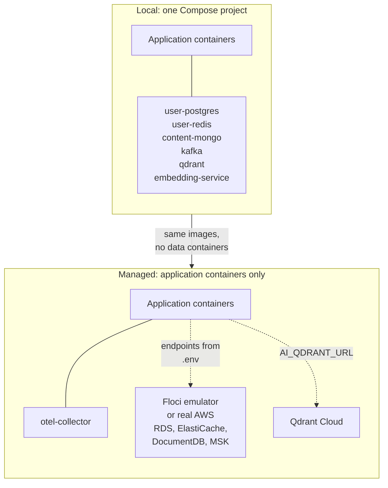
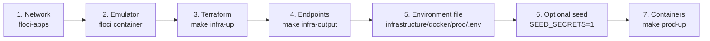

# Managed stack

Running Topos outside a laptop has a boot **order**, not just a boot command.
Databases must exist before their connection strings mean anything, secrets
must exist before services read them, and Compose comes last. This page is that
order, plus where every placeholder value in the environment file comes from.

## New to this service?

Read [Local stack](local-stack.md) first if you have never run Topos at all.
The managed stack is the same application containers with a completely
different set of dependencies behind them.

## The one structural difference



The managed Compose file contains **no database services at all**. Its own
header says so: *"app containers only, no docker postgres/redis/mongo/kafka/
qdrant."* Postgres, Redis, Mongo and Kafka come from Floci (or real AWS), and
vectors come from Qdrant Cloud.

## The boot order



`make prod-up` can perform steps 3, 6 and 7 in one go if you tell it to. By
default it performs **only step 7**, so that restarting containers is never
surprised by an infrastructure change or a secret overwrite.

## Step 1 and 2: network and emulator

The Compose file declares its network as external:

```yaml
networks:
  floci-bridge:
    name: floci-apps
    external: true
```

Something has to create it. `make infra-up ENV=floci` does, via an
`infra-floci-ensure` prerequisite that is idempotent:

```bash
docker network inspect floci-apps >/dev/null 2>&1 || docker network create floci-apps
```

It then starts the `floci` container on port `4566`, polls its health for up to
120 seconds, and connects it to `floci-apps` so that application containers can
reach it as the hostname `floci`.

If you skip Terraform entirely, you must create the network yourself:

```bash
docker network create floci-apps
```

## Step 3 and 4: Terraform

```bash
make infra-up ENV=floci     # starts the emulator, then terraform apply
make infra-output           # prints the 25 outputs
```

`infra-output` runs `terraform output`, which reads the **state file**, not the
network. It works offline and prints instantly.

Two things to know before you trust what it shows you:

| Observation | Detail |
| --- | --- |
| **11 of the outputs are marked sensitive** | They print as `<sensitive>`. Add `-json` only if you genuinely need the value, and never commit the result |
| **12 print as plain text** | Endpoint names, parameter names, secret ARNs, database name |
| **Two may be missing entirely** | `user_redis_endpoint` and `user_redis_reader_endpoint` are defined in [`outputs.tf`](../../terraform/outputs.tf) but absent from state here, because state only gains new outputs at the next `apply` |

That last row is a general rule: **`terraform output` reports what the last
apply recorded.** A newly added output does not exist until something applies
again.

## Step 5: the environment file

`make prod-up` creates `infrastructure/docker/prod/.env` from `.env.example` if
it is missing, then uses it as the Compose `--env-file`. The example file
begins:

```text
# Topos prod env. Copy to .env: cp .env.example .env, then fill CHANGEME from `terraform output`.
```

There are **11 lines containing `CHANGEME`**:

| Variable | Comes from |
| --- | --- |
| `USER_DATABASE_URL`, `USER_DATABASE_URL_MIGRATE` | Writer endpoint from `user_db_writer_endpoint`; password from the `topos/user/secrets` entry |
| `USER_REDIS_URL` | `user_redis_url` output, or Redis auth token secret |
| `USER_AI_CHECKPOINTER_PASSWORD` | The AI checkpointer password created by `user_database` |
| `AI_CHECKPOINT_DB_URL`, `AI_CHECKPOINT_DB_URL_MIGRATE` | `ai_db_name` plus the same password |
| `CONTENT_MONGO_URI` | `content_docdb_cluster_endpoint` plus the DocumentDB master password |
| `REDIS_PASSWORD` | `user_redis_auth_token_secret_arn` |
| `KAFKA_BROKERS` | `content_msk_bootstrap_brokers` (already filled in the example, but it changes whenever the cluster is recreated) |
| `USER_JWT_SECRET`, `CONTENT_JWT_SECRET` | **Must match each other.** Not Terraform-managed on Floci; a fixed placeholder is in `secrets.tf` |
| `CONTENT_INTERNAL_TOKEN` | Service-to-service token, not Terraform-managed |

Two traps in that table:

1. **`USER_JWT_SECRET` and `CONTENT_JWT_SECRET` are not the same variable name
   but must be the same value.** If they diverge, the gateway accepts the
   token and the content service rejects it.
2. **Passwords are not outputs.** Endpoints are; credentials live in Secrets
   Manager under `topos/user/secrets`, `topos/ai/secrets` and
   `topos/content/secrets`. Retrieve them with the AWS CLI against the Floci
   endpoint, or let Seed Secrets push them (next step).

## Step 6: optional seeding

```bash
SEED_SECRETS=1 make prod-up
```

This runs, before Compose:

```text
==> [2/3] seed (SM/SSM from infrastructure/docker/prod/.env)
```

Seed Secrets copies an **allowlisted** subset of `.env` into SSM Parameter
Store and Secrets Manager. It never prints values, and it refuses destinations
that Terraform owns unless you force it.

It is off by default because the direction matters: seeding writes your file
*into* managed storage. A routine `make prod-up` must never do that, or a
half-filled local `.env` would overwrite real credentials.

Preview first:

```bash
cd tools/seed-secrets
make dry-run ENV_FILE=../../infrastructure/docker/prod/.env ENDPOINT_URL=http://localhost:4566
```

Read [Seed Secrets safety guards](../../../tools/seed-secrets/docs/components/safety-guards.md)
before forcing anything.

## Step 7: start the containers

```bash
make prod-up
```

Exact output when both optional phases are enabled:

```text
==> [1/3] infra (terraform apply, ENV=floci)
==> [2/3] seed (SM/SSM from infrastructure/docker/prod/.env)
==> [3/3] app (compose up)
prod up: OK
```

With defaults, only the last two lines appear. Each phase prints a specific
recovery hint on failure:

| Failing phase | Message | Next step |
| --- | --- | --- |
| 1 | `FAILED phase 1/3: infra` | Fix the Terraform error, re-run |
| 2 | `FAILED phase 2/3: seed` | Check the Floci endpoint and AWS credentials |
| 3 | `FAILED phase 3/3: app` | `make prod-logs` |

Eleven containers start: four application containers, four workers, the
migrator helper, one Kafka topic initialiser, and `otel-collector`.

## What is different from local

| | Local | Managed |
| --- | --- | --- |
| Compose entry point | `docker/local/compose.yml` (26 lines, `include:` only) | `docker/prod/compose.yml` (93 lines, declares services directly) |
| Containers | 17 | 11 |
| Databases | Docker containers in the same project | Floci or AWS, outside the project |
| Network | `topos_local_network` (created by Compose) | `floci-apps` (external, must pre-exist) |
| Environment file | `.env.local`, gitignored, all defaults work | `.env`, gitignored, **11 placeholders must be filled** |
| Telemetry | Disabled (`OTEL_*` endpoints empty) | Collector running, exporting to New Relic |
| Vectors | Local `qdrant` container | Qdrant Cloud, `AI_QDRANT_URL` |
| Start command | `make local-up` | `make infra-up` then `SEED_SECRETS=1 make prod-up` |

## Verify

```bash
make prod-ps                              # container states
curl -s localhost:4000/graphql -H 'content-type: application/json' \
  -d '{"query":"{ __typename }"}'          # gateway alive
docker logs prod-otel-collector            # telemetry flowing?
```

The collector has its own health endpoint on `13133`, reachable only from
another container on the `floci-apps` network. The image is built on `scratch`,
so it contains no shell and `docker exec` cannot run anything inside it:

```bash
docker compose --env-file infrastructure/docker/prod/.env \
  -f infrastructure/docker/prod/compose.yml \
  exec user-service curl -fsS http://otel-collector:13133/
# {"status":"UP"}
```

## Tear down

```bash
make prod-down     # containers only, keeps volumes
make prod-clean    # containers and volumes
```

Destroying the **infrastructure** is a different and much larger action:

```bash
make infra-destroy ENV=prod
# refuses: "refusing to destroy prod without CONFIRM_DESTROY=1"
CONFIRM_DESTROY=1 make infra-destroy ENV=prod
```

`CONFIRM_DESTROY=1` is a guard against muscle memory, not a review process.
Read [Terraform workflow](../operations/terraform-workflow.md) before using it.

## Troubleshooting

| Symptom | Cause | Fix |
| --- | --- | --- |
| `network with name floci-apps does not exist` | The network is external, nothing created it | `docker network create floci-apps`, or run `make infra-up ENV=floci` |
| `dial tcp 127.0.0.1:4566: connect: connection refused` | The Floci emulator is not running | `make infra-floci-ensure` |
| Application fails authentication against itself | `USER_JWT_SECRET` and `CONTENT_JWT_SECRET` differ | Make them identical |
| `CHANGEME` in a connection error | `.env` never filled in | See step 5 above |
| `KAFKA_BROKERS` points at a cluster that no longer exists | The sidecar hostname changes when the MSK cluster is recreated | Re-run `make infra-up`, refresh the value |
| Telemetry absent everywhere | No `NEW_RELIC_LICENSE_KEY`, or the collector has no endpoint | Check `docker logs prod-otel-collector` |
| `terraform output` missing a new value | State lags config until the next apply | `make infra-up ENV=floci` |

## Where to go next

| If you want to... | Read |
| --- | --- |
| Understand the two planes properly | [Local and managed topology](../concepts/local-and-managed-topology.md) |
| Know what Terraform is actually creating | [Terraform modules](../components/terraform-modules.md) |
| See where every setting is owned | [Configuration and secrets](../components/configuration-and-secrets.md) |
| Deploy a change safely | [Deployment](../operations/deployment.md) |
| Verify before trusting it | [Testing overview](../testing/overview.md) |
