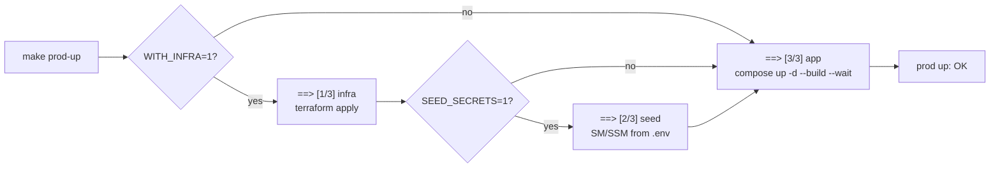

# Deployment

Infrastructure changes ship differently from application changes, because
infrastructure has no image to publish. It has a plan to apply, a state file to
update, an environment file to refresh, and then containers to restart in that
order.

This page is that sequence, plus the port and network facts you need when
something ends up in the wrong place.

## New to this service?

Read [Managed stack](../getting-started/managed-stack.md) first. That page is
how to boot from nothing; this one is how to change something that is already
running.

## What kind of change requires what

| You changed | Do this | Rebuild images? |
| --- | --- | --- |
| `.env` or `.env.local` | `make prod-up` or `make local-up` | no |
| A service's Compose file | `make local-up` (Compose picks up the definition) | for that service, yes if its Dockerfile changed |
| `otel-collector-config.yaml` | `docker restart prod-otel-collector` | **no** |
| `config.tf` (SSM values) | `make infra-up ENV=<env>` then restart the services | no |
| `secrets.tf` or a module | `make infra-plan`, review, `make infra-up`, refresh `.env`, `make prod-up` | no |
| `envs/*.tfvars` | `make infra-plan ENV=<env>`, review, apply | no |
| A subgraph schema | Rebuild the gateway image | **yes** |
| `variables.tf` defaults | plan against every affected environment before applying | no |

The collector row is the one people get wrong. Its config is a read-only bind
mount:

```yaml
volumes:
  - ./otel-collector-config.yaml:/etc/otelcol/config.yaml:ro
```

so a container restart is enough. There is nothing to rebuild.

The gateway row comes from the fact that its supergraph is composed **inside**
the image at build time; see [Gateway deployment](../../../gateway/docs/operations/deployment.md).

## The three phases



Full output with both optional phases enabled:

```text
==> [1/3] infra (terraform apply, ENV=floci)
==> [2/3] seed (SM/SSM from infrastructure/docker/prod/.env)
==> [3/3] app (compose up)
prod up: OK
```

| Phase | Trigger | Why it is off by default |
| --- | --- | --- |
| 1. infra | `WITH_INFRA=1` | A container restart must not become an infrastructure change |
| 2. seed | `SEED_SECRETS=1` | A restart must never overwrite managed secrets |
| 3. app | always | This is what `prod-up` is for |

Each phase prints its own recovery hint and exits immediately:

| Failure | Message | Then |
| --- | --- | --- |
| 1 | `FAILED phase 1/3: infra — fix the terraform error above, then re-run` | Read the Terraform error; [Terraform workflow](terraform-workflow.md) |
| 2 | `FAILED phase 2/3: seed — check the Floci endpoint / AWS creds` | Endpoint reachable? Credentials valid? |
| 3 | `FAILED phase 3/3: app — run 'make prod-logs' for details` | `make prod-logs` |

Stopping at the first failure is deliberate. Applying phase 3 after a failed
phase 1 would start containers against endpoints that do not exist yet.

## Ports

Rendered from both Compose files:

```bash
docker compose --env-file infrastructure/docker/local/.env.local \
  -f infrastructure/docker/local/compose.yml config --services
docker compose --env-file infrastructure/docker/prod/.env.example \
  -f infrastructure/docker/prod/compose.yml config
```

### Application ports

| Port | What | Local | Managed | Variable |
| --- | --- | --- | --- | --- |
| `3000` | Frontend | yes | yes | `FRONTEND_EXT_PORT` |
| `4000` | Gateway GraphQL | yes | yes | `GATEWAY_EXT_PORT` |
| `4001` | User service | yes | yes | `USER_SERVICE_EXT_PORT` |
| `4002` | Content service | yes | yes | `CONTENT_SERVICE_EXT_PORT` |
| `50051` | AI service gRPC | yes | yes | `AI_SERVICE_EXT_PORT` |
| `12666` | AI service metrics | yes | yes | `AI_METRICS_EXT_PORT` |

### Data ports

| Port | What | Local | Managed |
| --- | --- | --- | --- |
| `5432` | Postgres, user stack | yes | no, Floci uses `7001` internally |
| `5433` | Postgres, AI stack alias | yes | no |
| `6380` | Redis | yes | no, Floci uses `6379` internally |
| `27017` | Mongo | yes | no |
| `9092` | Kafka | yes | no |
| `6333` | Qdrant | yes | no, Qdrant Cloud |
| `11434` | Ollama embeddings | yes | no, server-side inference |

### Telemetry ports

| Port | What | Published? |
| --- | --- | --- |
| `4317` | Collector OTLP gRPC | never, `expose:` only |
| `4318` | Collector OTLP HTTP | never |
| `13133` | Collector health | never |
| `8088` | Gateway health and metrics | never, scraped inside the network |

Every row in the last table is reachable only via `docker exec` or another
container on the same network. That is the correct design: telemetry endpoints
have no business on a public interface.

Three ports would collide if you ran both stacks at once: `4000`, `4001` and
`4002` are the same in both. They are not designed to coexist.

## Networks

| | Local | Managed |
| --- | --- | --- |
| Name | `topos_local_network` | `floci-apps` |
| Declared as | Compose-managed | `external: true` |
| Created by | Compose, automatically | `infra-floci-ensure`, or manually |
| Attached | all project containers | app containers, collector, Floci and its sidecars |

If you start the managed stack without Terraform having run:

```bash
docker network create floci-apps
```

Otherwise Compose fails with `network with name floci-apps does not exist`.

## A rollout checklist

For a change that touches Terraform:

1. **`terraform fmt -recursive`** on both projects. Cheapest failure to fix.
2. **`make infra-test-unit`** (mocked contracts, no credentials needed).
3. **`make obs-test-unit`** if you touched observability.
4. **`make infra-plan ENV=floci`** and actually read the destroy list. Anything
   showing as `must be replaced` needs a `moved` block first.
5. **`make infra-up ENV=floci`**.
6. **`make infra-output`** (confirm new outputs appear and old ones are
   unchanged).
7. **Refresh `.env`** if endpoints moved.
8. **`make prod-up`** so containers pick up the new environment.
9. **Verify**: `make prod-ps`, a real GraphQL query, and
   `docker logs prod-otel-collector`.
10. **`make obs-plan` / `obs-apply`** only if dashboards or alerts changed.

Skip step 4 and step 5 becomes a surprise.

## Teardown

```bash
make prod-down      # containers, keeps volumes
make prod-clean     # containers and volumes
make infra-destroy ENV=floci
```

Production destruction requires an explicit acknowledgement:

```bash
$ make infra-destroy ENV=prod
refusing to destroy prod without CONFIRM_DESTROY=1

$ CONFIRM_DESTROY=1 make infra-destroy ENV=prod
```

That guard prevents a typo, not a considered decision. Before setting it,
confirm three things: which account you are authenticated against, where the
state backend points, and what `make infra-plan ENV=prod` says would be
destroyed.

## Failure modes

| Symptom during rollout | Cause | Fix |
| --- | --- | --- |
| `network with name floci-apps does not exist` | External network missing | `docker network create floci-apps` or `make infra-up ENV=floci` |
| Phase 1 fails, phase 3 never runs | Deliberate: fail-fast | Fix Terraform, re-run the whole target |
| Containers start, then auth errors | `USER_JWT_SECRET` and `CONTENT_JWT_SECRET` differ | Make them identical |
| New setting has no effect | Services read managed config once, at startup | Restart the affected containers |
| Collector not picking up config changes | Config is mounted, not baked, but the process reads it once | `docker restart prod-otel-collector` |
| Telemetry missing after a rollout | `NEW_RELIC_LICENSE_KEY` empty in `.env` | Check `docker logs prod-otel-collector` |
| Drift reported right after apply | Target disagrees with configuration | See the `plan -detailed-exitcode` table in [Terraform workflow](terraform-workflow.md) |
| Port already allocated | Both stacks running, or a leftover container | `make local-down && make prod-down` |

## See also

| Topic | Page |
| --- | --- |
| Booting from scratch | [Managed stack](../getting-started/managed-stack.md) |
| Applying and reviewing Terraform | [Terraform workflow](terraform-workflow.md) |
| Ports, health checks, containers | [Local stack](../getting-started/local-stack.md) |
| What CI checks before a merge | [Testing overview](../testing/overview.md) |
