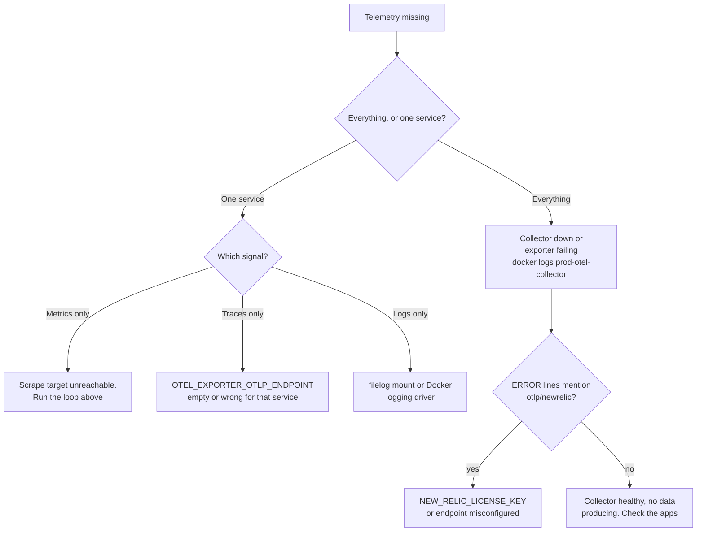

# Monitoring and telemetry operations

What to run when you need to know whether telemetry is flowing, and in what
order to look when it is not.

## New to this service?

Read [Observability architecture](../concepts/observability-architecture.md)
first. This page assumes you understand the three pipelines and are here to
operate them.

## The commands

```bash
make obs-plan           # diff dashboards and alerts (needs NEW_RELIC_API_KEY)
make obs-apply          # apply them (needs NEW_RELIC_API_KEY)
make obs-test-unit      # validate + mocked contracts, no credentials
make obs-test-live      # read-only API verification (needs account id too)
make obs-test-collector # validate the collector config, no credentials
```

Credential requirements, because three of the five need them:

| Command | `NEW_RELIC_API_KEY` | `NEW_RELIC_ACCOUNT_ID` | Docker |
| --- | --- | --- | --- |
| `obs-plan` | required, exits with a message if missing | defaulted to `8557859` | no |
| `obs-apply` | required | defaulted | no |
| `obs-test-unit` | no | no | no |
| `obs-test-live` | required | **required, no default** | no |
| `obs-test-collector` | no | no | yes, pulls the collector image |

Keep the key in the environment. It is injected as `TF_VAR_newrelic_api_key`
by the Makefile, so it never needs to appear in a file:

```bash
export NEW_RELIC_API_KEY=...
make obs-plan
```

## Is the collector alive?

The collector publishes no ports, its image is built on `scratch`, and Compose
defines no health check for it. Three consequences:

| You might try | Result |
| --- | --- |
| `docker exec prod-otel-collector wget ...` | Fails: `executable file not found in $PATH` |
| `docker exec prod-otel-collector sh` | Fails: `no such file or directory` |
| `docker ps` looking for `(healthy)` | Never shows it: there is no `healthcheck:` block |

There is no shell in the container at all, so every check must originate
outside it:

```bash
# 1. startup and runtime logs, the most useful signal
#    (a bad config makes the container exit, and the error is here)
docker logs prod-otel-collector

# 2. is the process up?
docker ps --filter name=otel-collector

# 3. the health endpoint, reached from a container that does have a shell
docker compose --env-file infrastructure/docker/prod/.env \
  -f infrastructure/docker/prod/compose.yml \
  exec user-service curl -fsS http://otel-collector:13133/
```

A healthy endpoint returns `{"status":"UP"}`. `user-service` is a good proxy
because its image ships `curl` for its own Compose health check, and
`otel-collector` resolves as a service name on the `floci-apps` network. Any
other container on that network works too.

Its Compose definition exposes three ports and publishes none:

| Port | Purpose |
| --- | --- |
| `4317` | OTLP gRPC receiver |
| `4318` | OTLP HTTP receiver |
| `13133` | Health check |

There is no `ports:` block, only `expose:`. Nothing on the host can reach the
collector; every probe has to come from a container on the same network.

## Is any target answering?

The collector scrapes seven targets every 15 seconds. Because `metrics_path` is
not set, it uses the Prometheus default of `/metrics`. Probe them all from one
container that has `curl`:

```bash
docker compose --env-file infrastructure/docker/prod/.env \
  -f infrastructure/docker/prod/compose.yml exec user-service sh -c '
  for t in user-service:4001 content-service:4002 content-worker:4003 \
           content-search-worker:4004 content-personalizer:4005 \
           ai-service:12666 gateway:8088; do
    printf "%-32s " "$t"
    curl -fsS -o /dev/null -m 3 "http://$t/metrics" && echo OK || echo FAIL
  done'
```

| Target | Service | What its metrics tell you |
| --- | --- | --- |
| `user-service:4001` | User service | Request rate, latency, cache behaviour |
| `content-service:4002` | Content API | RED signals for GraphQL |
| `content-worker:4003` | Summary worker | Consumer throughput, DLQ pressure |
| `content-search-worker:4004` | Search indexer | Vector indexing progress |
| `content-personalizer:4005` | Personalizer | Feed profile updates |
| `ai-service:12666` | AI service | gRPC and LLM call metrics |
| `gateway:8088` | Gateway | Router request totals, query planning, cache |

Note `content-worker` is `4003` here while the **local** environment file sets
`CONTENT_WORKER_INT_PORT=4012`. The collector config is prod-only; do not copy
this list into a local setup without adjusting it.

## Which signal is broken



### Logs specifically

Logs are not sent by the applications. The collector reads Docker's log files
from disk, so a log problem is usually a filesystem or driver problem:

| Check | Command |
| --- | --- |
| Is the mount there? | `docker inspect prod-otel-collector --format '{{range .Mounts}}{{.Source}} -> {{.Destination}}{{println}}{{end}}'` |
| Does Docker use `json-file`? | `docker info --format '{{.DockerRootDir}} {{.LoggingDriver}}'` |
| Is the collector root? | It must run as `0:0`; `/var/lib/docker` is mode `0700` |
| Is anything arriving? | `sudo ls /var/lib/docker/containers \| head` (the host directory the collector mounts) |

That last check runs on the **host**, because there is no shell inside the
collector to run `ls` in. It separates "nobody is logging" from "the collector
cannot read the logs": the directory holds one subdirectory per container, each
containing a `*-json.log` file.

### The feedback loop

The collector's own Compose logging driver is `local`, not `json-file`:

```yaml
logging:
  driver: local
```

If it were `json-file`, the collector's parser failures would produce log
lines, which the collector would then try to parse, producing more failures.
If you ever see `docker logs prod-otel-collector` repeating the same parser
error, check that this setting survived a Compose edit.

## First response to an incident

1. **Confirm containers are up.** `make prod-ps` or `make local-ps`.
2. **Confirm health endpoints answer.** Application health differs by service:
   user uses `/health`, content and its workers use `/healthz`, the gateway's
   is on `8088` and is not published.
3. **Read the service's own logs first.** `docker logs <container>`. Look for a
   `trace.id` so you can correlate in New Relic.
4. **Check dependencies**: database, cache, Kafka, Qdrant, or the LLM provider,
   depending on the failure. [Compose dependencies](../components/compose-dependencies.md)
   lists each one's health check.
5. **Check workers and DLQ depth** for delayed background work. A slow summary
   is a worker problem, not an API problem.
6. **Only then suspect the collector.** If exactly one service is missing, the
   collector is almost certainly fine.

The ordering matters: telemetry problems are usually a *symptom* of an
application problem, and the collector is downstream of everything.

## Dashboards and alerts while debugging

| Symptom | Look at |
| --- | --- |
| Errors up across services | `Topos <env> observability` |
| One API slow | Its own dashboard, p95 widget |
| Background work stuck | `Topos <env> - Workers & Kafka` |
| Nothing at all, silence | `log_silence` condition (disabled by default) |
| Router-specific | `Topos <env> - Gateway`, `apollo_router_*` metrics |

Thresholds and the alert that should have fired are documented in
[New Relic resources](../components/new-relic-resources.md).

## Local telemetry

There is none, and that is correct. `.env.local` leaves `USER_OTLP_ENDPOINT`
and `AI_OTLP_ENDPOINT` empty, and no collector is declared in
`docker/local/compose.yml`.

```bash
grep OTLP infrastructure/docker/local/.env.local
# USER_OTLP_ENDPOINT=
# AI_OTLP_ENDPOINT=
```

An empty endpoint means tracing is disabled rather than failing. You will see
no collector errors and no New Relic traffic. If you need to watch a request
locally, use the service's own structured logs.

## See also

| Topic | Page |
| --- | --- |
| How a log line is normalized on the way through | [Observability architecture](../concepts/observability-architecture.md) |
| Dashboards and alert thresholds | [New Relic resources](../components/new-relic-resources.md) |
| What CI validates about this configuration | [Testing overview](../testing/overview.md) |
| Gateway ports and metric families | [Gateway health and observability](../../../gateway/docs/operations/health-and-observability.md) |
