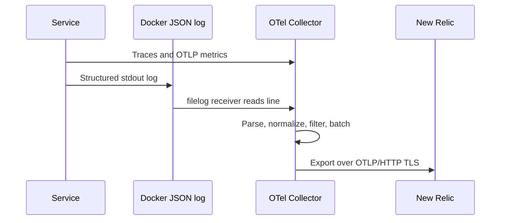

# Monitoring and telemetry operations

## Collector expectations

The production collector reads Docker's default JSON log files from the host,
receives OTLP on ports `4317` and `4318`, and scrapes application metrics. The
Docker daemon must use the expected JSON-file layout for filelog collection to
work.



## New Relic resources

`infrastructure/observability/` contains Terraform for dashboards and alerts,
including user, content, worker, AI, gateway, and log-focused dashboards. Root
Makefile targets:

```bash
make obs-plan
make obs-apply
make obs-test-unit
make obs-test-live
make obs-test-collector
```

`obs-plan`, `obs-apply`, and live verification require `NEW_RELIC_API_KEY`.
Keep it in the environment, not a checked-in configuration file.

## First response to an incident

1. Confirm the relevant container and health endpoint are up.
2. Inspect service logs and correlated trace ID if present.
3. Check dependency health: database/cache/Kafka/Qdrant/LLM as appropriate.
4. Check worker metrics and DLQ depth for delayed asynchronous work.
5. Verify the collector itself when telemetry is absent across multiple services.
