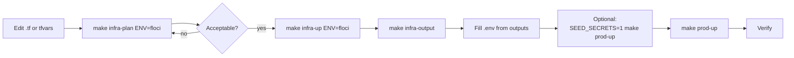
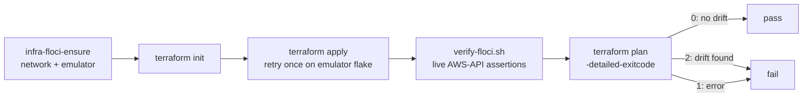

# Terraform workflow

Every Terraform command in this repository goes through a root Makefile target.
That is not ceremony: the targets pin the directory, select the right tfvars
file, and put the destroy guards where you cannot skip them by accident.

This page is the command reference plus the reasoning behind the guards.

## New to this service?

Read [Terraform architecture](../concepts/terraform-architecture.md) first if
the difference between `plan` and `apply` is not already familiar.

## The targets

```bash
make help   # includes this group
```

| Target | Does | Needs a live target? |
| --- | --- | --- |
| `check-tfvars` | Fails if `envs/$(ENV).tfvars` does not exist | no |
| `infra-floci-ensure` | Creates the `floci-apps` network, starts the `floci` container, waits up to 120s for healthy, connects it to the network | starts Docker |
| `infra-plan ENV=<env>` | `terraform init` then `plan -var-file=envs/<env>.tfvars` | **yes** if state has resources |
| `infra-up ENV=<env>` | `infra-floci-ensure` when `ENV=floci`, then `init` and `apply -auto-approve` | starts Docker |
| `infra-output` | `terraform output` | **no**, reads state only |
| `infra-destroy ENV=<env>` | `terraform destroy -auto-approve`, blocked for prod without confirmation | yes |
| `infra-test-unit` | `init -backend=false`, `validate`, `test -filter=tests/contracts.tftest.hcl` | **no** |
| `infra-test-floci` | Full live apply plus `verify-floci.sh` plus a drift check | yes, and only `ENV=floci` |

`ENV` defaults to `floci`. It is a Make variable; Terraform only ever sees the
resulting `-var-file=` argument.

## The happy path



A concrete change, start to finish:

```bash
make infra-plan ENV=floci     # 1. see the diff
make infra-up ENV=floci       # 2. apply it
make infra-output             # 3. pick up any new endpoints
make prod-up                  # 4. restart containers against the new state
```

## Why plan needs a running emulator

`infra-plan` does **not** call `infra-floci-ensure`. Only `infra-up` and
`infra-test-floci` do. With state that describes real resources and no
emulator listening, plan fails while trying to refresh them:

```text
Error: reading RDS DB Subnet Group (topos-user-floci-subnet-group):
operation error RDS: DescribeDBSubnetGroups, ...
Post "http://localhost:4566/": dial tcp 127.0.0.1:4566: connect: connection refused
```

That error is not a configuration problem. It means the target is unreachable.

```bash
make infra-floci-ensure       # start it without applying anything
make infra-plan ENV=floci     # now works
```

`infra-floci-ensure` is idempotent and cheap to re-run: it inspects before it
creates, and it will `docker start floci` rather than rebuilding if a stopped
container already exists.

## Safety guards

| Guard | Where | Effect |
| --- | --- | --- |
| tfvars existence | `check-tfvars` | `make infra-plan ENV=prod` fails immediately with `missing .../envs/prod.tfvars (ENV=prod; try ENV=floci)` instead of Terraform erroring halfway through |
| Prod destroy | `infra-destroy` | Refuses unless `CONFIRM_DESTROY=1` |
| Apply automation | `infra-up` | Uses `-auto-approve`, which is why `infra-plan` is a separate step you are expected to run first |
| Live test scope | `infra-test-floci` | Hard-coded to `ENV=floci`; any other value is rejected |
| Emulator flake | `infra-test-floci` | Retries the first `apply` once |

The destroy guard is one line:

```makefile
infra-destroy: check-tfvars
	@if [ "$(ENV)" = "prod" ] && [ "$(CONFIRM_DESTROY)" != "1" ]; then \
	  echo "refusing to destroy prod without CONFIRM_DESTROY=1"; exit 1; fi
```

It stops a typo. It does not stop a decision. Read the plan, confirm the
account and the state backend, and only then set the variable:

```bash
CONFIRM_DESTROY=1 make infra-destroy ENV=prod
```

## The three verification commands

### `make infra-test-unit`: the one to always run

```text
terraform -chdir=infrastructure/terraform init -backend=false
terraform -chdir=infrastructure/terraform validate
terraform -chdir=infrastructure/terraform test -filter=tests/contracts.tftest.hcl
```

`init -backend=false` skips state entirely, so it works offline on a machine
that has never touched AWS. The tests mock the provider:

```hcl
mock_provider "aws" {}
mock_provider "random" {}
```

Three tests run, all with `command = plan`:

| Test | Asserts |
| --- | --- |
| `floci_service_contracts` | The three SSM paths and three secret names are unchanged |
| `real_aws_service_contracts` | Service tags survive the `prod` variable set |
| `required_tags_cannot_be_overridden` | Caller-supplied tags cannot override the required ones |

These names are an integration contract, not a style preference. Applications
hard-code `/topos/user/config` and `topos/user/secrets`; renaming either in
Terraform breaks every service at startup.

```bash
make infra-test-unit
# Success! 3 passed, 0 failed.
```

### `make infra-test-floci`: the full live proof



`verify-floci.sh` asserts against the live emulator using only AWS-compatible
APIs, and never prints secrets:

| Check | Query |
| --- | --- |
| RDS instance | `rds describe-db-instances --db-instance-identifier topos-user-floci-db` |
| ElastiCache group | `elasticache describe-replication-groups --replication-group-id topos-user-floci-cache` |
| DocumentDB cluster | `docdb describe-db-clusters --db-cluster-identifier topos-content-floci-docdb` |
| MSK cluster | `kafka list-clusters` |
| Three SSM parameters | `ssm get-parameter` for each `/topos/*/config` |
| Plus | a Python step asserting the remaining contracts |

Those four resource names are worth memorising. They are what `make
infra-output` is describing and what a failed apply will name in its error.

The final `plan -detailed-exitcode` is the subtle part:

| Exit code | Meaning | Result |
| --- | --- | --- |
| `0` | No changes needed | Pass: what was applied matches configuration |
| `2` | Changes are pending | **Fail**: something drifted immediately after apply |
| `1` | Error | Fail |

So the test is not "did apply succeed" but "is there still nothing to do".

### `make obs-test-unit` and `make obs-test-collector`

Both are credential-free and belong to the observability project:

```bash
make obs-test-unit        # validate + 1 mocked New Relic contract test
make obs-test-collector   # compose config -q + collector validate
```

`obs-test-collector` does something different from the rest: it runs the real
collector image in validation mode.

```bash
docker run --rm -e NEW_RELIC_LICENSE_KEY=test \
  -e NEW_RELIC_OTLP_HTTP_ENDPOINT=https://otlp.nr-data.net \
  -v .../otel-collector-config.yaml:/etc/otelcol/config.yaml:ro \
  otel/opentelemetry-collector-contrib:0.122.1 \
  validate --config=/etc/otelcol/config.yaml
```

That parses all three pipelines and fails on an unknown processor name or a
malformed expression, without exporting anything. Placeholder credentials are
supplied purely so the config validates.

## Formatting

CI runs this before either test target:

```bash
terraform fmt -check -recursive infrastructure/terraform infrastructure/observability
```

Fix locally with:

```bash
terraform fmt -recursive infrastructure/terraform infrastructure/observability
```

A non-zero exit here is the most common and least interesting CI failure. Run
it before you push.

## Common changes

| You want to... | Edit | Then |
| --- | --- | --- |
| Change an instance size for one environment | `envs/floci.tfvars` | `make infra-plan ENV=floci` |
| Change it everywhere | the `default` in `variables.tf` | plan for both environments |
| Add a non-secret setting | `config.tf` | plan, apply, restart services |
| Add a credential | `secrets.tf` **with** `ignore_changes` | plan, apply, then seed if applications should manage it |
| Rename an SSM path or secret | **don't**, unless you also change every consumer | `make infra-test-unit` will fail, which is the point |
| Move state to S3 | `backend.hcl.example` → `backend.hcl` | `terraform init -backend-config=backend.hcl` |

## Failure modes

| Symptom | Cause | Fix |
| --- | --- | --- |
| `missing .../envs/prod.tfvars` | Only `floci.tfvars` is checked in | Create it, or use `ENV=floci` |
| `dial tcp 127.0.0.1:4566: connect: connection refused` | Emulator down | `make infra-floci-ensure` |
| `Floci did not become healthy` | Image pull or startup exceeded 120s | `docker logs floci`; re-run |
| Apply reports replacements for the proxy | A resource address changed without a `moved` block | Add the `moved` entry; see [Terraform modules](../components/terraform-modules.md) |
| Plan shows a permanent diff on `client_broker` or `db_subnet_group_name` | Target mismatch between emulator and configuration | Confirm `aws_endpoint_url` in the tfvars file |
| `terraform output` missing a newly added output | State gains outputs at the next apply | `make infra-up ENV=floci` |
| Live test fails on the first apply | Known emulator flake | The target already retries once; re-run if it fails again |

## See also

| Topic | Page |
| --- | --- |
| What the modules actually create | [Terraform modules](../components/terraform-modules.md) |
| Where outputs go afterwards | [Managed stack](../getting-started/managed-stack.md) |
| What CI runs on every pull request | [Testing overview](../testing/overview.md) |
| Which settings you may change | [Configuration and secrets](../components/configuration-and-secrets.md) |
