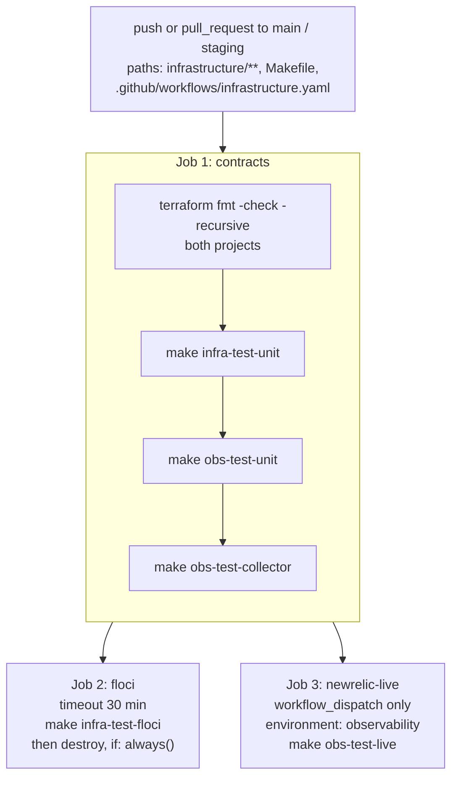

# Testing overview

Infrastructure verification answers a narrow question well: **does the
configuration still compose into what the applications expect?** There are five
commands, none of which touch an application, and one of which needs no
credentials or Docker at all.

## New to this service?

Run `make infra-test-unit` first. It is fast, offline, and catches the class of
change that breaks every service at startup.

## What exists

| Command | Credentials | Docker | Time | Verifies |
| --- | --- | --- | --- | --- |
| `terraform fmt -check -recursive` | no | no | instant | Formatting of both Terraform projects |
| `make infra-test-unit` | no | no | seconds | `validate` plus 3 mocked AWS contract tests |
| `make obs-test-unit` | no | no | seconds | `validate` plus 1 mocked New Relic contract test |
| `make obs-test-collector` | no | **yes** | seconds, one image pull | Prod Compose resolves, collector config parses |
| `make infra-test-floci` | no | **yes** | minutes | Live apply, resource assertions, zero-drift plan |
| `make obs-test-live` | **yes**, plus account id | no | seconds | Deployed dashboards and alerts exist |

There are no application tests here because there is no application. If a
service's behaviour changes, that service's own test suite is the right place;
this directory only has to keep provisioning true.

## The CI workflow

`.github/workflows/infrastructure.yaml` runs three jobs.



### Job 1: `contracts`

Four steps, all credential-free. Runs on every pull request that touches
`infrastructure/**`, the root `Makefile`, or the workflow itself.

This is the gate. A change that fails here never reaches the other two jobs.

```text
terraform fmt -check -recursive infrastructure/terraform infrastructure/observability
make infra-test-unit
make obs-test-unit
make obs-test-collector
```

Expected results:

```text
Success! The configuration is valid.
Success! 3 passed, 0 failed.        # infra-test-unit

Success! The configuration is valid.
Success! 1 passed, 0 failed.        # obs-test-unit

docker compose ... config -q                                       # obs-test-collector
docker run --rm ... validate --config=/etc/otelcol/config.yaml
```

### Job 2: `floci`

Runs only after job 1 passes, with a 30-minute timeout. It performs a real
apply against the Floci emulator, asserts live resources, and then checks for
drift:

```bash
make infra-test-floci
```

Terraform is set up at version `1.9.8` with `terraform_wrapper: false`, so
output is plain text rather than the wrapper's escaped form.

The cleanup step runs `if: always()`, including when the job failed:

```yaml
- name: Destroy Floci infrastructure
  if: always()
  run: |
    if [ -d infrastructure/terraform/.terraform ]; then
      terraform -chdir=infrastructure/terraform destroy -input=false \
        -auto-approve -var-file=envs/floci.tfvars || true
    fi
```

The `|| true` means a failed destroy does not mask the original failure.

### Job 3: `newrelic-live`

Deliberately expensive and deliberately manual:

```yaml
if: github.event_name == 'workflow_dispatch'
environment: observability
```

Two gates: it runs only when someone dispatches the workflow, and it requires
the `observability` GitHub environment, which is where the
`NEW_RELIC_API_KEY` and `NEW_RELIC_ACCOUNT_ID` secrets live. It never runs on
a pull request.

## Reproducing CI locally

The whole of job 1:

```bash
terraform fmt -check -recursive infrastructure/terraform infrastructure/observability
make infra-test-unit
make obs-test-unit
make obs-test-collector
```

Four commands, no credentials, no network beyond one image pull. Run them
before every push; they are exactly what the gate runs.

Job 2:

```bash
make infra-test-floci ENV=floci
```

Requires Docker and pulls `floci/floci:latest` on first use. The Makefile
retries the first `apply` once to absorb a known emulator flake.

Job 3 locally, if you have credentials:

```bash
export NEW_RELIC_API_KEY=...
export NEW_RELIC_ACCOUNT_ID=...
make obs-test-live
```

## What each check proves

| Check | Proves | Does **not** prove |
| --- | --- | --- |
| `fmt -check` | HCL is formatted consistently | anything about behaviour |
| `infra-test-unit` `validate` | Configuration is syntactically and type valid | that AWS accepts it |
| `infra-test-unit` contracts | SSM paths, secret names and tags are unchanged | that resources create successfully |
| `obs-test-unit` contracts | All 7 dashboards stay `PRIVATE`; the overview keeps 8 widgets | that New Relic accepts the queries |
| `obs-test-collector` | Compose resolves; collector config parses with the real image | that any receiver receives anything |
| `infra-test-floci` | Real resources are created with expected names; no drift after apply | that real AWS behaves the same, or that applications can connect |
| `obs-test-live` | Deployed dashboards and the alert policy exist | that alerts would fire correctly |

The contracts are the interesting row. Here is what one asserts:

```hcl
assert {
  condition     = aws_ssm_parameter.user_config.name == "/topos/user/config"
  error_message = "User config must retain its stable SSM path."
}
```

That is not a style preference. Every service reads `/topos/user/config` by
name. Renaming it in Terraform compiles fine, passes `validate`, and breaks all
three services at startup. The test exists to make that a red build instead.

## The manual matrix

Automated checks cover configuration. These cover the parts that need a running
system. Each has a known answer.

### Compose resolution

| # | Command | Expected |
| --- | --- | --- |
| 1 | `docker compose --env-file infrastructure/docker/local/.env.local -f infrastructure/docker/local/compose.yml config --services \| wc -l` | `17` |
| 2 | `docker compose --env-file infrastructure/docker/prod/.env.example -f infrastructure/docker/prod/compose.yml config --services \| wc -l` | `11` |
| 3 | `docker compose --env-file infrastructure/docker/prod/.env.example -f infrastructure/docker/prod/compose.yml config -q` | exit `0` |

### Terraform

| # | Command | Expected |
| --- | --- | --- |
| 4 | `make infra-test-unit` | `3 passed, 0 failed` |
| 5 | `make obs-test-unit` | `1 passed, 0 failed` |
| 6 | `terraform fmt -check -recursive infrastructure/terraform infrastructure/observability` | exit `0` |
| 7 | `make infra-output` | 23 outputs listed; 11 shown as `<sensitive>` |
| 8 | `make infra-plan ENV=floci` with the emulator stopped | fails with `dial tcp 127.0.0.1:4566: connect: connection refused` |

Item 8 is expected behaviour, not a defect. See
[Terraform workflow](../operations/terraform-workflow.md#why-plan-needs-a-running-emulator).

### Collector

| # | Command | Expected |
| --- | --- | --- |
| 9 | `make obs-test-collector` | exit `0` |
| 10 | `docker compose --env-file infrastructure/docker/prod/.env -f infrastructure/docker/prod/compose.yml exec user-service curl -fsS http://otel-collector:13133/` | `{"status":"UP"}` |
| 11 | `grep -c 'job_name' infrastructure/docker/prod/otel-collector-config.yaml` | `1` |
| 12 | Count scrape targets under that job | `7` |

## Before you open a PR

```text
[ ] terraform fmt -recursive on both projects (then fmt -check passes)
[ ] make infra-test-unit        3 passed
[ ] make obs-test-unit          1 passed
[ ] make obs-test-collector     exit 0
[ ] git status shows only the files you meant to change
[ ] No secret, key, token or connection string added anywhere
[ ] New SSM path or secret name? Every consumer updated too
[ ] New resource without a moved block? plan does not show "must be replaced"
[ ] Documentation updated for any behavioural change
```

The "No secret" line is not boilerplate. `config.tf` is a plain `String`
parameter readable by anyone with SSM access, and `.env.example` is tracked by
git. Both are places where a credential has been pasted by accident in
essentially every project that has ever used them.

## What to add if behaviour grows

The current suite assumes configuration only. If this directory gains logic,
these are the corresponding additions:

| Change | Test to add |
| --- | --- |
| A Terraform module that creates data the services consume | Live assertion in `verify-floci.sh` that the resource answers, not merely that it exists |
| New SSM or secret key | Contract test asserting the key's presence and type |
| New collector receiver or processor | A fixture log line asserted through `obs-test-collector`-style validation |
| A second environment | A `tfvars` file plus a `plan` run for it in CI |
| Non-default dashboard permissions | A contract assertion alongside the existing `PRIVATE` ones |

## See also

| Topic | Page |
| --- | --- |
| The commands behind each check | [Terraform workflow](../operations/terraform-workflow.md) |
| What the contract tests are protecting | [Configuration and secrets](../components/configuration-and-secrets.md) |
| Running a full live verification | [Managed stack](../getting-started/managed-stack.md) |
| CI paths that trigger this workflow | [Deployment](../operations/deployment.md) |
