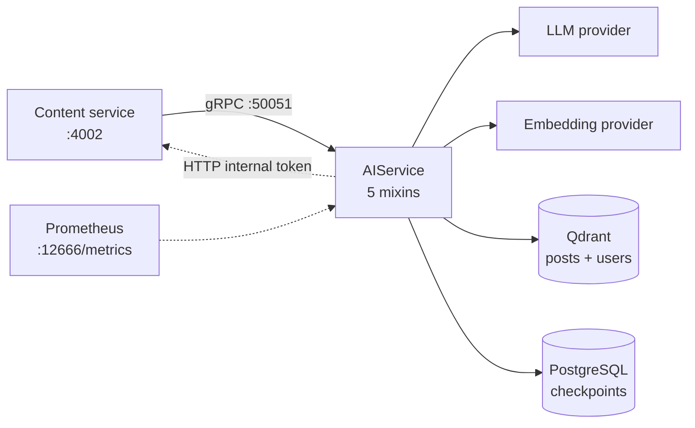

# AI service documentation

The AI service is the Python gRPC service that gives Topos its intelligence:
summaries and tags, a human-in-the-loop draft workflow, hybrid search over
Qdrant, grounded chat with citations, and personalised feeds.

No browser ever calls it directly. The content service is its only caller, and
it treats every result as optional — see
[Request flows](concepts/request-flows.md).

These pages explain how it works and how to run it, assuming no prior knowledge
of the service.

## New to this service?

Start here:

1. **[Quick start](getting-started/quickstart.md)** — get the service running
   and prove it works.
2. **[Architecture](concepts/architecture.md)** — see how the mixins, graphs,
   and providers fit together, and what happens during startup.
3. **[Retrieval and recommendations](concepts/retrieval-and-recommendations.md)**
   — understand what the service actually stores and how it ranks.

> **Read the [content service docs](../../content/docs/README.md) first?** Not
> required, but useful: content is this service's only caller, and it owns the
> canonical posts that this service only ever indexes.

## Documentation by topic

### Getting started

| Document | What it covers | Read it when |
| --- | --- | --- |
| [Quick start](getting-started/quickstart.md) | Install, generate stubs, run, verify | First time here |
| [Configuration](getting-started/configuration.md) | Every setting, the mode switches, aliases, prod hydration | Changing behaviour or deploying |

### Concepts

| Document | What it covers | Read it when |
| --- | --- | --- |
| [Architecture](concepts/architecture.md) | Layering, the composition root, the startup sequence | You need to find your way around |
| [Data model](concepts/data-model.md) | Qdrant collections, point IDs, graph state, prompts | You need to know what is stored |
| [Generation and review](concepts/generation-and-review.md) | Single-turn generation and the approval-gated draft graph | You care about summaries, tags, or drafts |
| [Chat flow](concepts/chat-flow.md) | The 7-node chat graph, retrieval loop, tools, citations | You are debugging an answer |
| [Retrieval and recommendations](concepts/retrieval-and-recommendations.md) | Hybrid search, interest profiles, the four feed modes | You care about ranking |
| [Request flows](concepts/request-flows.md) | Which caller invokes which RPC, traced end to end | You are tracing a bug across services |

### Components

| Document | What it covers | Read it when |
| --- | --- | --- |
| [RPC reference](components/rpc-reference.md) | All 16 RPCs, their limits, and their quirks | You are about to call the API |
| [Error handling](components/error-handling.md) | Python exceptions → gRPC status codes | Something failed and you want to know why |
| [Providers](components/providers.md) | The LLM, embedding, store, and fetcher abstractions | You want to swap a dependency or go offline |

### Operations

| Document | What it covers | Read it when |
| --- | --- | --- |
| [Reliability](operations/reliability.md) | Retries, degraded modes, failure scenarios, shutdown | Something is broken in prod |
| [Health and observability](operations/health-and-observability.md) | Probes, all 26 metrics, logs, traces | Monitoring or debugging the service |

### Testing

| Document | What it covers | Read it when |
| --- | --- | --- |
| [Testing](testing/overview.md) | pytest markers, evals, load tests, CI | Before you push |

## Boundary overview

The dotted line back to the content service is the `get_post_body` chat tool:
when a full post body is needed for grounding, the AI service fetches it from
content's internal HTTP route.

## Reading order by task

| Task | Read |
| --- | --- |
| Get it running offline | [Quick start](getting-started/quickstart.md) → [Providers](components/providers.md) |
| Understand why a chat answer is wrong | [Chat flow](concepts/chat-flow.md) → [Retrieval](concepts/retrieval-and-recommendations.md) |
| Understand why a feed looks wrong | [Retrieval and recommendations](concepts/retrieval-and-recommendations.md) → [Request flows](concepts/request-flows.md) |
| Handle an API failure | [Error handling](components/error-handling.md) → [Reliability](operations/reliability.md) |
| Ship a change | [Configuration](getting-started/configuration.md) → [Testing](testing/overview.md) |
